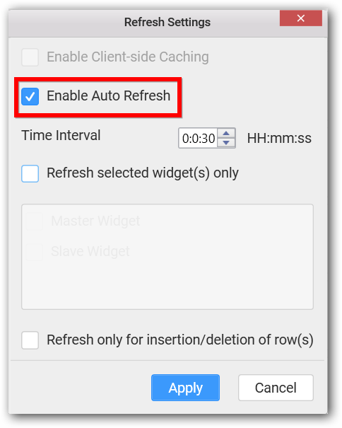
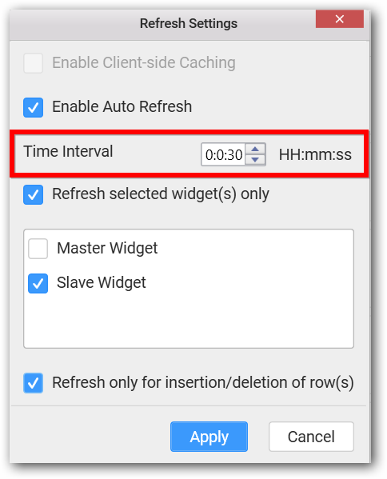
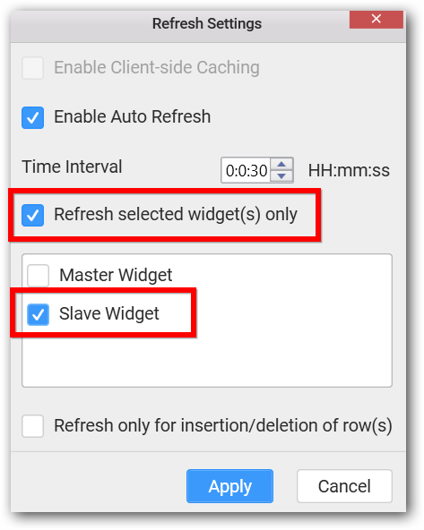
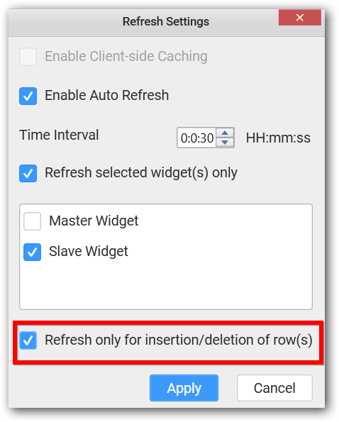

# Refresh Dashboard

Syncfusion Dashboard Designer allows you to configure the scheduled refresh of dashboard. Either the whole dashboard or specific widgets in a dashboard can be refreshed automatically based on a timer.

## How to enable automatic refresh for a Dashboard?

To enable auto refresh for a dashboard, 

Open a dashboard for which automatic refresh need to be scheduled.

Navigate to the `Server` menu and click the `Refresh Settings…` to open the `Refresh Settings` dialog.

Select `Enable Auto Refresh`. Click `Apply`.

## How to set the timer for automatic refresh?

Time Interval for automatic refresh will be 30 seconds by default. To set a different time interval, 

Select `Enable Auto Refresh` in `Refresh Settings` dialog.

Set the time interval ranging from a minimum of `30 seconds` to a maximum of `23 hours 59 minutes and 59 seconds`. Click `Apply`.

## How to enable automatic refresh for particular widgets in a dashboard?

Automatic refresh for particular widgets alone can be configured through `Refresh Settings` dialog.

Select `Enable Auto Refresh` in the dialog.

Select `Refresh selected widget(s) only`. This will enable the widgets list below to it.

Select the widgets that you need to get refreshed automatically. Click `Apply`.

## How to enable automatic refresh only for any record insertion or deletion in the associated database?

Automatic refresh will keep track of changes in data even it is an update to existing record. To refresh only on new insertion or deletion of records,

Select `Enable Auto Refresh` in the dialog.

Select `Refresh selected widget(s) only` if required. This will enable the widgets list below to it. Select the widgets that you need to get refreshed automatically. 

Select `Refresh only for insertion/deletion of row(s)`. Click `Apply`.

