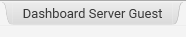
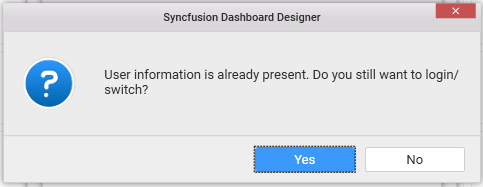

# Connecting to a Server

## Logging into Server

Log into the Dashboard Server through the login window.

Login window can be launched through any of the following ways.

**Through Application Menu**

Click the Server menu and select the `Login…` menu item to launch the login window.

**Through Title Bar**

Click the `Login` option in the title bar and choose the `New User Login` menu item to launch the login window.

**Through Manage Accounts**

Click the `Login` option in the title bar and chose `Manage Accounts` menu item in the drop down list.         

In the `Manage Accounts` dialog window,  click `Add Account` to launch the login window.

## Managing Multiple User Accounts  

Syncfusion Dashboard Designer provides the ability to configure multiple user accounts of same or different dashboard servers. Through this, current user login can be switched in between these accounts without requiring to feed the user account credentials every time.

**Manage Accounts**

`Manage Accounts` dialog maintain all the added user information. Each user account added can be edited and/or removed.

Click the `Login` option in the title bar and select `Manage Accounts` menu item in the drop down list. Now, `Manage Accounts` dialog window will be opened. 

N> Added user accounts and current login information will be maintained even Dashboard Designer upgraded to a newer version later, until removed explicitly.

**Add Account**

In the `Manage Accounts` dialog window, click `Add Account` to launch the login window for adding user information. If newly added user information is not present  already, added user account will act as current user and Login icon changed with the current user name

If the added user is already present in the list, show dialog box to prevent the duplicate user information are added again.

**Edit Account**

To edit an existing user account, navigate to the respective account in `Manage Accounts` dialog window and click `Edit` icon highlighted below. This will launch the `Login Window` to update the details. If provided user information is valid, login will succeed. Otherwise, fails.

**Remove Account**

To remove a user account, navigate to the respective account in `Manage Accounts` dialog window and click `Remove` icon highlighted below.

If selected user account is the one currently logged in, alert message will be displayed before removing the account from the list for confirmation.

**Switch Account**

To switch the current login between the accounts you added already, click the `Login` option in the title bar and choose `Switch Account` option. Navigate to the added user accounts that are displayed in sub menu and select the respective account to switch to. Selected account will then be considered as Current account. 

N> When the network disconnected between designer and server, selected user sign-in will not be showed until connection is re-established. Meanwhile, message `Unable to connect to the remote server` will be displayed on attempting to connect When you are not logged in currently, you will get Users menu item displayed instead with the configured user accounts in sub menu.

## Logging out from Server

You may logout from the dashboard server through any of the following ways.

**Through Application Menu**

Click the `Server` menu and select the `Logout` menu item to sign-out the current user.

**Through Title Bar**

Click the `Login` option in the title bar and choose `Logout` option to sign-out the current user. 

N> After the current user logged out, the added user accounts will still be maintained under `Users` sub menu for re-login later.

