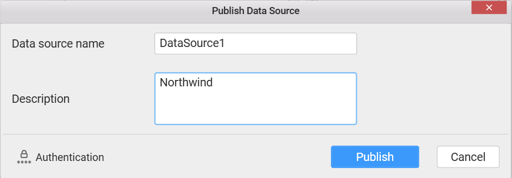

# Data Source Authentication Modes
	
  When a dashboard is published to a Dashboard Server, you can restrict access to the dashboards based on the following Authentication modes

  1. SQL Server Impersonation within a domain 
  
  2. Prompt for User Credentials  
  
  3. Embedded User Credentials
  
Configure these modes through the `Authentication` option in the `Publish` windows. 

### SQL Server Impersonation within a domain

Under Windows authentication mode, user accounts imported from Active Directory to Dashboard Server will impersonate as Dashboard Server user to communicate with SQL Server instance. For querying, both SQL Server and Active Directory account names should be the same and their authentication type should be Windows Authentication. With this setup, SQL Server administrator can define permissions for specific users.

Thus, the queries submitted is executed based on the permissions defined for that user in the SQL Server. The response will be sent accordingly back to the Dashboard. In Dashboard Designer, when you are connecting to an SQL Server to enable impersonation, you should connect using an account that has `Impersonate` permission enabled.

N> The Impersonate option will get displayed only when the signed in dashboard server user account is the one imported from Active Directory.

### Prompt for User Credentials

Setting Prompt option will prompt to enter the SQL Server credentials upon launching the respective dashboard(s). Using this mode, you can enforce row-level security in non-Active Directory environment for users with different set of SQL Server credentials.

### Embedded User Credentials

No authentication will be done in this mode. The connection parameters embedded in Dashboard will be used for querying up data.
