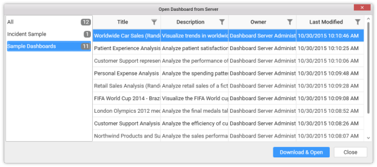

# Importing from Server

Dashboards and Data sources can be imported from Dashboard Server through the Application Menu.

### Importing Dashboard from Server

Click `Server` Menu and select `Open Dashboard…` menu item.

If you logged in to Dashboard Server already, you will be prompted with the `Open Dashboard from Server` dialog like below:

This dialog lists out the dashboards that you can view while you logged into dashboard server directly through web browser and see under DASHBOARDS tab like below.

Select the category in left pane and select the required dashboard to import at right pane. You may also filter and sort the display view for convenience.

Click `Download & Open` to download the selected dashboard and open in the dashboard designer from which this operation was handled.

Click `Close` to close the dialog.

[Save](/en-us/dashboard-platform/dashboard-designer/compose-dashboard/saving-a-dashboard) this dashboard in your local machine at your preferred location with a suitable name in SYDX format.

### Importing Data source from Server

Click `Server` Menu and select `Import Data Source…` menu item.

If you logged in to Dashboard Server already, you will be prompted with the `Import Data Source` dialog like below:

### Importing Widget from Server

Click `Import` icon form `WIDGETS` container.

If you logged in to Dashboard Server already, you will be prompted with the `Import Widget` dialog like below:

