## Publishing to Server

Dashboards and Data sources can be exported to server from Dashboard Designer through the Publish option in the Application Menu.

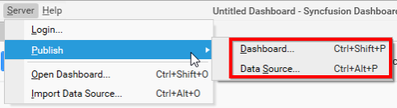

### Publishing Dashboard to Server

Click `Server` Menu and navigate to `Publish` menu item. Select `Dashboard…` menu item.

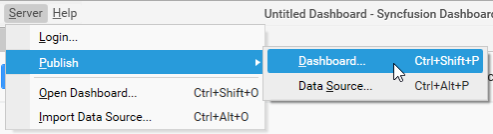

If you logged in to Dashboard Server already, you will be prompted with the publish dialog like below.

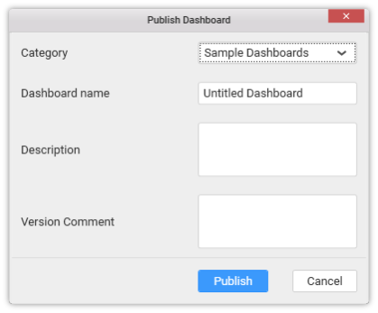

In this dialog, `Category` drop down list shows the list of categories added in the connected dashboard server. This represents the category under which the dashboard need to be published. Set the dashboard name near the `Dashboard name` label. Set the description, if you prefer, commenting over the dashboard, near `Description` area. `Version Comment` is for commenting over each version of publish. However, this is optional.

Click `Publish` to export dashboard to dashboard server. This dashboard can now be viewed under DASHBOARDS in the published dashboard server like below.

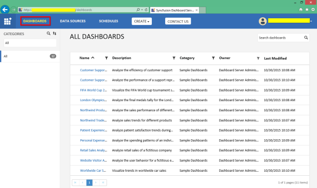

Click `Cancel` to cancel the export operation and close the dialog.

### Publishing Data source to Server

Click `Server` Menu and navigate to `Publish` menu item. Select `Data Source…` menu item.

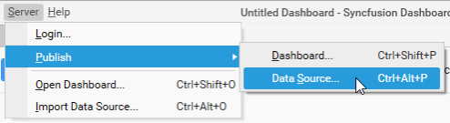

If you logged in to Dashboard Server already, you will be prompted with the publish dialog like below.

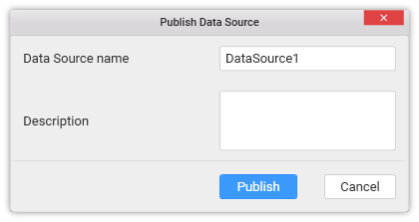

In this dialog, enter the data source name with which you require the data source to be published, in `Data Source name` text area.

Enter the description in the `Description` text area illustrating the data source, if required. This is optional.

Click `Publish` to export data source to dashboard server. This data source can now be viewed under DATA SOURCES in the published dashboard server like below.

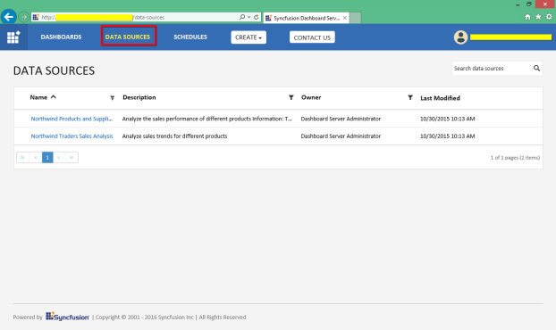

Click `Cancel` to cancel the export operation and close the dialog.

### Publishing Widget to Server

Click `Server` menu and navigate to `Publish` menu item. Select `Widget…` menu item.

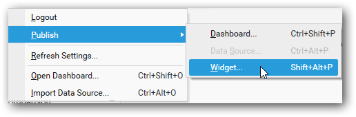

If you logged in to Dashboard Server already, you will be prompted with the publish dialog like below.

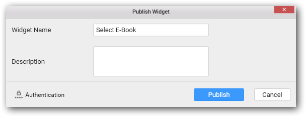

In this dialog, enter the widget name with which you require the widget to be published/exported to server, in `Widget Name` text area.

Enter the description in the `Description` text area illustrating the widget, if required. This is optional.

Click `Publish` to export widget to dashboard server. This widget can now be viewed under WIDGETS in the published dashboard server like below.

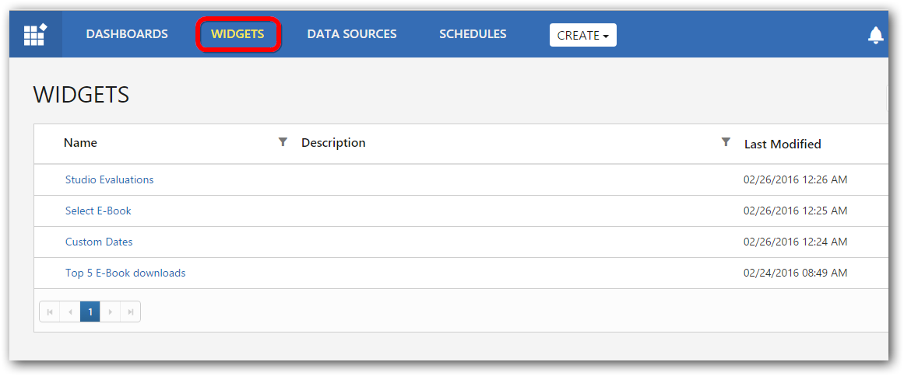

Click `Cancel` to cancel the export operation and close the dialog.

### Publishing Data to Server

Data publish is required for publishing dashboards into dashboard server whose data was created through connection types other than server-based data connection types.

With this, proceeding after `Publish Dashboard` dialog, the following dialog will be shown to feed the details of data server whose system requirements has been discussed [here](/en-us/dashboard-platform/dashboard-designer/system-requirements). The data server should either have Microsoft SQL Server installed or ODBC-enabled databases like SQL, MySQL or Oracle, or Spark SQL configured. 

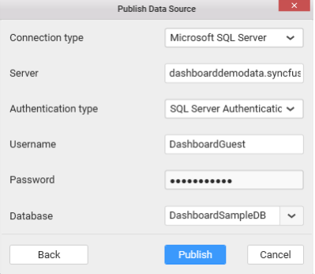
   
For data connections, other than the server typed connections such as CSV, Microsoft Excel, JSON, Salesforce, Web Data Source and Microsoft Azure Table Storage the data will be moved into the servers optionally as [SQL Server](/en-us/dashboard-platform/dashboard-designer/connecting-to-data/connecting-to-data#connecting-to-sql-server-database), [Spark SQL](/en-us/dashboard-platform/dashboard-designer/connecting-to-data/connecting-to-data#connecting-to-spark-sql-data) or ODBC-enabled databases ([MSSQL](/en-us/dashboard-platform/dashboard-designer/connecting-to-data/connecting-to-data#connecting-to-sql-server-database-through-odbc-connection), [MySQL](/en-us/dashboard-platform/dashboard-designer/connecting-to-data/connecting-to-data#connecting-to-mysql-database-through-odbc-connection) or [Oracle](/en-us/dashboard-platform/dashboard-designer/connecting-to-data/connecting-to-data#connecting-to-oracle-database-through-odbc-connection)) from the in-memory database which has been created while designing the data source.

## User Filter Configuration

You may configure user filters to restrict data view based on user logged in. Please refer [here](/en-us/dashboard-platform/dashboard-designer/compose-dashboard/configuring-user-based-filter) for more detail.

## Public Accessibility 

You can mark a particular dashboard as publicly accessible while publishing it to a Dashboard Server, so that the published dashboard can be viewed by anyone through the URL without the server credentials to log in. To set dashboard as public, enable the check box `Mark as public` in the `Publish Dashboard` dialog.

N> Setting dashboard as public will disable the user based filter and other user specific functionalities applied to the dashboard.

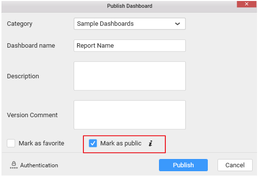

You can mark a dashboard as public even after publishing to dashboard server as discussed [here](/en-us/dashboard-platform/dashboard-server/administration/manage-dashboards/public-dashboards#make-public).

## Marking as Favorite

You can mark a particular dashboard as favorite while publishing to a Dashboard Server, so that dashboard can be listed under `Favorite Dashboards` category in the Dashboard Server. To set a dashboard as favorite, enable the check box `Mark as favorite` in the `Publish Dashboard` dialog.

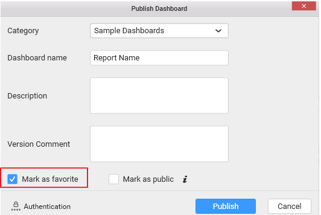

You can mark a dashboard as favorite even after publishing to dashboard server as discussed [here](/en-us/dashboard-platform/dashboard-server/administration/manage-dashboards/favorite-dashboards#mark-a-dashboard-as-favorite).

