# Data filters 

## Configuring Data Filters

  Data Filters can be configured to restrict records visibility based on defined criteria. The configuration can be done by adding and deleting a filter condition.
  
### Adding a filter condition

   Add a filter condition through clicking the `Add` button in the `Filters` window.

   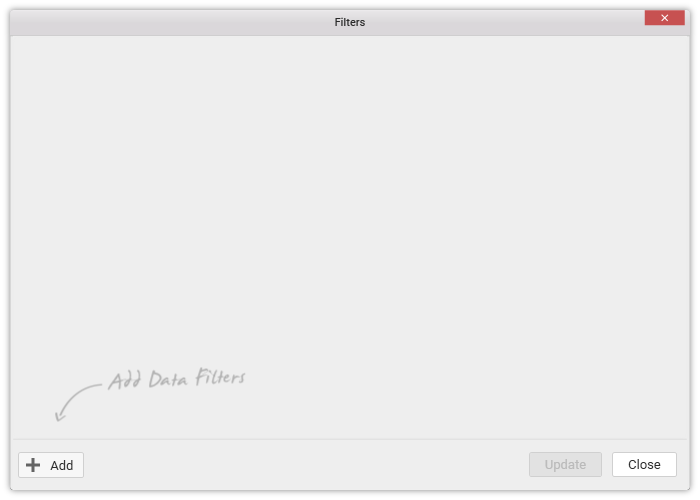

   Now, a filter condition will get added by default like below:

   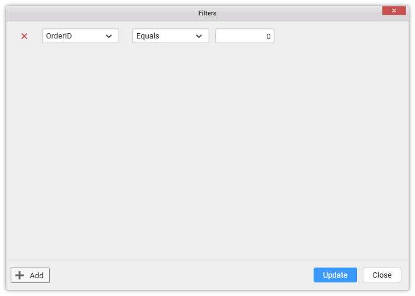

   Modify the condition as you require and define criteria. The condition can be defined based on the column. Based on its data type, the parameters to define will differ.

   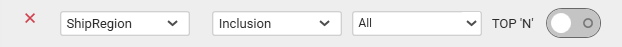

   With the date time type or text type column like above, you may get a toggle button TOP ‘N’ at right, to enable the Top `N` filter to configure the field and the condition by which it has to be applied.

   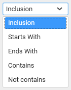

   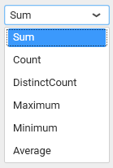

   For numeric type column, the parameters will be like below:

   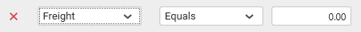

   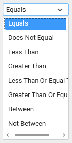

   For date time type column, the parameters will be like below:

   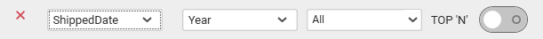

   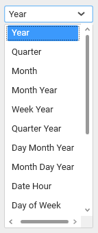

   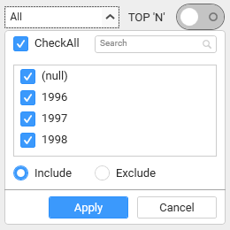

   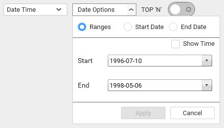

   Add more than one condition if you prefer, through clicking the `Add` button.

   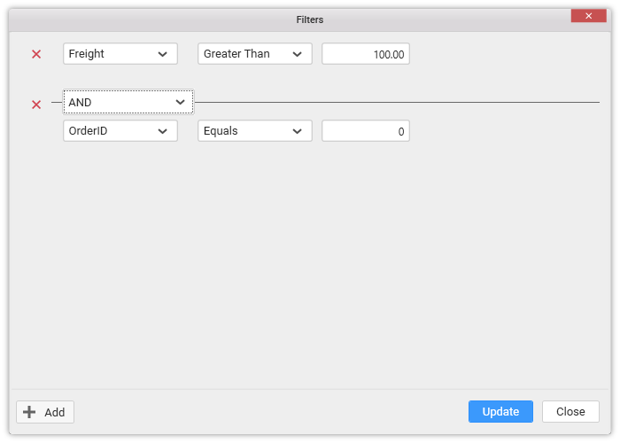

   By default, AND operation will be handled in between two conditions. However, you may change it to any of the below:

   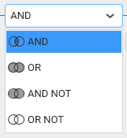

   However, this operation cannot be changed, when you have the TOP `N` option enabled like below:

   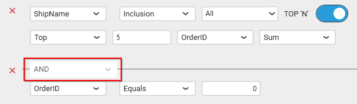

   Click `Update` to save the defined data filter conditions.

   Click `Close` button or the Close icon at top right corner of the window to close the Filters window.
   
### Deleting a filter condition

   You can remove a filter condition by clicking the close icon (highlighted below) at left of the respective filter condition.

   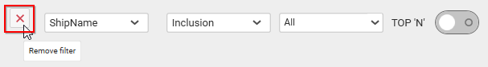

## Configuring Data Filters for SSAS Data source

N> Currently, Data filters for SSAS data source can be defined only through string type columns.

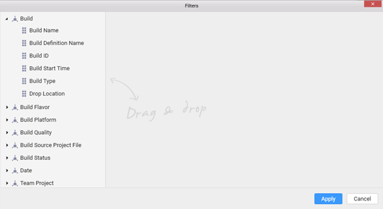
 
### Adding a filter condition
Expand the dimension and drop and drop a hierarchy or level to the right area to `add` a filter condition. 
 
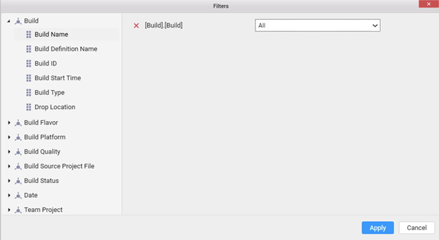

Add more than one filter condition if you prefer, through drag and drop.

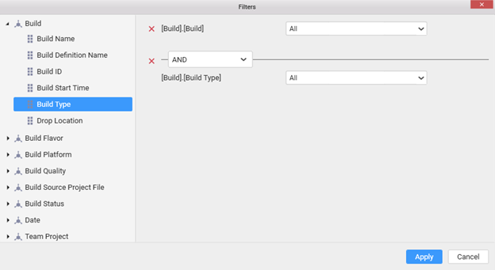
 
By default, `AND` operation will be handled in between two conditions as other connection. However, you may change it to any of the below:
 
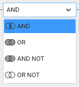

### Removing a filter condition
You can remove a filter condition by clicking the close icon at left of the respective filter condition.

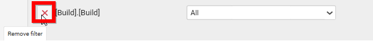
 

