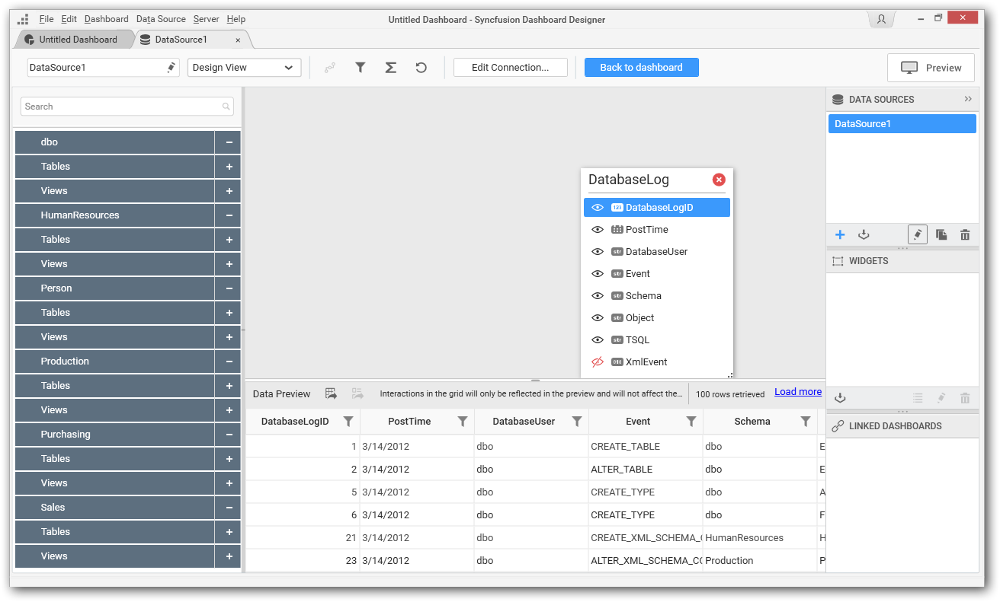
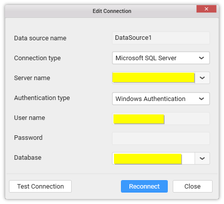

# Editing Data Connection

You can edit the existing data source connection through the following procedure:

Select a data source in the DATA SOURCES container that you need to edit.

Click the highlighted icon to edit the selected data source.

Now the respective data source will get opened in a separate tab.

Click the Edit Connection to open the `Edit Connection` window.

Now make connection changes through this window, test connection and then reconnect to apply changes.