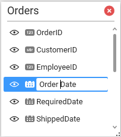
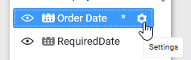
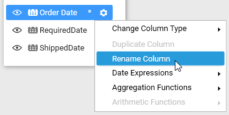

# Formatting Columns

## Renaming Column

   N> For `Microsoft SQL Server Analysis Services` connection type, column renaming is not supported.

   Rename the column, if required, through double clicking the respective column to enable the edit mode and typing the modified name. Press `<Enter>` key to commit the modification done.

   

   The renamed column will be represented by (*) mark.

   

   You can also rename the column through the `Settings` icon which will be displayed like below while hovering the respective column.

   

   Click this icon to drop down the menu with `Rename Column`, clicking which the edit mode will be enabled in that column.

   

## Handling Column Type Conversion

   N> For `Microsoft SQL Server Analysis Services` Connection type, type conversions can be handled only on string typed columns. The possible conversions are Text to Date Time and vice-versa.

   The following table represents the column types and their equivalent convertible types that are supported in Dashboard Designer.

   <table>
   <tr>
   <td>
   <b>Column Data Type</b></td><td>
   <b>Equivalent Convertible Types</b></td></tr>
   <tr>
   <td>
   Decimal</td><td>
   DateTime, Text</td></tr>
   <tr>
   <td>
   Integer</td><td>
   Decimal, DateTime, Text</td></tr>
   <tr>
   <td>
   Date Time</td><td>
   Decimal, Text</td></tr>
   <tr>
   <td>
   Text</td><td>
   DateTime, Decimal</td></tr>
   </table>
