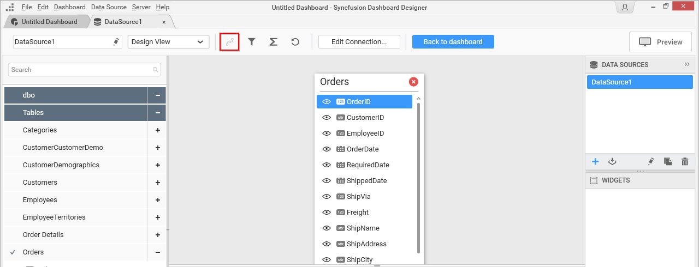
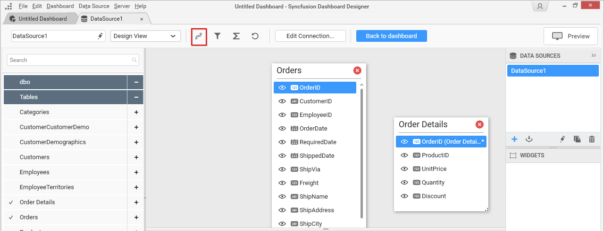
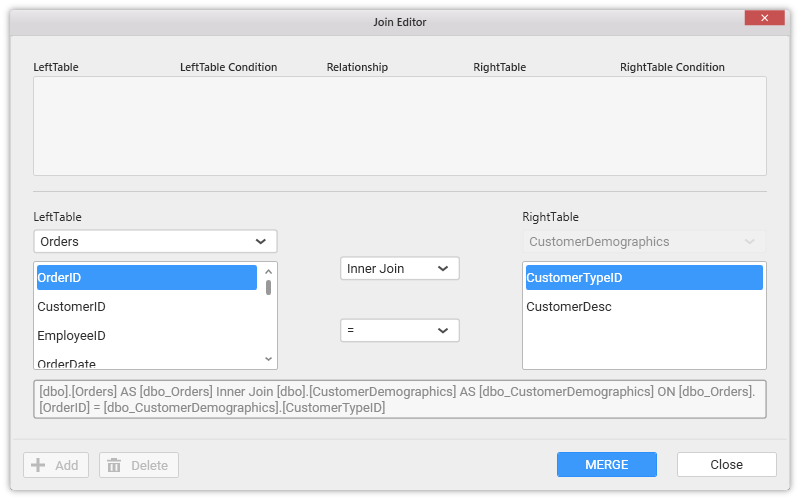
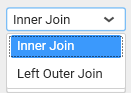
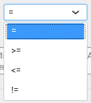
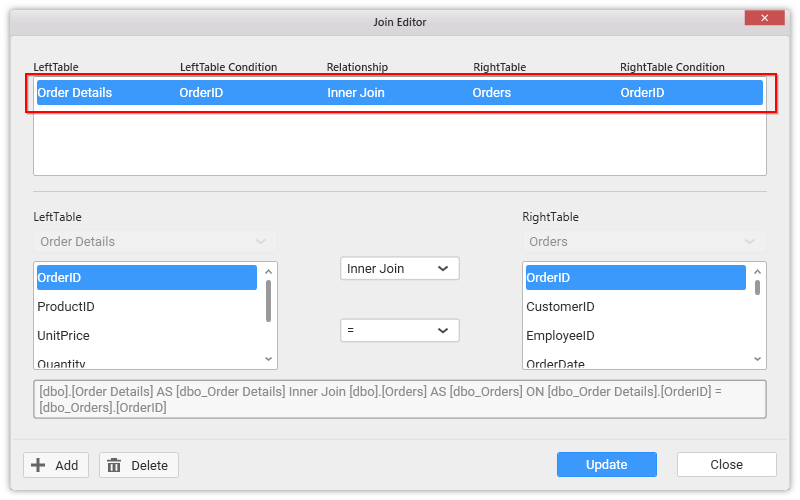
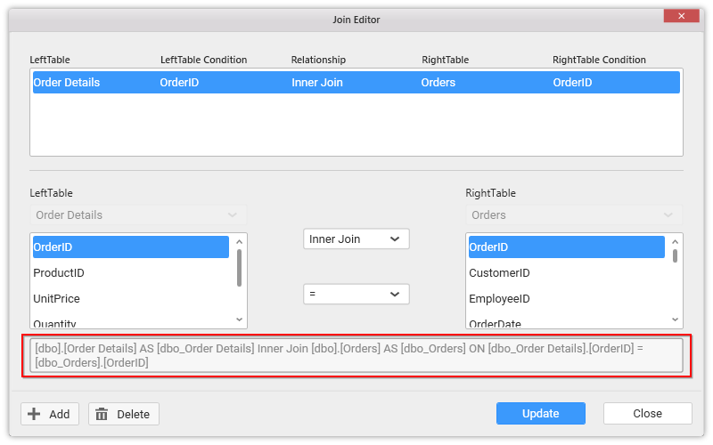
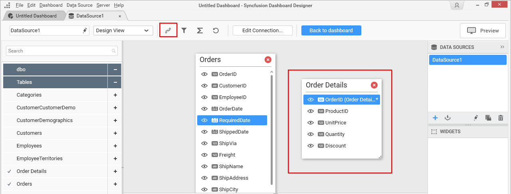
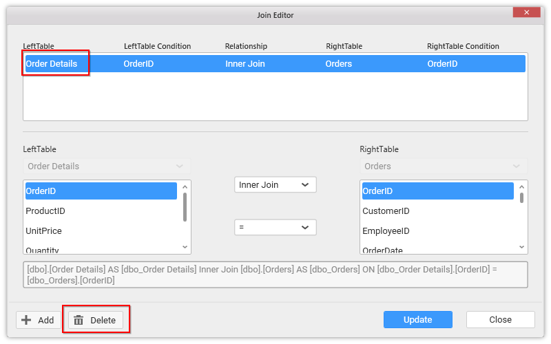
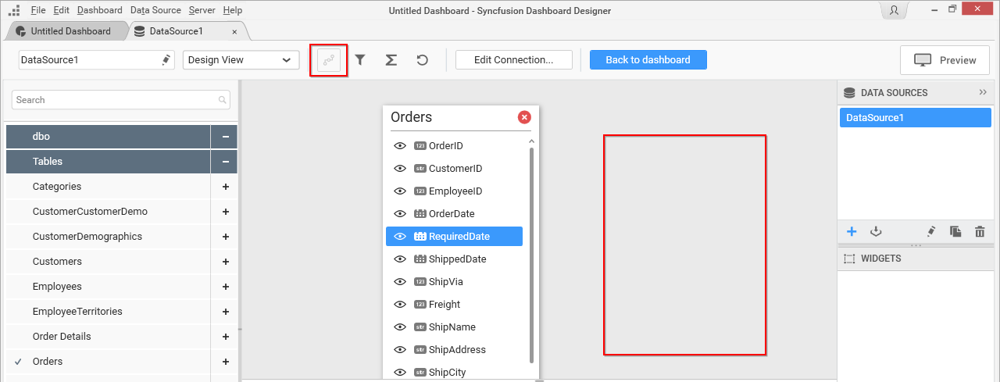

# Joining Tables

N> For `Microsoft SQL Server Analysis Services` connection type, table joining is not applicable.

Joining of tables is required when you are going to use more than one table in your data source design. The join icon (highlighted below) in the tools pane at data design view will be in disabled state, if there was only one table found dropped in table design view like below:

It will get enabled once you drop the 2nd table like below:

## Adding a join condition

If the subsequent table being dropped, has any of its column as foreign key in any of the already dropped tables, the joining will take place automatically. Else, it will prompt the join editor like below to let you define the keys (columns) to join between this table and any one of the already dropped tables.

In the above screen shot, the `LeftTable` illustrate the list of already dropped tables. The list below to the drop down, represents the columns available in the selected table. `The RightTable` illustrate the table which you dropped at the moment and that require you to set up a relation with any of the already dropped tables. The list below to that, represents the columns available in that table.

The join type and the compare operator to make between the two tables, can be defined through the options available in center part.

**Join Types**

Two types of joins can be made between tables in join editor. They are Left Outer Join and Inner Join.

**Join Condition**

You can define a condition for joining two tables through any of the compare operator for comparing the values of the two columns (one from each table) by which relation between tables need to be made.

You need to select the respective columns to join and the type and compare operator and click `Merge` to approve that joining. Approved join condition will then get added in the table at top like in the below screen shot.

Selecting the added condition in the top table will highlight the respective fields joined and its query preview at the bottom like highlighted below.

You may add more than one join condition through clicking `Add` button, then followed by its configuration and finally merging the same. Clicking Add will enable the `LeftTable` dropdown to let you change the table thereby letting you to have the fixed `RightTable` join with more than one table.

## Updating a join condition

Update an existing join condition through selecting that in the top table and then edit the mapping between columns through interacting with columns list, join type and compare operator.

If you are not at the join editor, it can be invoked through clicking the highlighted icon below in the data design view.

N> Updating an existing join condition will allow you to edit the column mapping only between those two tables.

Click Update to save the changes that you made.

## Deleting a join condition

Delete an existing join condition through selecting that in the top table and then click `Delete`. Now the selected condition get removed from the top table which indicates that specific join established between two tables was removed.

If that is the only join condition for any of those two tables, respective table itself get removed from the table design view on the above action. 

Click `Close` to close the join editor.