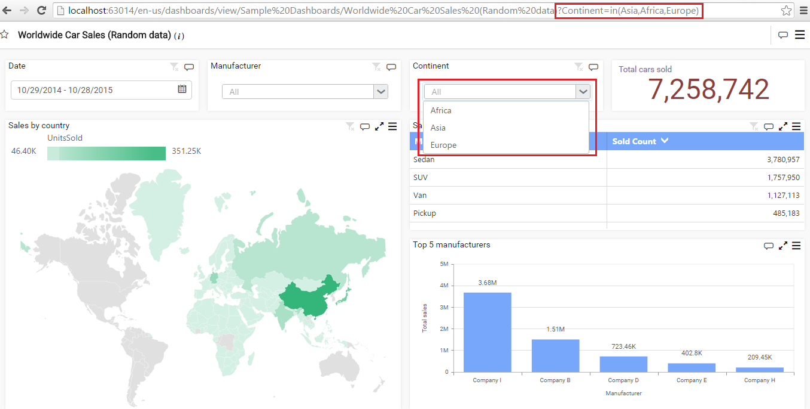

# ejDashboardViewer

Dashboard Viewer allows you to visualize the dashboard that was published in Dashboard Server or deployed in local physical path, opened through Dashboard Designer and run, navigating to specific URL in web browser. Certain options to widgets that have been enabled during design time like Maximize button, CSV, Excel & Image export options can be availed at run time through Dashboard Viewer. Also, you can export entire dashboard itself to image.

#### Syntax

     

     $(element).ejDashboardViewer()
  
     

#### Example 
  
    
   
    

 
    
    
    
    
#### Requires
     
* module:jquery-1.10.2.min.js
  
* module:jquery.easing.1.3.min.js
  
* module:jquery.globalize.min.js

* module:ej.dashboardViewer.all.min.js

## Members
  
### url `string`
   {:#members:url}

Adding the URL, will be used to run the Dashboard Service. To host the Dashboard Service in IIS, Please run the `SyncfusionDashboardServiceInstaller-IIS.exe` from the following location (%\AppData\Local\Syncfusion\Dashboard\Samples\Common\DashboardServiceInstaller) of `Dashboard Platform SDK` and enter the port number in which service URL need to be hosted. Open this URL in any of the browser and make sure Dashboard Service is running. By hosting the URL, users can preview the dashboard.

### Default value

The default value of the URL is `Empty`.

<li>””</li> 
    
#### Example 

     
   
     $("#container").ejDashboardViewer({
     url:"http://localhost:[port]/service.svc"
     });
   
     
     
### report  `string`	
  {:#members:report}
    
Upon successful creation of a dashboard, navigating to File->Save or Save As, one can save a dashboard in a local path, the dashboard will be saved with an extension `.sydx`. Set this saved dashboard file path (sydx) to preview the dashboard in the browser.

#### Default value 

The default value of the report is `Empty`.

<li>””</li>

#### Example 
   
     
   
     $("#container").ejDashboardViewer({
     report: "C:\\Documents\\Sample Dashboard.sydx"
     });
   
     
     
### filterParameters `string`

Used to filter value(s) while preview the dashboard with filtered view.

#### Default value

The default value of the filterParameters is `Empty`.

* ””

#### Example

     
   
     $(document).ready(function () {
         if('<%:LocalEmbeddedDashboard.Global.Url %>' == '') {
             alert('<%:LocalEmbeddedDashboard.Global.Errormessage %>');
             return;
         }
         $('#dashboard').ejDashboardViewer({
         url: '<%:LocalEmbeddedDashboard.Global.Url %>',
         report: '<%:LocalEmbeddedDashboard.Global.Errormessage %>',
         filterParameters: "Continent=Asia,Africa,Europe"
         });     
     });         
   
     

#### In preview,

 
     
### cssClass  `string`
   {:#members:cssclass}
    
You can change the CSS class name to override the default CSS themes used for the dashboard. The users may change the CSS based on their requirements. 

#### Default value 

<li>””</li>

#### Example 

     
   
     $("#container").ejDashboardViewer({
     cssClass: "e-CustomTheme"
     });
   
      

### enableServerSideCache `boolean`
  {:#members:enableserversidecache}

By enabling server side cache to `true` used to update the server side cache data also to avoid frequent request to server.
    
#### Default value 

<li>false</li>

#### Example 
   
     
   
     $("#container").ejDashboardViewer({
     enableServerSideCache:true
     });

     
   
### cacheAjax  `object`
   {:#members:cacheajax}
    
This cacheAjax is used to cache the AJAX request in Dashboard Viewer side so that if the same filter is applied the service will not be hit every time in the Dashboard Viewer.

### cacheAjax.enableAjaxCache `boolean`
  {:#members:cacheajax-enableajaxcache}
    
Used to enable cache data. If the enableAjaxCache is true, then the request will not send. Change the value to `false` to send the request for enabling the cache data.
    
#### Default value 
     
<li>true</li>
   
#### Example 
    
    
    
    $("#container").ejDashboardViewer({
    cacheAjax:{enableAjaxCache:false}
    });
   
    

### cacheAjax.capacity `number`
  {:#members:cacheajax-capacity}
    
The cacheAjax capacity is used to store the number of request enabled for cache data. The default capacity value for cacheAjax is `10`.

#### Default value 
     
<li>10</li>

#### Example 
   
     
     
     $("#container").ejDashboardViewer({
     cacheAjax:{capacity:50}
     });

     

### cacheAjax.enableExpiration `boolean`
  {:#members:cacheajax-enableexpiration}
    
Enable Expiration is used to control the storage in cache and to enable the expiration of the cache data. The default value for the enableExpiration is `true`. By enabling this, we may remove the cache data.
 
#### Default value 

<li>true</li>

#### Example 
   
     
   
     $("#container").ejDashboardViewer({
     cacheAjax:{enableExpiration:false}
     });
   
     

### cacheAjax.expirationMinutes `number`
  {:#members:cacheajax-expirationminutes}
    
The cached data that are not accessed for more than the given minutes will be automatically cleared from memory. The default expirationMinutes will be `5` minutes. Based on the usage, we may change the expirationMinutes of the cache data. The cache data will be removed, when it reaches the expired minutes. If the users sets below or equal to zero, it does not cache the data.

#### Default value 
      
<li>5</li>

#### Example 
   
     
   
     $("#container").ejDashboardViewer({
     cacheAjax:{expirationMinutes:20}
     });
   
     

### autorefreshSettings `object`
  {:#members:autorefreshsettings}
    
Auto Refresh allows you to configure the scheduled refresh of dashboard. It is used to refresh the data based on the specified time. Either the whole dashboard or specific widgets in a dashboard can be refreshed automatically based on a timer.

### autorefreshSettings.enableAutorefresh   `boolean`  
   {:#members:autorefreshsettings-enableautorefresh}
    
Enable auto refresh is used to enable auto refresh settings. The default value of auto refresh will be `false`. By enabling this to `true`, the refresh method will get hit in the Dashboard Viewer.

#### Default value 
     
<li>false</li>
     
#### Example 
   
     
   
     $("#container").ejDashboardViewer({
     autorefreshSettings:{enableAutorefresh:true}
     });
   
        

### autorefreshSettings.time `number` 
   {:#members:autorefreshsettings-time}
    
Data refresh time period (how many second once data to be refreshed) will be set. The default value of time interval for auto refresh settings will be `30` seconds. You can set the time interval ranging from a minimum of 30 seconds to a maximum of 2147483647 seconds.

#### Default value 
       
<li>30</li>
     
#### Example 
   
     
   
     $("#container").ejDashboardViewer({
     autorefreshSettings:{time:50}
     });
   
        

### autorefreshSettings.showIndicator `boolean`  
   {:#members:autorefreshsettings-showindicator}
    
It is used to show the auto refresh indicator when the auto refresh gets hit in the Dashboard Viewer based on time interval given in the auto refresh settings.

#### Default value 
    
<li>false</li>
     
#### Example 
   
     
   
     $("#container").ejDashboardViewer({
     autorefreshSettings:{showIndicator:true}
     });
   
        

### autorefreshSettings.isWidgetSpecific `boolean`
   {:#members:autorefreshsettings-iswidgetspecific}
    
Used to enable the auto refresh settings for particular widgets alone can be configured through Refresh Settings dialog. You can select number of widgets used to get refresh in the dashboard by selecting the checkbox in the settings.

#### Default value 
 
<li>false</li>
     
#### Example 
   
     
   
     $("#container").ejDashboardViewer({
     autorefreshSettings:{isWidgetSpecific:true}
     });
   
        

### autorefreshSettings.widgets `array`
   {:#members:autorefreshsettings-widgets}
    
Used to show the list of widgets collection in the dashboard will be available. The widgets will be available in the array with widget id. 

#### Default value 
 
<li>[]</li>
     
#### Example 
   
     
     
     $("#container").ejDashboardViewer({
     autorefreshSettings:{enableAutorefresh:true, isWidgetSpecific:true, widgets:["Grid_1", "Chart_1"] }  
      });
   
        

### autoRefreshSettings.isConsiderRowCount  `boolean`
   {:#members:autorefreshsettings-isconsiderrowcount}
    
Row count based settings. Automatic refresh will keep track of changes in data even it is an update to existing record.

#### Default value 
        
<li>false</li>
     
#### Example 
   
     
   
     $("#container").ejDashboardViewer({
     autorefreshSettings:{isConsiderRowCount:true}
     });
   
       
     
### commentSettings `object`
  {:#members:commentsettings}
  
Comment settings allows you to enable commenting over a dashboard and/or its individual widgets by users when published to a dashboard server. You can add the comment for dashboard and each widgets which is available in the dashboard. The user can add more information about the dashboard and the widgets. 
    
### commentSettings.enableComment   `boolean`
   {:#members:commentsettings-enablecomment}
    
Enable comment used to enable Comment icon in Dashboard Viewer. After enabling this icon, you can add the comment over dashboard and/or its individual widgets.
    
#### Default value 
     
<li>true</li>

#### Example 
   
     
   
     $("#container").ejDashboardViewer({
     commentSettings:{enableComment:false}
     });

     

### commentSettings.isDashboardCommented   `boolean`
   {:#members:commentsettings-isdashboardcommented}
    
Used to set the comment icon for the dashboard. If it is commented, then the information will be available by clicking the comment icon in the Dashboard Viewer.
    
#### Default value 
     
<li>false</li>

#### Example 
   
     
   
     $("#container").ejDashboardViewer({
     commentSettings:{isDashboardCommented:true}
     });

     
    
### commentSettings.isWidgetCommented   `boolean`
   {:#members:commentsettings-iswidgetcommented}
    
Used to set the comment icon for the widgets in the dashboard. If it is commented,then the information will be shown by clicking the comment icon.
    
#### Default value 
     
<li>false</li>

#### Example 
   
     
   
     $("#container").ejDashboardViewer({
     commentSettings:{isWidgetCommented:true}
     });

     
     
### commentSettings.commentedWidgetList `array`
   {:#members:commentsettings-commentedwidgetlist}
    
List of widgets collection will be available in the array (widget id). Commented  widget list will be available in the array with widget id.  

#### Default value 
 
<li>[]</li>
     
#### Example 
   
     
     
     $("#container").ejDashboardViewer({
     commentSettings:{enableComment:true, isWidgetCommented:true, commentedWidgetList:["544d998d-3775-4973-b46f-dc3cd2ac33f4", "544d998d-3775-4973-b46f-dc3cd2ac33f5"]}    
     });
   
        

### localizationSettings `object`
  {:#members:localizationsettings}
  
Used to add the localization setting. It is the process of translating an application’s user interface based on specific culture.

### localizationSettings.enableCustomLanguage   `boolean`
   {:#members:localizationsettings-enablecustomlanguage}
    
It is used to enable the custom language. You can localize the Dashboard Viewer by placing an XML file (.xml) with predefined settings modified as per your preferred culture.
    
#### Default value 
     
<li>false</li>

#### Example 
   
     
   
     $("#container").ejDashboardViewer({
     localizationSettings:{enableCustomLanguage:true}
     });

     

### localizationSettings.resourcePath  `string`	
  {:#members:localizationsettings-resourcepath}
    
On successful creation of a XML file and saved it in a local path with an extension `.xml`. Add this saved resource path file location in the Dashboard Viewer.

#### Default value 

<li>””</li>

#### Example 
   
     
   
     $("#container").ejDashboardViewer({
     localizationSettings:{resourcePath:"D:\Dashboard\Trunk\Samples\Common\Resources\Syncfusion.DashboardViewer.Resource.xml"}
     });
   
     
     
### localizationSettings.culture  `string`	
  {:#members:localizationsettings-culture}
    
You may modify as per your preferred culture for current dashboard when enableCustomLanguage set to `true`. By using this, it will be more understandable by the different user. 

#### Default value 

<li>””</li> 

#### Example 
   
     
   
     $("#container").ejDashboardViewer({
     localizationSettings:{culture:"en-US"}
     });
   
     
    
    
## Events
     
### dashboardCreated
   {:#events:dashboardcreated}
   
This event get invoked once all the control layout rendered with data in the Dashboard Viewer.

#### Example 
   
     
   
     $("#container").ejDashboardViewer({ 
     dashboardCreated: function (args) {
     // Write a code block to perform an operation after dashboard created } 
     });
   
     
     
   <table>
        <thead>
            <tr>
                <th>Name</th>
                <th>Type</th>
                <th>Description</th>
            </tr>
        </thead>

        <tbody>
            <tr>
                <td class='name'>argument</td>
                <td class='type'>object</td>
                <td class='description'>
                    Event parameters from Dashboard Viewer
                    <table>
                        <thead>
                            <tr>
                                <th>Name</th>
                                <th>Type</th>
                                <th>Description</th>
                            </tr>
                        </thead>

                        <tbody>
                            <tr>
                                <td class='name'>model</td>
                                <td class='type'>object</td>
                                <td class='description'>Returns the Dashboard Viewer model</td>
                            </tr>
                            <tr>
                                <td class='name'>data</td>
                                <td class='type'>object</td>
                                <td class='description'>Hold the Dashboard Viewer data and layout information</td>
                            </tr>
                        </tbody>
                    </table>
                </td>
            </tr>
        </tbody>
   </table>

### ondemandChangeConnectionString 
   {:#events:ondemandchangeconnectionstring}
   
This event gets triggered if connection string is changed in the Dashboard Viewer.

#### Example 
   
     
   
     $("#container").ejDashboardViewer({ 
     ondemandChangeConnectionString: function (args) {
     // Write a code block to perform an operation if connection string is changed } 
     });
   
     

 <table>
        <thead>
            <tr>
                <th>Name</th>
                <th>Type</th>
                <th>Description</th>
            </tr>
        </thead>

        <tbody>
            <tr>
                <td class='name'>argument</td>
                <td class='type'>object</td>
                <td class='description'>
                    Event parameters from Dashboard Viewer
                    <table>
                        <thead>
                            <tr>
                                <th>Name</th>
                                <th>Type</th>
                                <th>Description</th>
                            </tr>
                        </thead>

                        <tbody>
                            <tr>
                                <td class='name'>model</td>
                                <td class='type'>object</td>
                                <td class='description'>Returns the Dashboard Viewer model</td>
                            </tr>
                            <tr>
                                <td class='name'>data</td>
                                <td class='type'>object</td>
                                <td class='description'>Hold the Dashboard Viewer data and layout information</td>
                            </tr>
                        </tbody>
                    </table>
                </td>
            </tr>
        </tbody>
   </table>
   
### openWidgetComment 
  {:#events:openwidgetcomment}
   
The user can add the comment to the particular widgets available in the dashboard. This information will be shown by clicking the comment icon in the widgets. OpenWidgetComment event gets triggered when widget comment icon gets clicked in the Dashboard Viewer. 

#### Example 
   
     
   
     $("#container").ejDashboardViewer({ 
     openWidgetComment: function (args) {
     // Write a code block to perform an operation on widget comment icon click } 
     });  
     
     
 
  <table>
        <thead>
            <tr>
                <th>Name</th>
                <th>Type</th>
                <th>Description</th>
            </tr>
        </thead>

        <tbody>
            <tr>
                <td class='name'>argument</td>
                <td class='type'>object</td>
                <td class='description'>
                    Event parameters from Dashboard Viewer
                    <table>
                        <thead>
                            <tr>
                                <th>Name</th>
                                <th>Type</th>
                                <th>Description</th>
                            </tr>
                        </thead>

                        <tbody>
                            <tr>
                                <td class='name'>event</td>
                                <td class='type'>object</td>
                                <td class='description'>Hold the click event</td>
                            </tr>
                            <tr>
                                <td class='name'>reportGuid</td>
                                <td class='type'>string</td>
                                <td class='description'>Hold the current widget guid value</td>
                            </tr>
                        </tbody>
                    </table>
                </td>
            </tr>
        </tbody>
   </table>
   
### openDashboardComment 
   {:#events:opendashboardcomment}
   
The user can add the comment to the dashboard. This information will be shown by clicking the comment icon of the dashboard in Viewer. openDashboardComment event gets triggered when dashboard comment icon gets clicked in the Dashboard Viewer. 

#### Example 
   
     
   
     $("#container").ejDashboardViewer({ 
     openDashboardComment: function (args) {
     // Write a code block to perform an operation on widget comment icon click } 
     });  
     
     
     
<table>
        <thead>
            <tr>
                <th>Name</th>
                <th>Type</th>
                <th>Description</th>
            </tr>
        </thead>

        <tbody>
            <tr>
                <td class='name'>argument</td>
                <td class='type'>object</td>
                <td class='description'>
                    Event parameters from Dashboard Viewer
                    <table>
                        <thead>
                            <tr>
                                <th>Name</th>
                                <th>Type</th>
                                <th>Description</th>
                            </tr>
                        </thead>

                        <tbody>
                            <tr>
                                <td class='name'>event</td>
                                <td class='type'>object</td>
                                <td class='description'>Hold the click event</td>
                            </tr>
                            </tbody>
                    </table>
                </td>
            </tr>
        </tbody>
   </table>

### beforeMasterFilterApplied 
   {:#events:beforeMasterFilterApplied}
   
Event gets triggered before filter applied on master widget interaction 

#### Example 
   
     
   
     $("#container").ejDashboardViewer({ 
     beforeMasterFilterApplied: function (args) {
     // Write a code block to perform an operation before MasterFilter applied } 
     });  
     
     
     
<table>
        <thead>
            <tr>
                <th>Name</th>
                <th>Type</th>
                <th>Description</th>
            </tr>
        </thead>

        <tbody>
            <tr>
                <td class='name'>argument</td>
                <td class='type'>object</td>
                <td class='description'>
                    Event parameters from Dashboard Viewer
                    <table>
                        <thead>
                            <tr>
                                <th>Name</th>
                                <th>Type</th>
                                <th>Description</th>
                            </tr>
                        </thead>

                        <tbody>
                            <tr>
                                <td class='name'>event</td>
                                <td class='type'>object</td>
                                <td class='description'>Handle the filter values applied on dynamic interaction(s) with master widget and supply the modified values to its listener(s) conditionally.</td>
                            </tr>
                            </tbody>
                    </table>
                </td>
            </tr>
        </tbody>
   </table>
