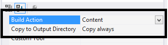
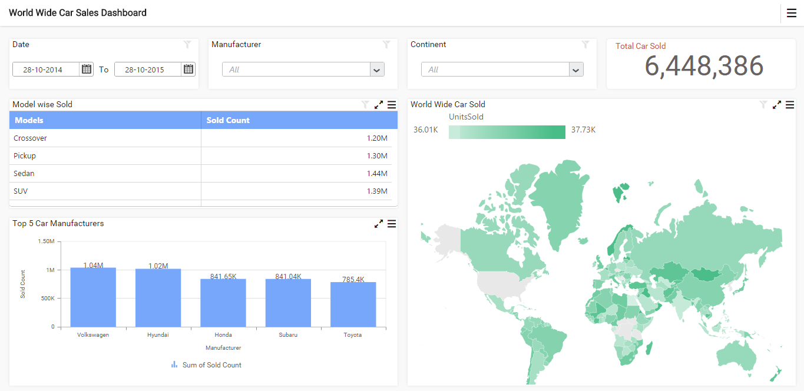

# Getting Started with ASP.NET MVC Application

  This section describes how to create an ASP.NET MVC application with an embedded dashboard viewer.

## Project Creation

   Create a new empty ASP.NET MVC project using Microsoft Visual Studio IDE.

## Adding files and references
   
   Add the scripts, styles and refer fonts that are required for the dashboard from the following location to the application project.
  
   `%localappdata%\Syncfusion\Dashboard\Samples\Common\Html`
	 
   Include the dashboard file (\*.sydx) in the project and set the `Build Action` and `Copy to Output Directory` properties to `Content` and `Copy always`, respectively.
  
   

## Creating Model, View and Controller
   
   Create a model class `DashboardViewer` with the following code.
   
   
   
   using System;
   using System.IO;
   using System.Net;
   using Microsoft.Win32;
   public class DashboardViewer
   {
		private readonly string _environmentFolder = AppDomain.CurrentDomain.BaseDirectory;
		string Version = System.Reflection.Assembly.GetExecutingAssembly().GetName().Version.ToString();
		public string ServiceUrl;
		public string Errormessage;
		
		public DashboardViewer()
		{
			#region Pick Dashboard Windows Service Url
			ServiceUrl = GetWindowsServiceUrl();
			#endregion
			
			#region Pick IISExpress or IIS  Dashboard Service Url if Windows Dashboard Service is not running
			if (ValidateDashboardService(ServiceUrl))
			{
				DashboardServiceSerialization serializer = new DashboardServiceSerialization();
				DashboardServicePreviewSettings settings = new DashboardServicePreviewSettings();
				string dashboardServiceSettingPath = Environment.GetFolderPath(Environment.SpecialFolder.ApplicationData) + @"\Syncfusion\Dashboard Platform SDK\" + Version + @"\DashboardServiceSetting.xml";
				if (File.Exists(dashboardServiceSettingPath))
				{
					settings = serializer.Deserialize(dashboardServiceSettingPath);
					if (!ValidateDashboardService(settings.ServiceURL))
						ServiceUrl = settings.ServiceURL;
					else
					{
						ServiceUrl = string.Empty;
						Errormessage = "Dashboard Service is not running. Run DashboardServiceInstaller.exe file to start Dashboard Service in IIS Express";
					}
				}
				else
				{
					Errormessage = "Dashboard Service is not running. Run DashboardServiceInstaller.exe file to start Dashboard Service in IIS Express";
					ServiceUrl = string.Empty;
				}
			}
			#endregion
		}
		
		/// 

		/// Validate whether Dashboard Service is running in the provided Url
		/// 

		/// <param name="dashboardServiceUrl">Dashboard Service Url</param>
		/// <returns>true, if valid; false otherwise</returns>
		private static bool ValidateDashboardService(string dashboardServiceUrl)
		{
			bool errorOccured = false;
			try
			{
				if (string.IsNullOrWhiteSpace(dashboardServiceUrl))
				{
					return true;
				}
				if (!dashboardServiceUrl.Contains("http://") && !dashboardServiceUrl.Contains("https://"))
					dashboardServiceUrl = "http://" + dashboardServiceUrl + @"/IsServiceExists";
				else
					dashboardServiceUrl = dashboardServiceUrl + @"/IsServiceExists";
				WebRequest request = WebRequest.Create(new Uri(dashboardServiceUrl, UriKind.Absolute));
				request.Method = "GET";
				using (WebResponse response = request.GetResponse())
				{
					using (StreamReader reader = new StreamReader(response.GetResponseStream()))
					{
						string text = reader.ReadToEnd();
						if (!text.Contains(System.Convert.ToBase64String(System.Text.Encoding.UTF8.GetBytes("DashboardServiceExists"))))
						{
							errorOccured = true;
						}
					}
				}
				dashboardServiceUrl = dashboardServiceUrl.Replace(@"/IsServiceExists", "");

			}
			catch (Exception e)
			{
				dashboardServiceUrl = dashboardServiceUrl.Replace(@"/IsServiceExists", "");
				errorOccured = true;
			}
			return errorOccured;
		}
		
		/// 

		/// Gets the Dashboard Windows Service URL 
		/// 

		/// <returns>Service URL of Dashboard Windows Service</returns>
		private string GetWindowsServiceUrl()
        {
            string url = string.Empty;
            try
            {
                RegistryKey key = Registry.LocalMachine.OpenSubKey(@"Software\SyncfusionDashboard\Syncfusion Dashboard Service");
                if (key == null)
                    key = Registry.LocalMachine.OpenSubKey(@"Software\Wow6432Node\SyncfusionDashboard\Syncfusion Dashboard Service");
                if (key != null)
                {
                    url = (string)key.GetValue("ServiceURL");
                    key.Close();
                }
            }
            catch (Exception)
            {

            }
            return url;
        }
       }

   
   
   Imports System
   Imports System.IO
   Imports System.Net
   Imports Microsoft.Win32
   Public Class DashboardViewer
		Private ReadOnly _environmentFolder As String = AppDomain.CurrentDomain.BaseDirectory
		Private Version As String = System.Reflection.Assembly.GetExecutingAssembly().GetName().Version.ToString()
		Public ServiceUrl As String
		Public Errormessage As String
		Public Sub New()
            'Pick Dashboard Windows Service Url
			ServiceUrl = GetWindowsServiceUrl()
        
            'Pick IISExpress or IIS  Dashboard Service Url if Windows Dashboard Service is not running
			If ValidateDashboardService(ServiceUrl) Then
				Dim serializer As New DashboardServiceSerialization()
				Dim settings As New DashboardServicePreviewSettings()
				Dim dashboardServiceSettingPath As String = Environment.GetFolderPath(Environment.SpecialFolder.ApplicationData) & "\Syncfusion\Dashboard Platform SDK\" & Version & "\DashboardServiceSetting.xml"
				If File.Exists(dashboardServiceSettingPath) Then
					settings = serializer.Deserialize(dashboardServiceSettingPath)
					If Not ValidateDashboardService(settings.ServiceURL) Then
						ServiceUrl = settings.ServiceURL
					Else
						ServiceUrl = String.Empty
						Errormessage = "Dashboard Service is not running. Run DashboardServiceInstaller.exe file to start Dashboard Service in IIS Express"
					End If
				Else
					Errormessage = "Dashboard Service is not running. Run DashboardServiceInstaller.exe file to start Dashboard Service in IIS Express"
					ServiceUrl = String.Empty
				End If
			End If

		End Sub
		
		''' 

		''' Validate whether Dashboard Service is running in the Url
		''' 

		''' <param name="dashboardServiceUrl">Dashboard Service Url</param>
		''' <returns>true, if valid; false otherwise</returns>
		Private Shared Function ValidateDashboardService(ByVal dashboardServiceUrl As String) As Boolean
			Dim errorOccured As Boolean = False
			Try
				If String.IsNullOrWhiteSpace(dashboardServiceUrl) Then
					Return True
				End If
				If Not dashboardServiceUrl.Contains("http://") AndAlso Not dashboardServiceUrl.Contains("https://") Then
					dashboardServiceUrl = "http://" & dashboardServiceUrl & "/IsServiceExists"
				Else
					dashboardServiceUrl = dashboardServiceUrl & "/IsServiceExists"
				End If
				Dim request As WebRequest = WebRequest.Create(New Uri(dashboardServiceUrl, UriKind.Absolute))
				request.Method = "GET"
				Using response As WebResponse = request.GetResponse()
					Using reader As New StreamReader(response.GetResponseStream())
						Dim text As String = reader.ReadToEnd()
						If Not text.Contains(System.Convert.ToBase64String(System.Text.Encoding.UTF8.GetBytes("DashboardServiceExists"))) Then
							errorOccured = True
						End If
					End Using
				End Using
				dashboardServiceUrl = dashboardServiceUrl.Replace("/IsServiceExists", "")

			Catch e As Exception
				dashboardServiceUrl = dashboardServiceUrl.Replace("/IsServiceExists", "")
				errorOccured = True
			End Try
			Return errorOccured
		End Function
		
		''' 

		''' Used to pick the Dashboard Windows Service URL 
		''' 

		''' <returns>Service URL of Dashboard Windows Service</returns>
		Private Function GetWindowsServiceUrl() As String
			Dim url As String = String.Empty
			Try
				Dim key As RegistryKey = Registry.LocalMachine.OpenSubKey("Software\SyncfusionDashboard\Syncfusion Dashboard Service")
				If key Is Nothing Then
					key = Registry.LocalMachine.OpenSubKey("Software\Wow6432Node\SyncfusionDashboard\Syncfusion Dashboard Service")
				End If
				If key IsNot Nothing Then
					url = CStr(key.GetValue("ServiceURL"))
					key.Close()
				End If
			Catch e1 As Exception

			End Try
			Return url
    End Function
	End Class
    End Namespace
   
   
   
   Add a class `DashboardServicePreviewSettings` with the following code.
   
   
   
   using System;
   using System.Collections.Generic;
   public class DashboardServicePreviewSettings
   {
		public string ServiceURL { get; set; }
		public List<Guid> DashboardServiceInstances { get; set; }
		public DashboardServicePreviewSettings()
		{
			DashboardServiceInstances = new List<Guid>();
		}
   }
   
   
   Imports System
   Imports System.Collections.Generic
   Public Class DashboardServicePreviewSettings
		Public Property ServiceURL() As String
		Public Property DashboardServiceInstances() As List(Of Guid)
		Public Sub New()
			DashboardServiceInstances = New List(Of Guid)()
		End Sub
   End Class
   
   
	
   Add a model class `DashboardServiceSerialization` to serialize and deserialize the DashboardService URL when Dashboard Service is running in IIS Express.
   
   
   
   using System;
   using System.IO;
   using System.Xml.Serialization;
   public class DashboardServiceSerialization
   {
		static readonly XmlSerializer previewSerializer = new XmlSerializer(typeof(DashboardServicePreviewSettings));
		public void Serialize(DashboardServicePreviewSettings settings, string path)
		{
			try
			{
				using (StreamWriter writer = new StreamWriter(path))
				{
					previewSerializer.Serialize(writer, settings);
				}
			}
			catch (Exception)
			{

			}
		}
		public DashboardServicePreviewSettings Deserialize(string path)
		{
			DashboardServicePreviewSettings settings = new DashboardServicePreviewSettings();
			try
			{
				using (StreamReader reader = new StreamReader(path))
				{
					settings = (DashboardServicePreviewSettings)previewSerializer.Deserialize(reader);
				}
			}
			catch (Exception)
			{

			}
			return settings;
		}
	}
   
   
   Imports System
   Imports System.IO
   Imports System.Xml.Serialization
	Public Class DashboardServiceSerialization
		Private Shared ReadOnly previewSerializer As New XmlSerializer(GetType(DashboardServicePreviewSettings))
		Public Sub Serialize(ByVal settings As DashboardServicePreviewSettings, ByVal path As String)
			Try
				Using writer As New StreamWriter(path)
					previewSerializer.Serialize(writer, settings)
				End Using
			Catch e1 As Exception

			End Try

		End Sub
		Public Function Deserialize(ByVal path As String) As DashboardServicePreviewSettings
			Dim settings As New DashboardServicePreviewSettings()
			Try
				Using reader As New StreamReader(path)
					settings = CType(previewSerializer.Deserialize(reader), DashboardServicePreviewSettings)
				End Using
			Catch e1 As Exception

			End Try
			Return settings
		End Function
   End Class
   
   
   
   Create a controller class `DashboardViewerController` and set the report path and service URL using the following code.
	 
   
   
   using System;
   using System.Web.Mvc;
   public class DashboardViewerController : Controller
   {
	  public ActionResult Index()
	  {
		 ViewBag.ReportPath = AppDomain.CurrentDomain.BaseDirectory.Replace("\\", "\\\\") + "bin\\\\WorldWideCarSalesDashboard.sydx";
         DashboardViewer dashboardViewer = new DashboardViewer();
         ViewBag.ServieURL = dashboardViewer.ServiceUrl;
		 return View();
	  }
   }
   
   
   Imports System
   Imports System.Web.Mvc
   Public Class DashboardViewerController
	 Inherits Controller
	 Public Function Index() As ActionResult
		ViewBag.ReportPath = AppDomain.CurrentDomain.BaseDirectory.Replace("\", "\\") & "bin\\WorldWideCarSalesDashboard.sydx"
		Dim dashboardViewer As New DashboardViewer()
		ViewBag.ServieURL = dashboardViewer.ServiceUrl
	  Return View()
	 End Function
   End Class
   
   
   
   Add a Razor view (`Index.cshtml` file) with the following template included.
  
   
   <!DOCTYPE html>
   <html>
   <head>
	 
		<title>LocalEmbeddedDashboard</title>
		
		
		
		
		<link href="@Url.Content("~/themes/bootstrap.css")" rel="stylesheet">
		<link href="@Url.Content("~/themes/default-theme/ej.widgets.all.min.css")" rel="stylesheet">
		<link href="@Url.Content("~/themes/ej.DashboardViewer.css")" rel="stylesheet">
		<link href="@url.Content("~/themes/e.Breadcrumb.css")" rel="stylesheet">
		<link href="@Url.Content("~/themes/e-Card.css")" rel="stylesheet">
		<link href="@Url.Content("~/themes/ej.dashboarddatepicker.css")" rel="stylesheet">
		<link href="@Url.Content("~/themes/dashboard-themes/light/ej.DashboardViewer.css")" rel="stylesheet">
		<link href="@Url.Content("~/themes/dashboard-themes/light/lightcontroltheme.css")" rel="stylesheet">
		<link href="@Url.Content("~/themes/default-theme/ej.theme.min.css")" rel="stylesheet">
		<link href="@Url.Content("~/themes/default-theme/ej.pivotgridcustomtheme.css")" rel="stylesheet">
	 </head>
	 </html>
   

## Control Initialization

   Initialize the Dashboard Viewer using the following script under the `body` tag.

   
   

   
   

## Configuring Route

   In the `RegisterRoutes` method in the `RouteConfig` class in the `App_Start` folder, set the controller name as `DashboardViewer`.
  
   Build and run the application to view the dashboard.
  
   