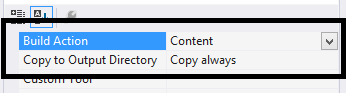
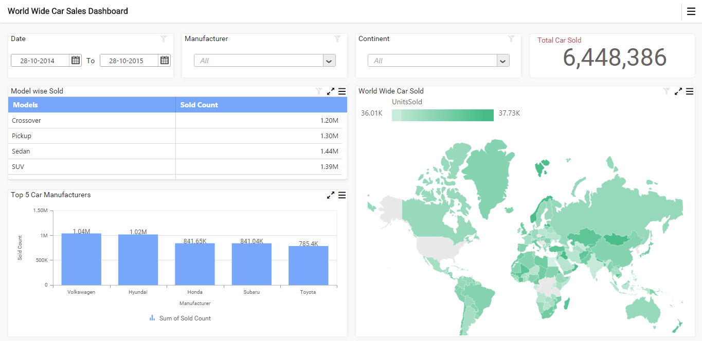

# Getting Started with ASP.NET Application

  This section describes how to create an ASP.NET application with embedded dashboard viewer.

## Project Creation
  
   Create a new ASP.NET Empty Web application project using Microsoft Visual Studio IDE.
 
## Adding files and references

   Add the scripts, styles and refer fonts that are required for the dashboard from the following location to the application project.
  
   `%localappdata%\Syncfusion\Dashboard\Samples\Common\Html`
	 
   Include the dashboard file (\*.sydx) into the project.

   Set the `Build Action` property to `Content` and the `Copy to Output Directory` property to `Copy always` as shown in the following image for all the files added to the project.
  
   

   Create a Web Form named as `Default` and add the following template.
     
   
   
   <%@ Page Title="WebApplication1" Language="C#" AutoEventWireup="true" CodeBehind="Default.aspx.cs" Inherits="WebApplication1.Default" %>
   <!DOCTYPE html> 
   <html lang="en">
	 <head id="Head1" runat="server">
		<meta charset="utf-8" />
		<title>WebApplication1</title>
		
		
		
		
		
		<link href="themes/bootstrap.css" rel="stylesheet" />
		<link href="themes/default-theme/ej.widgets.all.min.css" rel="stylesheet" />
        <link href="themes/e-Breadcrumb.css" rel="stylesheet" />
		<link href="themes/ej.DashboardViewer.css" rel="stylesheet" />
		<link href="themes/e-Card.css" rel="stylesheet" />
		<link href="themes/dashboard-themes/light/ej.DashboardViewer.css" rel="stylesheet" />
		<link href="themes/dashboard-themes/light/lightcontroltheme.css" rel="stylesheet" />
		<link href="themes/default-theme/ej.theme.min.css" rel="stylesheet" />
		<link href="themes/default-theme/ej.pivotgridcustomtheme.css" rel="stylesheet" />
	 </head>
   </html>
   
   
   <%@ Page Title="WebApplication1" Language="vb" AutoEventWireup="true" CodeBehind="Default.aspx.vb" Inherits="WebApplication1._Default" %>
   <!DOCTYPE html> 
   <html lang="en">
	 <head id="Head1" runat="server">
		<meta charset="utf-8" />
		<title>WebApplication1</title>
		
		
		
		
		
		<link href="themes/bootstrap.css" rel="stylesheet" />
		<link href="themes/default-theme/ej.widgets.all.min.css" rel="stylesheet" />
		<link href="themes/ej.DashboardViewer.css" rel="stylesheet" />
		<link href="themes/e-Card.css" rel="stylesheet" />
		<link href="themes/dashboard-themes/light/ej.DashboardViewer.css" rel="stylesheet" />
		<link href="themes/dashboard-themes/light/lightcontroltheme.css" rel="stylesheet" />
		<link href="themes/default-theme/ej.theme.min.css" rel="stylesheet" />
		<link href="themes/default-theme/ej.pivotgridcustomtheme.css" rel="stylesheet" />
	 </head>
   </html>
   
   
	 
## Control Initialization

   Initialize Dashboard Viewer with the following script under `body` tag (after closing `head` tag) in the same file.
    
    
   
   

	 
    
   
   

	 
   
   
   
   Create a class named `DashboardViewer` with the following code.
  
   
   
   using System;
   using System.IO;
   using System.Net;
   using Microsoft.Win32;
   public class DashboardViewer
   {
        private readonly string _environmentFolder = AppDomain.CurrentDomain.BaseDirectory;
        string version = System.Reflection.Assembly.GetExecutingAssembly().GetName().Version.ToString();
        public string ServiceUrl;
        public string Errormessage;
        public DashboardViewer()
        {
            #region Pick Windows Dashboard Service Url
            ServiceUrl = GetWindowsServiceUrl();
            #endregion
            #region Pick IISExpress or IIS  Dashboard Service Url if Windows Dashboard Service is not running
            if (ValidateDashboardService(ServiceUrl))
            {
                DashboardServiceSerialization serializer = new DashboardServiceSerialization();
                DashboardServicePreviewSettings settings = new DashboardServicePreviewSettings();
                string dashboardServiceSettingPath = Environment.GetFolderPath(Environment.SpecialFolder.ApplicationData) + @"\Syncfusion\Dashboard Platform SDK\" + version + @"\DashboardServiceSetting.xml";
                if (File.Exists(dashboardServiceSettingPath))
                {
                    settings = serializer.Deserialize(dashboardServiceSettingPath);
                    if (!ValidateDashboardService(settings.ServiceURL))
                        ServiceUrl = settings.ServiceURL;
                    else
                    {
                        ServiceUrl = string.Empty;
                        Errormessage = "Dashboard Service is not running. Run DashboardServiceInstaller.exe file to start Dashboard Service in IIS Express";
                    }
                }
                else
                {
                    Errormessage = "Dashboard Service is not running. Run DashboardServiceInstaller.exe file to start Dashboard Service in IIS Express";
                    ServiceUrl = string.Empty;
                }
            }
            #endregion
        }
		
        /// 

        /// Used to pick the Windows Dashboard Service URL 
        /// 

        /// <returns>ServiceURL of Windows Dashboard Service</returns>
        private string GetWindowsServiceUrl()
        {
            string url = string.Empty;
            try
            {
                RegistryKey key = Registry.LocalMachine.OpenSubKey(@"Software\SyncfusionDashboard\Syncfusion Dashboard Service");
                if (key == null)
                    key = Registry.LocalMachine.OpenSubKey(@"Software\Wow6432Node\SyncfusionDashboard\Syncfusion Dashboard Service");
                if (key != null)
                {
                    url = (string)key.GetValue("ServiceURL");
                    key.Close();
                }
            }
            catch (Exception)
            {

            }
            return url;
        }

		
        /// 

        /// Validate whether Dashboard Service is running in the Url
        /// 

        /// <param name="dashboardServiceUrl">Dashboard Service Url</param>
        /// <returns>returns whether valid dashboard service</returns>
        private static bool ValidateDashboardService(string dashboardServiceUrl)
        {
            bool errorOccured = false;
            try
            {
                if (string.IsNullOrWhiteSpace(dashboardServiceUrl))
                {
                    return true;
                }
                if (!dashboardServiceUrl.Contains("http://") && !dashboardServiceUrl.Contains("https://"))
                    dashboardServiceUrl = "http://" + dashboardServiceUrl + @"/IsServiceExists";
                else
                    dashboardServiceUrl = dashboardServiceUrl + @"/IsServiceExists";
                WebRequest request = WebRequest.Create(new Uri(dashboardServiceUrl, UriKind.Absolute));
                request.Method = "GET";
                using (WebResponse response = request.GetResponse())
                {
                    using (StreamReader reader = new StreamReader(response.GetResponseStream()))
                    {
                        string text = reader.ReadToEnd();
                        if (!text.Contains(System.Convert.ToBase64String(System.Text.Encoding.UTF8.GetBytes("DashboardServiceExists"))))
                        {
                            errorOccured = true;
                        }
                    }
                }
                dashboardServiceUrl = dashboardServiceUrl.Replace(@"/IsServiceExists", "");

            }
            catch (Exception e)
            {
                dashboardServiceUrl = dashboardServiceUrl.Replace(@"/IsServiceExists", "");
                errorOccured = true;
            }
            return errorOccured;
        }
   }
   
   
   Imports System
   Imports System.IO
   Imports System.Net
   Imports Microsoft.Win32
   Public Class DashboardViewer
		Private ReadOnly _environmentFolder As String = AppDomain.CurrentDomain.BaseDirectory
		Private version As String = System.Reflection.Assembly.GetExecutingAssembly().GetName().Version.ToString()
		Public ServiceUrl As String
		Public Errormessage As String
		
		Public Sub New()
			'Pick Dashboard Windows Service URL
			ServiceUrl = GetWindowsServiceUrl()

			'Pick IISExpress or IIS  Dashboard Service Url if Windows Dashboard Service is not running
			If ValidateDashboardService(ServiceUrl) Then
				Dim serializer As New DashboardServiceSerialization()
				Dim settings As New DashboardServicePreviewSettings()
				Dim dashboardServiceSettingPath As String = Environment.GetFolderPath(Environment.SpecialFolder.ApplicationData) & "\Syncfusion\Dashboard Platform SDK\" & version & "\DashboardServiceSetting.xml"
				If File.Exists(dashboardServiceSettingPath) Then
					settings = serializer.Deserialize(dashboardServiceSettingPath)
					If Not ValidateDashboardService(settings.ServiceURL) Then
						ServiceUrl = settings.ServiceURL
					Else
						ServiceUrl = String.Empty
						Errormessage = "Dashboard Service is not running. Run DashboardServiceInstaller.exe file to start Dashboard Service in IIS Express"
					End If
				Else
					Errormessage = "Dashboard Service is not running. Run DashboardServiceInstaller.exe file to start Dashboard Service in IIS Express"
					ServiceUrl = String.Empty
				End If
			End If
		End Sub
		
		''' 

		''' Used to pick the Windows Dashboard Service URL 
		''' 

		''' <returns>ServiceURL of Windows Dashboard Service</returns>
		Private Function GetWindowsServiceUrl() As String
			Dim url As String = String.Empty
			Try
				Dim key As RegistryKey = Registry.LocalMachine.OpenSubKey("Software\SyncfusionDashboard\Syncfusion Dashboard Service")
				If key Is Nothing Then
					key = Registry.LocalMachine.OpenSubKey("Software\Wow6432Node\SyncfusionDashboard\Syncfusion Dashboard Service")
				End If
				If key IsNot Nothing Then
					url = CStr(key.GetValue("ServiceURL"))
					key.Close()
				End If
			Catch e1 As Exception

			End Try
			Return url
                End Function
		
		''' 

		''' Validate whether Dashboard Service is running in the Url
		''' 

		''' <param name="dashboardServiceUrl">Dashboard Service Url</param>
		''' <returns>returns whether valid dashboard service or not.</returns>
		Private Shared Function ValidateDashboardService(ByVal dashboardServiceUrl As String) As Boolean
			Dim errorOccured As Boolean = False
			Try
				If String.IsNullOrWhiteSpace(dashboardServiceUrl) Then
					Return True
				End If
				If Not dashboardServiceUrl.Contains("http://") AndAlso Not dashboardServiceUrl.Contains("https://") Then
					dashboardServiceUrl = "http://" & dashboardServiceUrl & "/IsServiceExists"
				Else
					dashboardServiceUrl = dashboardServiceUrl & "/IsServiceExists"
				End If
				Dim request As WebRequest = WebRequest.Create(New Uri(dashboardServiceUrl, UriKind.Absolute))
				request.Method = "GET"
				Using response As WebResponse = request.GetResponse()
					Using reader As New StreamReader(response.GetResponseStream())
						Dim text As String = reader.ReadToEnd()
						If Not text.Contains(System.Convert.ToBase64String(System.Text.Encoding.UTF8.GetBytes("DashboardServiceExists"))) Then
							errorOccured = True
						End If
					End Using
				End Using
				dashboardServiceUrl = dashboardServiceUrl.Replace("/IsServiceExists", "")

			Catch e As Exception
				dashboardServiceUrl = dashboardServiceUrl.Replace("/IsServiceExists", "")
				errorOccured = True
			End Try
			Return errorOccured
		End Function
   End Class
   
   
   
   Add a class named `DashboardServicePreviewSettings` with the following code.
   
   
   
   using System;
   using System.Collections.Generic;
   public class DashboardServicePreviewSettings
   {
        public string ServiceURL { get; set; }
        public List<Guid> DashboardServiceInstances { get; set; }
        public DashboardServicePreviewSettings()
        {
            DashboardServiceInstances = new List<Guid>();
        }
   }
   
   
   Imports System
   Imports System.Collections.Generic
   Public Class DashboardServicePreviewSettings
		Public Property ServiceURL() As String
		Public Property DashboardServiceInstances() As List(Of Guid)
		Public Sub New()
			DashboardServiceInstances = New List(Of Guid)()
		End Sub
   End Class
   
   
   
   Add a class named `DashboardServiceSerialization` to serialize and deserialize the DashboardService URL when Dashboard Service is running in IIS Express. 
   
   
   
   using System;
   using System.IO;
   using System.Xml.Serialization;
   public class DashboardServiceSerialization
   {
        static readonly XmlSerializer previewSerializer = new XmlSerializer(typeof(DashboardServicePreviewSettings));
        public void Serialize(DashboardServicePreviewSettings settings, string path)
        {
            try
            {
                using (StreamWriter writer = new StreamWriter(path))
                {
                    previewSerializer.Serialize(writer, settings);
                }
            }
            catch (Exception)
            {

            }
        }
        public DashboardServicePreviewSettings Deserialize(string path)
        {
            DashboardServicePreviewSettings settings = new DashboardServicePreviewSettings();
            try
            {
                using (StreamReader reader = new StreamReader(path))
                {
                    settings = (DashboardServicePreviewSettings)previewSerializer.Deserialize(reader);
                }
            }
            catch (Exception)
            {

            }
            return settings;
        }
   }
   
   
   Imports System
   Imports System.IO
   Imports System.Xml.Serialization
   Public Class DashboardServiceSerialization
		Private Shared ReadOnly previewSerializer As New XmlSerializer(GetType(DashboardServicePreviewSettings))
		Public Sub Serialize(ByVal settings As DashboardServicePreviewSettings, ByVal path As String)
			Try
				Using writer As New StreamWriter(path)
					previewSerializer.Serialize(writer, settings)
				End Using
			Catch e1 As Exception

			End Try

		End Sub
		Public Function Deserialize(ByVal path As String) As DashboardServicePreviewSettings
			Dim settings As New DashboardServicePreviewSettings()
			Try
				Using reader As New StreamReader(path)
					settings = CType(previewSerializer.Deserialize(reader), DashboardServicePreviewSettings)
				End Using
			Catch e1 As Exception

			End Try
			Return settings
		End Function
   End Class
   
   
   
## Dashboard and Service Binding

   Create a global application class file named `Global.asax`.
    
   Define the properties with public access level for handling dashboard path and service URL through the following code definitions under `Global` class in `Global.asax` file.
   
   
   
   public static string ReportPath;
   public static string Url;
   
   
   Public Shared ReportPath As String
   Public Shared Url As String
   
   
   
   Set the dashboard path and service URL using the following code under `Application_Start` method in `Global.asax` file.
	 
   
   
      ReportPath = AppDomain.CurrentDomain.BaseDirectory.Replace("\\", "\\\\") + "bin\\\\WorldWideCarSalesDashboard.sydx";
      DashboardViewer dashboardViewer = new DashboardViewer();
      Url = dashboardViewer.ServiceUrl;
   
   
      ReportPath = AppDomain.CurrentDomain.BaseDirectory.Replace("\", "\\") & "bin\\WorldWideCarSalesDashboard.sydx"
	  Dim dashboardViewer As New DashboardViewer()
	  Url = dashboardViewer.ServiceUrl
   
   
	 
   Build and run the application to view the dashboard.
  
   