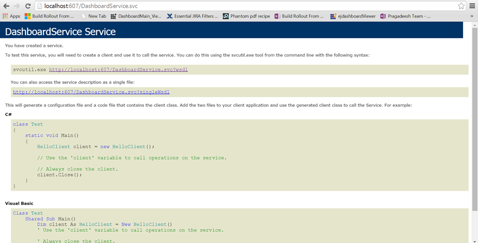

# Embedding Dashboard Viewer in a HTML page

## HTML page creation

Create a new document and save it as .html extension.

### Adding help files

After installing Dashboard SDK [setup](https://www.syncfusion.com/downloads/dashboard), scripts, themes, font folders will be found in the below location.

`%localappdata%\Syncfusion\Dashboard\Samples\Common\Html`

Include these scripts, themes, font folders in your application and refer the files of each folder in the HTML page as mentioned below:


<head>

<link href="themes/bootstrap.css" rel="stylesheet" />
<link href="themes/default-theme/ej.widgets.all.min.css" rel="stylesheet" />
<link href="themes/ej.DashboardViewer.css" rel="stylesheet" />
<link href="themes/e-Card.css" rel="stylesheet" />
<link href="themes/dashboard-themes/light/ej.DashboardViewer.css" rel="stylesheet" />
<link href="themes/dashboard-themes/light/lightcontroltheme.css" rel="stylesheet" />
<link href="themes/default-theme/ej.theme.min.css" rel="stylesheet" />
<link href="themes/default-theme/ej.pivotgridcustomtheme.css" rel="stylesheet" />
</head>


### Hosting Dashboard Service
 
After installing the Dashboard SDK setup you will find Service and DashboardServiceInstaller folder in the following location and these folders are required to start the Dashboard Service.

`%localappdata%\Syncfusion\Dashboard\Samples\Common`

To host the Dashboard Service in IIS, Please run the `SyncfusionDashboardServiceInstaller-IIS.exe` from the following location and enter the port number in which dashboard service to be hosted.

`%localappdata%\Syncfusion\Dashboard\Samples\Common\DashboardServiceInstaller`

For Example:
 
If you are hosting Dashboard Service at port #607 in localhost, then Dashboard Service URL will be framed as below:

`http://localhost:607/DashboardService.svc`

Open this URL in any of the browser and make sure Dashboard Service is running.

### Adding Dashboard Service and Dashboard File Location

Add the hosted Dashboard Service URL and the Dashboard file (*.SYDX) file location to the Dashboard Viewer like below. 



 


Finally you get the complete Dashboard Viewer Sample structure like below. 


<html>
<head>

<link href="themes/bootstrap.css" rel="stylesheet" />
<link href="themes/default-theme/ej.widgets.all.min.css" rel="stylesheet" />
<link href="themes/ej.DashboardViewer.css" rel="stylesheet" />
<link href="themes/e-Card.css" rel="stylesheet" />
<link href="themes/dashboard-themes/light/ej.DashboardViewer.css" rel="stylesheet" />
<link href="themes/dashboard-themes/light/lightcontroltheme.css" rel="stylesheet" />
<link href="themes/default-theme/ej.theme.min.css" rel="stylesheet" />
<link href="themes/default-theme/ej.pivotgridcustomtheme.css" rel="stylesheet" />
</head>
<body>
  

   
</body>
</html>


