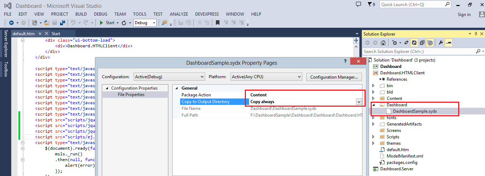

# Getting Started with LightSwitch HTML Application

  This section describes how to create an LightSwitch HTML application with embedded dashboard viewer.
   
## Creating LightSwitch HTML Project

   Open Visual Studio IDE and navigate to File->New->Project, click on LightSwitch and select LightSwitch HTML Application and give a name (say Dashboard) and click OK.
   
   
   
   N> You must have the LightSwitch HTML Client extension installed if you are not using Microsoft Visual Studio 2012 Update 2 or later version. You must have `Office Developer Tools for Visual Studio 2015` installed, if you are using Microsoft Visual Studio 2015.
   
   Now you will find a solution with three projects created by default in Solution Explorer View.
   
   
  
## Adding references to HTML Client Project

   Right click on Dashboard.HTMLClient project and click on `Open Folder in File Explorer`, and copy the content from this location into HTMLClient folder.
   
   `%localappdata%\Syncfusion\Dashboard\Samples\Common\Html` 
   
   
   
   In Solution Explorer, click `Show All Files` icon if not checked, select those newly added folder and files, right click and select `Include in Project`.
   
   
   
   Set the `Build Action` property to `Content` and the `Copy to Output Directory` property to `Copy always` as shown in the following image for all the files added to the project.
   
   
   
## Adding scripts and links to HTML Client Project

   Open `default.htm` in Dashboard.HTMLClient project.
   
   Copy the below link references above `</head>` tag.

   
   <link href="Content/ej/responsive-css/ejgrid.responsive.css" rel="stylesheet" />
   <link href="themes/bootstrap.css" rel="stylesheet" />
   <link href="themes/default-theme/ej.widgets.all.min.css" rel="stylesheet" />
   <link href="themes/ej.DashboardViewer.css" rel="stylesheet" />
   <link href="themes/e.Breadcrumb.css" rel="stylesheet"/>
   <link href="themes/e-Card.css" rel="stylesheet" />
   <link href="themes/dashboard-themes/light/ej.DashboardViewer.css" rel="stylesheet" />
   <link href="themes/dashboard-themes/light/lightcontroltheme.css" rel="stylesheet" />
   <link href="themes/default-theme/ej.theme.min.css" rel="stylesheet" />
   <link href="themes/default-theme/ej.pivotgridcustomtheme.css" rel="stylesheet" />
   
   
   Now, the file will look like below.
   
   
   
   Copy the below script references above `
   
   
   
   
   
   Now, the file will look like below.
   
   
   
## Adding a dashboard to HTML Client Project

   Create a new folder under HTMLClient Project, right click and select New Folder (name it as Dashboard) and place the dashboard SYDX file inside this folder (name of dashboard file is DashboardSample.sydx).
   
   Right click on the SYDX file and select properties,
   
   Set the `Package Action` to `Content` and set the `Copy to Output Directory` to `Copy Always`.
   
   
 
   
## Creating controllers for handling path and service URL under Server project

   Create a new folder (named it as API) under Dashboard.Server project.
   
   
   
  
   Create a Web API class inside API folder

   Right click on the newly created API folder Add->New Item, navigate to Web ->WebAPI and click on Web API controller class (v2), (name it as DashboardPathController.cs).
   
   
   
 
   
   Replace all the codes present in this class with the below one.
   
   
   
   public class DashboardPathController : ApiController
   {
     // Get api/<controller>
      public Dictionary<string, string> Get()
        {
            Dictionary<string, string> reportDetails = new Dictionary<string, string>();
            DashboardViewer dashboardViewer = new DashboardViewer();
            string str = AppDomain.CurrentDomain.BaseDirectory.Substring(0, AppDomain.CurrentDomain.BaseDirectory.LastIndexOf("Bin")) + "LocalEmbeddedDashboard.Server\\bin\\Debug\\Dashboard\\WorldWideCarSalesDashboard.sydx";
            reportDetails.Add("ReportPath", str);
            reportDetails.Add("ServiceURL", dashboardViewer.ServiceUrl);
            reportDetails.Add("Errormessage", dashboardViewer.Errormessage);
            return reportDetails;
     }
   }
   
   
   Public Class DashboardPathController
	   Inherits ApiController
       
	 ' Get api/<controller>
		Public Function [Get]() As Dictionary(Of String, String)
			Dim reportDetails As New Dictionary(Of String, String)()
			Dim dashboardViewer As New DashboardViewer()
			Dim str As String = AppDomain.CurrentDomain.BaseDirectory.Substring(0, AppDomain.CurrentDomain.BaseDirectory.LastIndexOf("Bin")) & "LocalEmbeddedDashboard.Server\bin\Debug\Dashboard\WorldWideCarSalesDashboard.sydx"
			reportDetails.Add("ReportPath", str)
			reportDetails.Add("ServiceURL", dashboardViewer.ServiceUrl)
			reportDetails.Add("Errormessage", dashboardViewer.Errormessage)
			Return reportDetails
	 End Function
   End Class
   
   
   
   Now, the file will look like below.
   
   
   
    
 ## Creating model
 
 Create a new folder (named it as Models) under Dashboard.Server project.

 Create a class `DashboardViewer` inside the `Models` folder with the following code.  
 
  
  
   

    public class DashboardViewer
    {
        private readonly string _environmentFolder = AppDomain.CurrentDomain.BaseDirectory;
        string Version = System.Reflection.Assembly.GetExecutingAssembly().GetName().Version.ToString();
        public string ServiceUrl;
        public string Errormessage;
        public DashboardViewer()
        {
            #region Pick Windows Dashboard Service Url
            ServiceUrl = GetWindowsServiceUrl();
            #endregion        
            #region Pick IISExpress or IIS  Dashboard Service URL if Dashboard Windows Service is not running
            if (ValidateDashboardService(ServiceUrl))
            {
                DashboardServiceSerialization serializer = new DashboardServiceSerialization();
                DashboardServicePreviewSettings settings = new DashboardServicePreviewSettings();
                string dashboardServiceSettingPath = Environment.GetFolderPath(Environment.SpecialFolder.ApplicationData) + @"\Syncfusion\Dashboard Platform SDK\" + Version + @"\DashboardServiceSetting.xml";
                if (File.Exists(dashboardServiceSettingPath))
                {
                    settings = serializer.Deserialize(dashboardServiceSettingPath);
                    if (!ValidateDashboardService(settings.ServiceURL))
                        ServiceUrl = settings.ServiceURL;
                    else
                    {
                        ServiceUrl = string.Empty;
                        Errormessage = "Syncfusion Dashboard Service is not running. Please start the SyncfusionDashboardServiceInstaller-IISExpress.exe file  to start the service.";
                    }
                }
                else
                {
                    Errormessage = "Syncfusion Dashboard Service is not running. Please start the SyncfusionDashboardServiceInstaller-IISExpress.exe file  to start the service.";
                    ServiceUrl = string.Empty;
                }
            }
            #endregion
        }
        /// 

        /// Validate whether Dashboard Service is running in the URL
        /// 

        /// <param name="dashboardServiceUrl">Dashboard Service URL</param>
        /// <returns>returns whether valid dashboard service</returns>
        private static bool ValidateDashboardService(string dashboardServiceUrl)
        {
            bool errorOccured = false;
            try
            {
                if (string.IsNullOrWhiteSpace(dashboardServiceUrl))
                {
                    return true;
                }
                if (!dashboardServiceUrl.Contains("http://") && !dashboardServiceUrl.Contains("https://"))
                    dashboardServiceUrl = "http://" + dashboardServiceUrl + @"/IsServiceExists";
                else
                    dashboardServiceUrl = dashboardServiceUrl + @"/IsServiceExists";
                WebRequest request = WebRequest.Create(new Uri(dashboardServiceUrl, UriKind.Absolute));
                request.Method = "GET";
                using (WebResponse response = request.GetResponse())
                {
                    using (StreamReader reader = new StreamReader(response.GetResponseStream()))
                    {
                        string text = reader.ReadToEnd();
                        if (!text.Contains(System.Convert.ToBase64String(System.Text.Encoding.UTF8.GetBytes("DashboardServiceExists"))))
                        {
                            errorOccured = true;
                        }
                    }
                }
                dashboardServiceUrl = dashboardServiceUrl.Replace(@"/IsServiceExists", "");

            }
            catch (Exception e)
            {
                dashboardServiceUrl = dashboardServiceUrl.Replace(@"/IsServiceExists", "");
                errorOccured = true;
            }
            return errorOccured;
        }
        /// 

        /// Used to pick the Dashboard Windows Service URL 
        /// 

        /// <returns>Service URL of Dashboard Windows Service</returns>
        private string GetWindowsServiceUrl()
        {
            string url = string.Empty;
            try
            {
                RegistryKey key = Registry.LocalMachine.OpenSubKey(@"Software\SyncfusionDashboard\Syncfusion Dashboard Service");
                if (key == null)
                    key = Registry.LocalMachine.OpenSubKey(@"Software\Wow6432Node\SyncfusionDashboard\Syncfusion Dashboard Service");
                if (key != null)
                {
                    url = (string)key.GetValue("ServiceURL");
                    key.Close();
                }
            }
            catch (Exception)
            {

            }
            return url;
        }
    }

   
   
   Public Class DashboardViewer
		Private ReadOnly _environmentFolder As String = AppDomain.CurrentDomain.BaseDirectory
		Private Version As String = System.Reflection.Assembly.GetExecutingAssembly().GetName().Version.ToString()
		Public ServiceUrl As String
		Public Errormessage As String
		Public Sub New()
'			#Region "Pick Windows Dashboard Service Url"
			ServiceUrl = GetWindowsServiceUrl()
'			#End Region        
'			#Region "Pick IISExpress or IIS  Dashboard Service URL if Dashboard Windows Service is not running"
			If ValidateDashboardService(ServiceUrl) Then
				Dim serializer As New DashboardServiceSerialization()
				Dim settings As New DashboardServicePreviewSettings()
				Dim dashboardServiceSettingPath As String = Environment.GetFolderPath(Environment.SpecialFolder.ApplicationData) & "\Syncfusion\Dashboard Platform SDK\" & Version & "\DashboardServiceSetting.xml"
				If File.Exists(dashboardServiceSettingPath) Then
					settings = serializer.Deserialize(dashboardServiceSettingPath)
					If Not ValidateDashboardService(settings.ServiceURL) Then
						ServiceUrl = settings.ServiceURL
					Else
						ServiceUrl = String.Empty
						Errormessage = "Syncfusion Dashboard Service is not running. Please start the SyncfusionDashboardServiceInstaller-IISExpress.exe file  to start the service."
					End If
				Else
					Errormessage = "Syncfusion Dashboard Service is not running. Please start the SyncfusionDashboardServiceInstaller-IISExpress.exe file  to start the service."
					ServiceUrl = String.Empty
				End If
			End If
'			#End Region
		End Sub
		''' 

		''' Validate whether Dashboard Service is running in the URL
		''' 

		''' <param name="dashboardServiceUrl">Dashboard Service URL</param>
		''' <returns>returns whether valid dashboard service</returns>
		Private Shared Function ValidateDashboardService(ByVal dashboardServiceUrl As String) As Boolean
			Dim errorOccured As Boolean = False
			Try
				If String.IsNullOrWhiteSpace(dashboardServiceUrl) Then
					Return True
				End If
				If Not dashboardServiceUrl.Contains("http://") AndAlso Not dashboardServiceUrl.Contains("https://") Then
					dashboardServiceUrl = "http://" & dashboardServiceUrl & "/IsServiceExists"
				Else
					dashboardServiceUrl = dashboardServiceUrl & "/IsServiceExists"
				End If
				Dim request As WebRequest = WebRequest.Create(New Uri(dashboardServiceUrl, UriKind.Absolute))
				request.Method = "GET"
				Using response As WebResponse = request.GetResponse()
					Using reader As New StreamReader(response.GetResponseStream())
						Dim text As String = reader.ReadToEnd()
						If Not text.Contains(System.Convert.ToBase64String(System.Text.Encoding.UTF8.GetBytes("DashboardServiceExists"))) Then
							errorOccured = True
						End If
					End Using
				End Using
				dashboardServiceUrl = dashboardServiceUrl.Replace("/IsServiceExists", "")

			Catch e As Exception
				dashboardServiceUrl = dashboardServiceUrl.Replace("/IsServiceExists", "")
				errorOccured = True
			End Try
			Return errorOccured
		End Function
		''' 

		''' Used to pick the Dashboard Windows Service URL 
		''' 

		''' <returns>Service URL of Dashboard Windows Service</returns>
		Private Function GetWindowsServiceUrl() As String
			Dim url As String = String.Empty
			Try
				Dim key As RegistryKey = Registry.LocalMachine.OpenSubKey("Software\SyncfusionDashboard\Syncfusion Dashboard Service")
				If key Is Nothing Then
					key = Registry.LocalMachine.OpenSubKey("Software\Wow6432Node\SyncfusionDashboard\Syncfusion Dashboard Service")
				End If
				If key IsNot Nothing Then
					url = DirectCast(key.GetValue("ServiceURL"), String)
					key.Close()
				End If
			Catch e1 As Exception

			End Try
			Return url
		End Function
	End Class
   
   
  Now the file look like below
   
   
## Configuring Route

   Right click Dashboard.Server project Add->New Item and navigate to Web-> General, select Global Application Class.
   
   Add the following code under `Application_Start` method:

   
   
   RouteTable.Routes.MapHttpRoute(
       name: "DefaultApi",
       routeTemplate: "Api/{controller}/{id}",
       defaults: new { id = System.Web.Http.RouteParameter.Optional }
       );
    
   
    RouteTable.Routes.MapHttpRoute(
        name:="DefaultApi",
        routeTemplate:="Api/{controller}/{id}",
        defaults:=New With {Key .id = System.Web.Http.RouteParameter.Optional})
   
   
   
   Add the following namespace declarations.

   
   
   using System.Web.Routing;
   using System.Web.Http;
    
   
   Imports System.Web.Routing
   Imports System.Web.Http
   
   
   
   Now, the file will look like below.
   
   
   
## Creating a Browser Screen and Custom Control in HTML Client Project

   Right click on `Dashboard.HTMLClient` project and select `Add Screen`, Select `Browser Data Screen`, type the screen name as Dashboard and click OK.

   
   
   Add a custom control through `Add -> New Custom Control` menu item.
   
   
   
   Handle the following settings in Properties window:
   
   Label position: None
   
   Width: Stretch to container
   
   Height: Fixed Size
   
   Pixels: 800
   
   
   
   In Properties window, click on `Edit Render Code`, to open a JS file named `Dashboard.js`.
   
   
   
   Add the following code lines in the JS file:

    
  myapp.Dashboard.ScreenContent_render = function (element, contentItem) {
    // Write code here.
     $('html').find(".msls-header-area").hide();   
      $('html').find(".msls-content").css("padding", "0px");
    $(element).append('

');
    msls.promiseOperation(GetReportDetails).then(function PromiseSuccess(PromiseResult) {
            $('#dashboard').ejDashboardViewer({
                url: PromiseResult.ServiceURL,
                report: PromiseResult.ReportPath,
            });
    });
  
            $(window).resize(function () {
            windowHeight = $(window).innerHeight();
            $(".msls-vstretch").css({ "height": windowHeight, "min-height": windowHeight });
        });
    
    function GetReportDetails(operation) {
        $.ajax({
            type: 'get',
            data: {},
            url: '../Api/DashboardViewer',
            success: operation.code(function AjaxSuccess(AjaxResult) {
                operation.complete(AjaxResult);
            })
        });
    };
};
myapp.Dashboard.Group_postRender = function (element, contentItem) {
    // Write code here.
};
   
   
   
   
   Click on `Start` and dashboard will load in default browser.

   

   
   

   

     

	
	 
