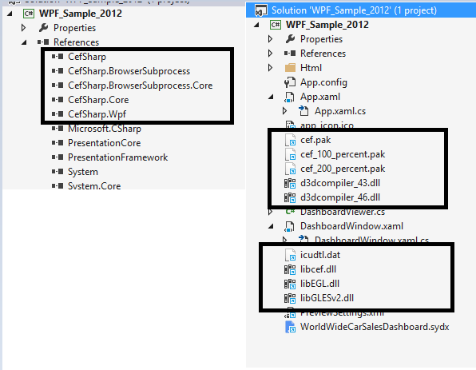
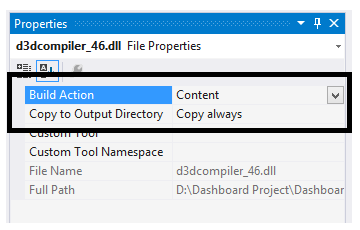
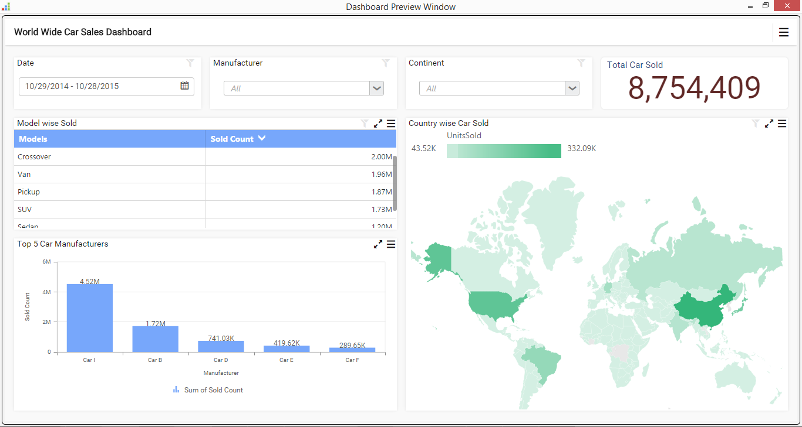

# Getting Started with WPF Application

  This section describes how to create a WPF application with embedded dashboard viewer.

## Project Creation

   Create a new WPF Application Project using Microsoft Visual Studio IDE.
  
## Adding files and references

   Copy the HTML folder from the following location and paste to your project location.
  
   `%localappdata%\Syncfusion\Dashboard\Samples\Common\Html`
	 
   Include this pasted HTML folder in your project.
  
   Include a dashboard like WorldWideCarSalesDashboard (\*.sydx) from the following location or any other \*.sydx file you prefer in your project.
  
   `%localappdata%\Syncfusion\Dashboard\Samples\Common\Dashboards`
	 
   Reference the assemblies and add the files from the following location to the project.
  
   `%localappdata%\Syncfusion\Dashboard\Samples\WPF\CefSharp Assemblies`
	 
   
	 
   Set the `Build Action` property to `Content` and the `Copy to Output Directory` property to `Copy always` as shown in the following screenshot for all the files added to the project.
  
   
	 
## Control Initialization

   Include the following code under constructor method of `App.xaml` class file so it will execute before initializing the ChromiumWebBrowser control.
  
   
   
   var settings = new CefSettings();
   settings.PackLoadingDisabled = true;
   settings.LogSeverity = LogSeverity.Disable;
   if(!Cef.Initialize(settings))
   {
      if(Environment.GetCommandLineArgs().Contains("--type=renderer"))
	  {
	    Environment.Exit(0);
	  }
	  else
	  {
	    return;
	  }
   }
   
   
   Dim settings = New CefSettings()
   settings.PackLoadingDisabled = True
   settings.LogSeverity = LogSeverity.Disable
   If Not CefSharp.Cef.Initialize(settings) Then
	  If Environment.GetCommandLineArgs().Contains("--type=renderer") Then
		Environment.Exit(0)
	  Else
		Return
	  End If
   End If
   
   
	 
   Initialize ChromiumWebBrowser control in MainWindow XAML file through including the following template within `Grid` element block.
  
   
   <Border xmlns:cefSharp="clr-namespace:CefSharp.Wpf;assembly=CefSharp.Wpf">
	  <cefSharp:ChromiumWebBrowser x:Name="WindowBrowser"/>
   </Border>
   

   Create a class named `DashboardProperties` with the following code.
   
   
   
   public class DashboardProperties
   {
        /// 

        ///     Gets or sets the sydx File Name
        /// 

        public string SydxFileName { get; set; }

        /// 

        ///     Gets or sets the ServiceUrl
        /// 

        public string ServiceUrl { get; set; }
   }
   
   
   Public Class DashboardProperties
		''' 

		'''     Gets or sets the sydx File Name
		''' 

		Public Property SydxFileName() As String

		''' 

		'''     Gets or sets the ServiceUrl
		''' 

		Public Property ServiceUrl() As String
   End Class
   
   
   
   Create a class named `DashboardViewer` with the following code.
   
   
   
   public class DashboardViewer
   {
        #region Private Variables

        private readonly string _environmentFolder = AppDomain.CurrentDomain.BaseDirectory;

        private const string HtmlFolder = "Html\\";

        public string ServiceUrl;

        public string Errormessage;

        #endregion

        /// 

        ///     Constructor for class DashboardViewer
        /// 
         
        public DashboardViewer()
        {
            string version = System.Reflection.Assembly.GetExecutingAssembly().GetName().Version.ToString();
            string dashboardServicePath = (AppDomain.CurrentDomain.BaseDirectory).Substring(0, (AppDomain.CurrentDomain.BaseDirectory).LastIndexOf("Sample") + 7) + "\\Common\\IISExpress_DashboardService";
            #region Pick Dashboard Windows Service URL
            ServiceUrl = GetWindowsServiceUrl();
            #endregion  
            #region Pick IISExpress or IIS Dashboard Service URL when Dashboard Windows Service is not running
            if (ValidateDashboardService(ServiceUrl))
            {
                DashboardServiceSerialization serializer = new DashboardServiceSerialization();
                DashboardServicePreviewSettings settings = new DashboardServicePreviewSettings();
                string dashboardServiceSettingPath = Environment.GetFolderPath(Environment.SpecialFolder.ApplicationData) + @"\Syncfusion\Dashboard Platform SDK\" + version + @"\DashboardServiceSetting.xml";
                if (File.Exists(dashboardServiceSettingPath))
                {
                    settings = serializer.Deserialize(dashboardServiceSettingPath);
                    if (!ValidateDashboardService(settings.ServiceURL))
                        ServiceUrl = settings.ServiceURL;
                    else
                    {
                        ServiceUrl = string.Empty;
                        MessageBox.Show("Dashboard Service is not running. Run DashboardServiceInstaller.exe file to start Dashboard Service in IIS Express", "Error", MessageBoxButton.OK, MessageBoxImage.Error);
                        return;
                    }
                }
                else
                {
                    ServiceUrl = string.Empty;
                    MessageBox.Show("Dashboard Service is not running. Run DashboardServiceInstaller.exe file to start Dashboard Service in IIS Express", "Error", MessageBoxButton.OK, MessageBoxImage.Error);
                    return;
                }
            }
            #endregion
        }
		
        /// 

        /// Validate whether Dashboard Service is running in the provided URL
        /// 

        /// <param name="dashboardServiceUrl">Dashboard Service URL</param>
        /// <returns>true, if valid; false otherwise</returns>
        private static bool ValidateDashboardService(string dashboardServiceUrl)
        {
            bool errorOccured = false;
            try
            {
                if (string.IsNullOrWhiteSpace(dashboardServiceUrl))
                {
                    return true;
                }
                if (!dashboardServiceUrl.Contains("http://") && !dashboardServiceUrl.Contains("https://"))
                    dashboardServiceUrl = "http://" + dashboardServiceUrl + @"/IsServiceExists";
                else
                    dashboardServiceUrl = dashboardServiceUrl + @"/IsServiceExists";
                WebRequest request = WebRequest.Create(new Uri(dashboardServiceUrl, UriKind.Absolute));
                request.Method = "GET";
                using (WebResponse response = request.GetResponse())
                {
                    using (StreamReader reader = new StreamReader(response.GetResponseStream()))
                    {
                        string text = reader.ReadToEnd();
                        if (!text.Contains(System.Convert.ToBase64String(System.Text.Encoding.UTF8.GetBytes("DashboardServiceExists"))))
                        {
                            errorOccured = true;
                        }
                    }
                }
                dashboardServiceUrl = dashboardServiceUrl.Replace(@"/IsServiceExists", "");
            }
            catch(Exception e)
            {
                dashboardServiceUrl = dashboardServiceUrl.Replace(@"/IsServiceExists", "");
                errorOccured = true;
            }
            return errorOccured;
        }
		
        /// 

        /// Gets the Dashboard Windows Service URL
        /// 

        /// <returns>Service URL of Dashboard Windows Service</returns>
       private string GetWindowsServiceUrl()
        {
            string url = string.Empty;
            try
            {
                RegistryKey key = Registry.LocalMachine.OpenSubKey(@"Software\SyncfusionDashboard\Syncfusion Dashboard Service");
                if (key == null)
                    key = Registry.LocalMachine.OpenSubKey(@"Software\Wow6432Node\SyncfusionDashboard\Syncfusion Dashboard Service");
                if (key != null)
                {
                    url = (string)key.GetValue("ServiceURL");
                    key.Close();
                }
            }
            catch (Exception)
            {

            }
            return url;
        }

		
        /// 

        /// Gets the URL string for the generated html page
        /// 

        /// <param name="sydxFileName">Sydx file name</param>
        /// <returns>URL</returns>
        public string GetUrlofHtmlPage(string sydxFileName)
        {
            if (string.IsNullOrWhiteSpace(sydxFileName) || string.IsNullOrWhiteSpace(ServiceUrl))
                return string.Empty;

            DashboardProperties dashboardProperties = new DashboardProperties
            {
                SydxFileName = sydxFileName,
                ServiceUrl = ServiceUrl,
            };
            return GetUrlofHtmlPage(dashboardProperties);
        }

        /// 

        /// Generate Viewer Html String
        /// 

        #region Generate Viewer Html String

        private const string BeforeHeadHtml = "<!-- saved from url=(0014)about:internet -->\n"
                                          + "<!DOCTYPE html>\n"
                                          + "<html xmlns=\"http://www.w3.org/1999/xhtml\">\n"
                                          + "<head>\n"
                                          + "<meta charset=\"utf-8\" content=\"width=device-width, initial-scale=1.0\">"
                                          + "";

        private string GetUrlofHtmlPage(DashboardProperties dashboardProperties)
        {
            var jsFiles = new List<string>
            {
                "jquery-1.10.2.min.js",
                "jquery.easing.1.3.min.js",
                "ej.dashboardViewer.all.min.js",
                "jquery.globalize.min.js",

            };

            var cssfiles = new List<string>
            {
                "bootstrap.css",
                "default-theme/ej.widgets.all.min.css",
                "default-theme/ej.theme.min.css",
                "ej.DashboardViewer.css",
                "e.Breadcrumb.css",
                "e-Card.css",
                "ej.dashboarddatepicker.css",
                "dashboard-themes/light/ej.DashboardViewer.css",
                "dashboard-themes/light/lightcontroltheme.css",
                "default-theme/ej.pivotgridcustomtheme.css",
            };

            try
            {
                string htmlString = GetHtmlString(GetViewer(dashboardProperties), jsFiles, cssfiles).ToString();

                //Below code block is used to copy the html related files from app folder since app folder doesn't have required permission to write file.
                string sourcefolderPath = AppDomain.CurrentDomain.BaseDirectory + HtmlFolder;
                if (!File.Exists(sourcefolderPath))
                    Directory.CreateDirectory(sourcefolderPath);
                string filePath = sourcefolderPath + "Temp.html";
                //End

                using (FileStream fs = new FileStream(filePath, FileMode.Create))
                {
                    using (StreamWriter w = new StreamWriter(fs, Encoding.UTF8))
                    {
                        w.Write(htmlString);
                    }
                }

                return filePath;
            }
            catch (Exception ex)
            {
                MessageBox.Show(ex.Message, "Error", MessageBoxButton.OK, MessageBoxImage.Error);
            }
            return string.Empty;
        }

        private StringBuilder GetHtmlString(string bodyString, IEnumerable<string> jsFiles, IEnumerable<string> cssFiles)
        {
            var headSb = new StringBuilder();
            foreach (var item in jsFiles)
            {
                headSb.Append("");
            }
            foreach (var item in cssFiles)
            {
                headSb.Append("<link href=\"themes/" + item + "\" rel=\"stylesheet\"></link>");
            }
            var htmlSb = new StringBuilder();
            htmlSb.Append(BeforeHeadHtml);
            htmlSb.Append(headSb);
            htmlSb.Append("</head>\n");
            htmlSb.Append(bodyString);
            htmlSb.Append("</html>");
            return htmlSb;
        }

        private string GetViewer(DashboardProperties dashboardProperties)
        {
            if (dashboardProperties == null) return string.Empty;

            var sydbPath = _environmentFolder + dashboardProperties.SydxFileName;
            var viewerstr = "$('#dashboard').ejDashboardViewer({url: '" + dashboardProperties.ServiceUrl +
                            "', report: '" +
                            sydbPath.Replace(@"\", @"\\") +
                            "',filterParameters:location.search.substr(1)});";
            var sb = new StringBuilder();
            sb.Append("<body style=\"width:100%; height:100%;\">");
            sb.Append("
");
            sb.Append("");
            sb.Append("</body>");
            return sb.ToString();
        }
   }
   
   
   Public Class DashboardViewer
		
		Private ReadOnly _environmentFolder As String = AppDomain.CurrentDomain.BaseDirectory

		Private Const HtmlFolder As String = "Html\"

		Public ServiceUrl As String

		Public Errormessage As String

		''' 

		'''     Constructor for class DashboardViewer
		''' 

		'''           
		Public Sub New()
			Dim version As String = System.Reflection.Assembly.GetExecutingAssembly().GetName().Version.ToString()
			Dim dashboardServicePath As String = (AppDomain.CurrentDomain.BaseDirectory).Substring(0, (AppDomain.CurrentDomain.BaseDirectory).LastIndexOf("Sample") + 7) & "\Common\IISExpress_DashboardService"
            'Pick Windows Dashboard Service Url
			ServiceUrl = GetWindowsServiceUrl()
            'Pick IISExpress or IIS  Dashboard Service Url if Windows Dashboard Service is not running
			If ValidateDashboardService(ServiceUrl) Then
				Dim serializer As New DashboardServiceSerialization()
				Dim settings As New DashboardServicePreviewSettings()
				Dim dashboardServiceSettingPath As String = Environment.GetFolderPath(Environment.SpecialFolder.ApplicationData) & "\Syncfusion\Dashboard Platform SDK\" & version & "\DashboardServiceSetting.xml"
				If File.Exists(dashboardServiceSettingPath) Then
					settings = serializer.Deserialize(dashboardServiceSettingPath)
					If Not ValidateDashboardService(settings.ServiceURL) Then
						ServiceUrl = settings.ServiceURL
					Else
						ServiceUrl = String.Empty
						MessageBox.Show("Dashboard Service is not running. Run DashboardServiceInstaller.exe file to start Dashboard Service in IIS Express", "Error", MessageBoxButton.OK, MessageBoxImage.Error)
						Return
					End If
				Else
					ServiceUrl = String.Empty
					MessageBox.Show("Dashboard Service is not running. Run DashboardServiceInstaller.exe file to start Dashboard Service in IIS Express", "Error", MessageBoxButton.OK, MessageBoxImage.Error)
					Return
				End If
			End If
		End Sub
		
		''' 

		''' Validate whether Dashboard Service is running in the URL
		''' 

		''' <param name="dashboardServiceUrl">Dashboard Service URL</param>
		''' <returns>returns whether valid dashboard service</returns>
		Private Shared Function ValidateDashboardService(ByVal dashboardServiceUrl As String) As Boolean
			Dim errorOccured As Boolean = False
			Try
				If String.IsNullOrWhiteSpace(dashboardServiceUrl) Then
					Return True
				End If
				If Not dashboardServiceUrl.Contains("http://") AndAlso Not dashboardServiceUrl.Contains("https://") Then
					dashboardServiceUrl = "http://" & dashboardServiceUrl & "/IsServiceExists"
				Else
					dashboardServiceUrl = dashboardServiceUrl & "/IsServiceExists"
				End If
				Dim request As WebRequest = WebRequest.Create(New Uri(dashboardServiceUrl, UriKind.Absolute))
				request.Method = "GET"
				Using response As WebResponse = request.GetResponse()
					Using reader As New StreamReader(response.GetResponseStream())
						Dim text As String = reader.ReadToEnd()
						If Not text.Contains(System.Convert.ToBase64String(System.Text.Encoding.UTF8.GetBytes("DashboardServiceExists"))) Then
							errorOccured = True
						End If
					End Using
				End Using
				dashboardServiceUrl = dashboardServiceUrl.Replace("/IsServiceExists", "")

			Catch e As Exception
				dashboardServiceUrl = dashboardServiceUrl.Replace("/IsServiceExists", "")
				errorOccured = True
			End Try
			Return errorOccured
		End Function
		
		''' 

		''' Used to pick the Dashboard Windows Service URL 
		''' 

		''' <returns>Service URL of Dashboard Windows Service</returns>
		Private Function GetWindowsServiceUrl() As String
			Dim url As String = String.Empty
			Try
				Dim key As RegistryKey = Registry.LocalMachine.OpenSubKey("Software\SyncfusionDashboard\Syncfusion Dashboard Service")
				If key Is Nothing Then
					key = Registry.LocalMachine.OpenSubKey("Software\Wow6432Node\SyncfusionDashboard\Syncfusion Dashboard Service")
				End If
				If key IsNot Nothing Then
					url = CStr(key.GetValue("ServiceURL"))
					key.Close()
				End If
			Catch e1 As Exception

			End Try
			Return url
       End Function

		
		''' 

        ''' Gets the URL string for the generated html page
        ''' 

        ''' <param name="sydxFileName">Sydx file name</param>
        ''' <returns>URL</returns>
		Public Function GetUrlofHtmlPage(ByVal sydxFileName As String) As String
			If String.IsNullOrWhiteSpace(sydxFileName) OrElse String.IsNullOrWhiteSpace(ServiceUrl) Then
				Return String.Empty
			End If

			Dim dashboardProperties As DashboardProperties = New DashboardProperties With {
				.SydxFileName = sydxFileName,
				.ServiceUrl = ServiceUrl
			}
			Return GetUrlofHtmlPage(dashboardProperties)
		End Function

		'Generate Viewer Html String

		Private Const BeforeHeadHtml As String = "<!-- saved from url=(0014)about:internet -->" & ControlChars.Lf & "<!DOCTYPE html>" & ControlChars.Lf & "<html xmlns=""http://www.w3.org/1999/xhtml"">" & ControlChars.Lf & "<head>" & ControlChars.Lf & "<meta charset=""utf-8"" content=""width=device-width, initial-scale=1.0"">" & ""

		Private Function GetUrlofHtmlPage(ByVal dashboardProperties As DashboardProperties) As String
			Dim jsFiles = New List(Of String) From {"jquery-1.10.2.min.js", "jquery.easing.1.3.min.js", "ej.dashboardViewer.all.min.js", "jquery.globalize.min.js"}

			Dim cssfiles = New List(Of String) From {"bootstrap.css", "default-theme/ej.widgets.all.min.css", "default-theme/ej.theme.min.css", "ej.DashboardViewer.css", "e-Card.css", "ej.dashboarddatepicker.css", "dashboard-themes/light/ej.DashboardViewer.css", "dashboard-themes/light/lightcontroltheme.css", "default-theme/ej.pivotgridcustomtheme.css"}

			Try
				Dim htmlString As String = GetHtmlString(GetViewer(dashboardProperties), jsFiles, cssfiles).ToString()

				'Below code block is used to copy the html related files from app folder since app folder doesn't have required permission to write file.
				Dim sourcefolderPath As String = AppDomain.CurrentDomain.BaseDirectory & HtmlFolder
				If Not File.Exists(sourcefolderPath) Then
					Directory.CreateDirectory(sourcefolderPath)
				End If
				Dim filePath As String = sourcefolderPath & "Temp.html"
				'End

				Using fs As New FileStream(filePath, FileMode.Create)
					Using w As New StreamWriter(fs, Encoding.UTF8)
						w.Write(htmlString)
					End Using
				End Using

				Return filePath
			Catch ex As Exception
				MessageBox.Show(ex.Message, "Error", MessageBoxButton.OK, MessageBoxImage.Error)
			End Try
			Return String.Empty
		End Function

		Private Function GetHtmlString(ByVal bodyString As String, ByVal jsFiles As IEnumerable(Of String), ByVal cssFiles As IEnumerable(Of String)) As StringBuilder
			Dim headSb = New StringBuilder()
			For Each item In jsFiles
				headSb.Append("")
			Next item
			For Each item In cssFiles
				headSb.Append("<link href=""themes/" & item & """ rel=""stylesheet""></link>")
			Next item
			Dim htmlSb = New StringBuilder()
			htmlSb.Append(BeforeHeadHtml)
			htmlSb.Append(headSb)
			htmlSb.Append("</head>" & ControlChars.Lf)
			htmlSb.Append(bodyString)
			htmlSb.Append("</html>")
			Return htmlSb
		End Function

		Private Function GetViewer(ByVal dashboardProperties As DashboardProperties) As String
			If dashboardProperties Is Nothing Then
				Return String.Empty
			End If

			Dim sydbPath = _environmentFolder & dashboardProperties.SydxFileName
			Dim viewerstr = "$('#dashboard').ejDashboardViewer({url: '" & dashboardProperties.ServiceUrl & "', report: '" & sydbPath.Replace("\", "\\") & "',filterParameters:location.search.substr(1)});"
			Dim sb = New StringBuilder()
			sb.Append("<body style=""width:100%; height:100%;"">")
			sb.Append("
")
			sb.Append("")
			sb.Append("</body>")
			Return sb.ToString()
		End Function
   End Class
   
   
   
   Add a class named `DashboardServicePreviewSettings` with the following code.
    
   
   public class DashboardServicePreviewSettings
   {
        public string ServiceURL { get; set; }
        public List<Guid> DashboardServiceInstances { get; set; }
        public DashboardServicePreviewSettings()
        {
            DashboardServiceInstances = new List<Guid>();
        }
   }
   
   
   Public Class DashboardServicePreviewSettings
		Public Property ServiceURL() As String
		Public Property DashboardServiceInstances() As List(Of Guid)
		Public Sub New()
			DashboardServiceInstances = New List(Of Guid)()
		End Sub
   End Class
   
   
   
   Add a class named `DashboardServiceSerialization` with the following code to serialize and deserialize the DashboardService URL when Dashboard Service is running in IIS Express. 	 
   
    
   
   public class DashboardServiceSerialization
   {
        static readonly XmlSerializer previewSerializer = new XmlSerializer(typeof(DashboardServicePreviewSettings));
        public void Serialize(DashboardServicePreviewSettings settings, string path)
        {
            try
            {
                using (StreamWriter writer = new StreamWriter(path))
                {
                    previewSerializer.Serialize(writer, settings);
                }
            }
            catch (Exception)
            {

            }

        }
        public DashboardServicePreviewSettings Deserialize(string path)
        {
            DashboardServicePreviewSettings settings = new DashboardServicePreviewSettings();
            try
            {
                using (StreamReader reader = new StreamReader(path))
                {
                    settings = (DashboardServicePreviewSettings)previewSerializer.Deserialize(reader);
                }
            }
            catch (Exception)
            {

            }
            return settings;
        }
   }
   
   
	Public Class DashboardServiceSerialization
		Private Shared ReadOnly previewSerializer As New XmlSerializer(GetType(DashboardServicePreviewSettings))
		Public Sub Serialize(ByVal settings As DashboardServicePreviewSettings, ByVal path As String)
			Try
				Using writer As New StreamWriter(path)
					previewSerializer.Serialize(writer, settings)
				End Using
			Catch e1 As Exception

			End Try

		End Sub
		Public Function Deserialize(ByVal path As String) As DashboardServicePreviewSettings
			Dim settings As New DashboardServicePreviewSettings()
			Try
				Using reader As New StreamReader(path)
					settings = CType(previewSerializer.Deserialize(reader), DashboardServicePreviewSettings)
				End Using
			Catch e1 As Exception

			End Try
			Return settings
		End Function
	End Class
   
   	  		

## URL Generation and Binding

   Include the following code under `MainWindow` class.
  
   
   
   private string _sydxFileName = "WorldWideCarSalesDashboard.sydx";
	 
   public string SydxFileName
   {
	  get{ return _sydxFileName;}
	  set{ _sydxFileName = value;}
   }
	 
   private void Navigate()
   {
	  DashboardViewer dashboardViewer = new DashboardViewer();
	  string url = dashboardViewer.GetUrlofHtmlPage(SydxFileName);
    if(!string.IsNullOrWhiteSpace(url))
     WindowBrowser.Address = url;
   }
   
   
   Private _sydxFileName As String = "WorldWideCarSalesDashboard.sydx"

   Public Property SydxFileName() As String
	  Get
		  Return _sydxFileName
	  End Get
	  Set(ByVal value As String)
		  _sydxFileName = value
	  End Set
   End Property

   Private Sub Navigate()
	  Dim dashboardViewer As New DashboardViewer()
	  Dim url As String = dashboardViewer.GetUrlofHtmlPage(SydxFileName)
	  If Not String.IsNullOrWhiteSpace(url) Then
		WindowBrowser.Address = url
	  End If
   End Sub
   
   
   
   Add the following method call after `InitializeComponent` method call in constructor method.   
   
   
   
   Navigate();
   
   
   Navigate()
   
   
   
   Build the application and run it to view the dashboard.
  
   