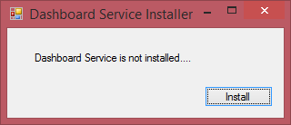
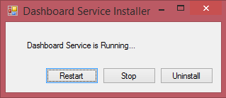
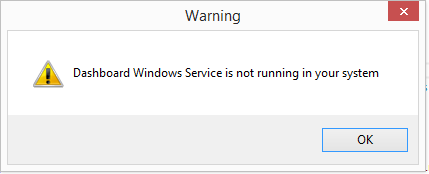
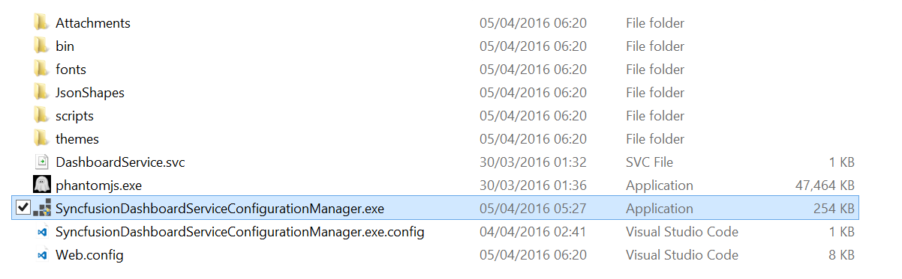
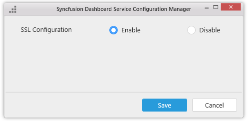

# Installation and Deployment

  This section briefly illustrates the installation and deployment procedure of Syncfusion Dashboard Platform SDK.

## Installation

   The Syncfusion Dashboard Platform SDK can be downloaded and installed through the following procedure.

   1. Download the installer from [here](http://www.syncfusion.com/downloads/dashboard)
   2. Run the Syncfusion Dashboard Platform SDK installer.
   3. Choose the installation location and install.
   4. Once installation completes, click Finish to launch the Samples folder to explore.

## Samples Deployment

   With the installation of Syncfusion Dashboard Platform SDK, samples get installed in the following location.

   `%localappdata%\Syncfusion\Dashboard\Samples`

   The scripts, styles and fonts that are required to run the dashboard application will get placed in the following location.

   `%localappdata%\Syncfusion\Dashboard\Samples\Common\Html`

   This folder holds samples for 4 different platforms: ASP.NET MVC, ASP.NET, LightSwitch HTML, WPF and Windows Forms. Each of these platform folders contains two samples, one that shows embedding local dashboard files and the other showing embedding dashboard files hosted on the dashboard server.

   N> Internet connection is required to run sample dashboards as their data need to be retrieved from a remote data server.

## Service Installation

   With the installation of Syncfusion Dashboard Platform SDK, a windows service called `Syncfusion Dashboard Windows Service` gets installed and started automatically to run as a background process. This service is essential for the Dashboard Viewer to render the dashboard. You can also stop and restart the service through the Task Manager, if required.

### Hosting Dashboard Service as Windows Service background process

   To install this service on deployment machines you need to copy over the folder `Windows Service` along with its contents from the following location, paste in a desired location in deployment machine and run the `Syncfusion Dashboard Service Installer.exe`.

   `C:\Program Files (x86)\Syncfusion\Dashboard Platform SDK\Utilities`
  
   N> Running this EXE require administrator access for the current user.
   
   

   

   You can also stop/restart/uninstall the service through this EXE when you dealt with any error related to service like below.

   

### Hosting Dashboard Service in IIS Express

  To host Syncfusion dashboard service in IIS express and run on deployment machines, you need to copy the folders DashboardServiceInstaller and Service along with their contents from the following location, paste in a desired location in the deployment machine and run the SyncfusionDashboardServiceInstaller-IISExpress.exe available in the DashboardServiceInstaller folder.
  
  `%localappdata%\Syncfusion\Dashboard\Samples\Common`

   
### Hosting Dashboard Service in IIS 

To host Syncfusion Dashboard Service in IIS and run on deployment machines, you need to copy over the folders `DashboardServiceInstaller` and Service along with their contents from the following location, paste in a desired location in the deployment machine and run the `SyncfusionDashboardServiceInstaller-IIS.exe` available in the `DashboardServiceInstaller` folder.

`%localappdata%\Syncfusion\Dashboard\Samples\Common`

`SyncfusionDashboardServiceInstaller-IIS.exe` can be also executed through command prompt to host the service in the specified port after copying the needed file as above.

**Command**

`C:\Windows\system32>[Path of SyncfusionDashboardServiceInstaller-IIS.exe] [Portnumber]`

Example:

`C:\Windows\system32> C:\Users\administrator\AppData\Local\Syncfusion\Dashboard\Samples\Common\DashboardServiceInstaller\SyncfusionDashboardServiceInstaller-IIS.exe 400`

N> SyncfusionDashboardServiceInstaller-IIS.exe execution requires administrator mode.

## Configuring SSL for Dashboard Service

To configure SSL for Dashboard Service, run Syncfusion Dashboard Service Configuration Manager application from the following location.

`%localappdata%\Syncfusion\Dashboard\Samples\Common\Service`

Choose the type of configuration required and click on `Save` button.

N> SyncfusionDashboardServiceConfigurationManager.exe execution requires administrator mode.