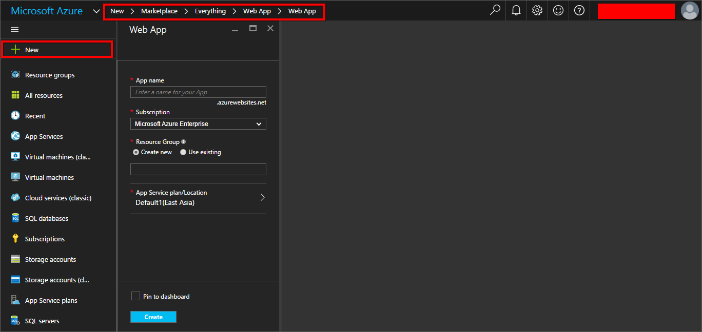
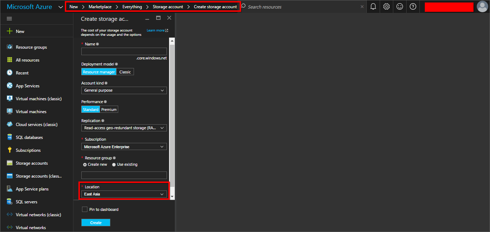
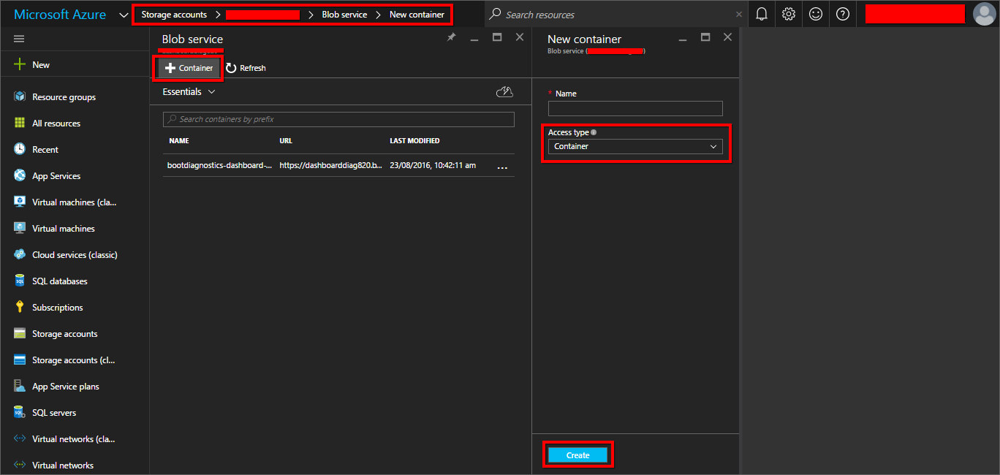
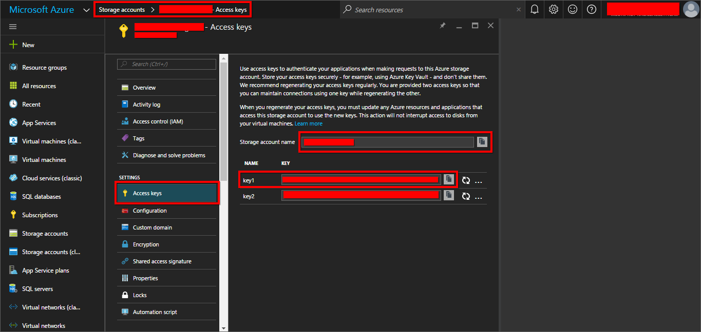
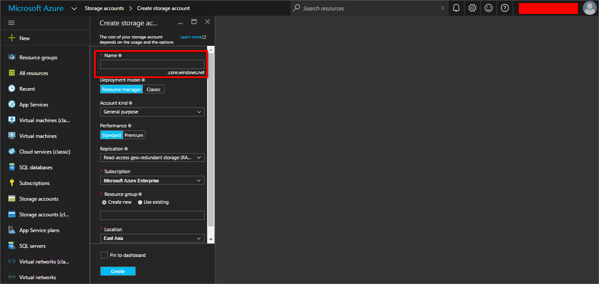
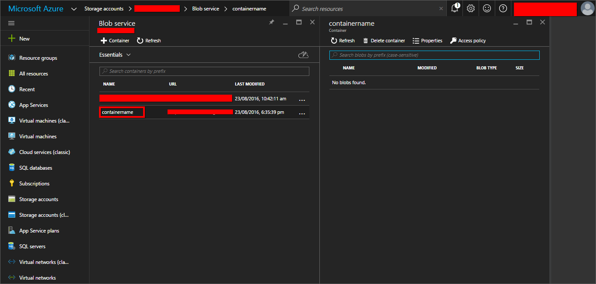
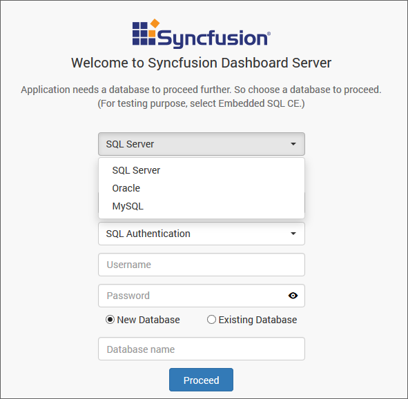
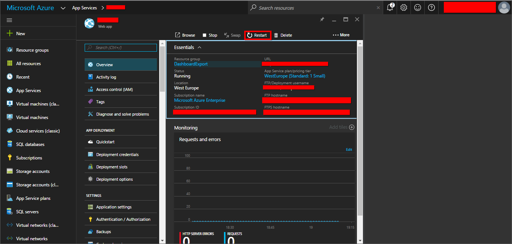

# Installation and Deployment 

This section explains on how to deploy the dashboard Server application into Azure cloud. 

## Download Setup

* Download the dashboard Server Azure setup from [here](http://www.syncfusion.com/downloads/dashboard) 
* Licensed customers can download the install from the [downloads](http://www.syncfusion.com/support/directtrac/downloads) section 

## How to deploy

### Create New Web App

After logged into your Azure management portal, click the `New` link in the left panel of the Azure portal. And follow the breadcrumb in the below screenshot.

At the end, it will be landed in the Create Web App form as below,

In order to create the new Azure cloud web Application, click on Create button at the bottom of the form.

### Create New Storage Account

Create the Azure storage account with the same location of Azure web application.

Click `New` button in the left panel of the Azure portal. And follow the breadcrumb in the below screen shot

N> If you want to choose the above Storage Account for Diagonistic Logs, the location of the Storage Account must be same as Azure Wep App service.   

And click on Create button to create the new Azure storage account to hold the containers, files, tables, blobs, queues inside it.

## Create Container

In order to create the container under Blob service, browse for storage account and choose the corresponding account from the list of accounts and choose the blob service from service list, then the list of containers and the Add container button is at the top of the panel.

While click on Add Container button, the form will be appeared next to the list of containers.

Please refer the below figure,

You have to choose the Access Type as `Container`.

And click on Create button to create the new Azure storage account container to store the blobs inside it.

### Web Configuration file edits

You will need the following storage settings to store the files into the Azure Blob container.

* Azure Blob storage Account name
* Azure Blob storage Container name
* Azure Blob storage Access key
* Azure Blob storage Endpoint
* Blob Endpoint (If it has the custom endpoint).

Find the Account name and Access key from the below figure

Find the Azure Blob storage Endpoint from the below figure

Azure Blob storage Endpoint will be https://example.core.windows.net, if the Account name is `example`.

Find the container name from the below figure

Extract the zip file which was downloaded earlier and edit the files in the below location and replace the settings as below.

* \Web.Config
* \App_Data\jobs\continuous\DashboardServerScheduler\Syncfusion.Server.Base.Dashboards.Scheduler.AzureWebJob.exe.config
* API\Web.Config

Azure connection type should be one of the following values HTTPS &#124; HTTP &#124; customendpoint.

If the connection type is customendpoint, the sub domain of the `AzureStorageBlobURL` must be equal to the storage account name. Otherwise leave the `AzureStorageBlobURL` as empty.

Save the files and upload them to the Azure Web App FTP folder as discussed below.

### Azure Web App Configuration

Upload the extracted files into the Azure Web application portal, please follow the steps below to configure the web app.

Login into your Windows Azure portal.

Upload the files into Azure web app portal through FileZilla, so it is must to create the FileZilla credentials from the Azure portal website.

Find the settings panel at the left side of the Web Application panel as shown in figure.

Configure the FileZilla credentials by click the `Deployment Credentials` link from the settings panel as shown in below figure.

After get logged into your FTP, upload the files into the below folder in FTP.

/site/wwwroot

After uploading the files into the Azure web app, Configure the virtual path for below applications

* Root Dashboard server project
* API project
* Dashboard Service project

To navigate to the below screen, click settings and click on the `Application settings` link in the settings panel.

### Enabling Log

This section explains how to configure Logging for Dashboard Server to diagnose the application.

To enable logging in the Dashboard Server web application, go to the Dashboard Server web app in Azure portal and click `Settings` > `Diagnostics logs`.

Enable Application Logging (Blob) then set the level as `Information` and click on `Storage Settings` then it will be asked to select the `storage account`.

And click on the storage account which is used in the web application then it will display all the containers inside the storage account.

Choose the container which is used in the web application to store the logs and click on the Select button. Now the selected Storage Account will be displayed in the logs menu.

Then click on the Save button in the Logs menu. It will log all information produced by the application and the log files will be stored in blob storage container.

Now browse your site and configure the startup screens.

### Azure Blob Storage settings

This section explain how to set up the Azure blob settings to store the static files into the Azure blob.

If the application will be hosted as Azure cloud Application, you cannot be create the SQL CE database, so the database SQL CE will not be listed.

After creating the database, it will be redirected to the Azure Blob storage settings form.

If the application will be hosted as Azure cloud application, the form filled with the Azure blob settings which will be available in the Web.Config and the form will be disabled by default, you cannot be edit the values here. Please refer the below screenshot.

If the provided Azure Blob storage settings are invalid, the error message will be displayed under the form as shown in the below

If the settings are configured without any error, it will be redirected to the admin user creation form.

### View/Download logs

To view the resources and logs stored in the blob storage, install the Microsoft Azure Storage Explorer.

Download and install Microsoft Azure Storage Explorer from [here](http://storageexplorer.com/). 

Add your Azure account in the Microsoft Azure Storage Explorer.

Then the storage accounts will be listed in the Microsoft Azure Storage Explorer, expand the storage account which is used in the web application. Select the container inside the Blob containers.

The log files generated by the Dashboard Server web application will be listed under the Year/Month/Date/Time folder structure and download log files from here.

## Upgrade to new Version

This Section explains on how to upgrade the Syncfusion Dashboard Server Azure App Service to the next version.

### Download the latest build

* Download the Dashboard Server Azure package from [here](http://www.syncfusion.com/downloads/dashboard).

* Licensed customers can download the Dashboard Server Azure package from [here](http://www.syncfusion.com/support/directtrac/downloads).

### Steps to upgrade the Dashboard Server Azure Web App

* Extract the downloaded Dashboard Server Azure web App package.
* Edit the Azure Storage properties in the below project config files with your existing property values.
    * \Web.Config
    * \App_Data\jobs\continuous\DashboardServerScheduler\Syncfusion.Server.Base.Dashboards.Scheduler.AzureWebJob.exe.config
    * API\Web.Config

* Upload the files into the Azure App Service using FileZilla in the below folder
    * /site/wwwroot  
* Restart the Azure App Service as below,

  