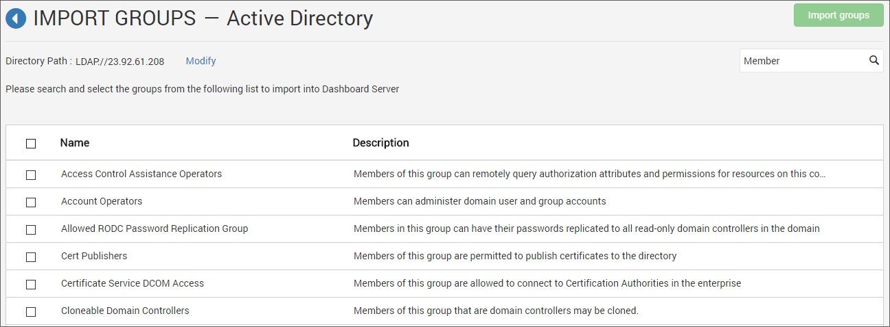
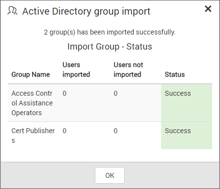
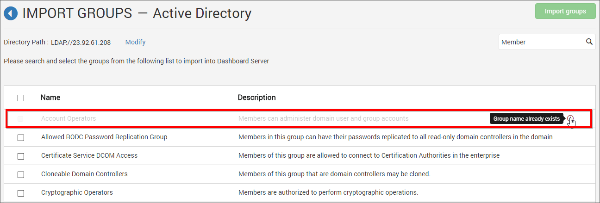

# Active Directory Group Import

This section explain on how to search and import groups from Active Directory into the Syncfusion Dashboard Server.

N> Active Directory connection has to be configured in the [Active Directory Settings](/en-us/dashboard-platform/dashboard-server/site-settings/active-directory) in the `General` page for importing groups.

Users belonging to the `System Administrator` group only can import Active Directory groups into the Syncfusion Dashboard Server.

## Search Groups

You can search the Active Directory groups with any one of the below properties and choose them to import into Syncfusion Dashboard Server.

* Group name
* Group description

A maximum of 1000 groups will be searched and pulled from Active Directory in a single request. 

Dashboard Server will list the search results of the groups in the grid as shown in the below figure.

## Import Groups

To import the Active Directory groups into the Dashboard Server, you have to choose the groups from the list and click on the `Import groups` button at the top right corner.

Dashboard Server will import the chosen groups and a confirmation message will be displayed as shown in the below figure.

The success message box explains the users who all are get imported/not imported into the Dashboard server.

## Duplicate Groups

Active Directory groups who has the same groupname as that of the Dashboard Server groups(which are already present) will be marked as duplicate groups and will not be allowed to import into Dashboard Server.

