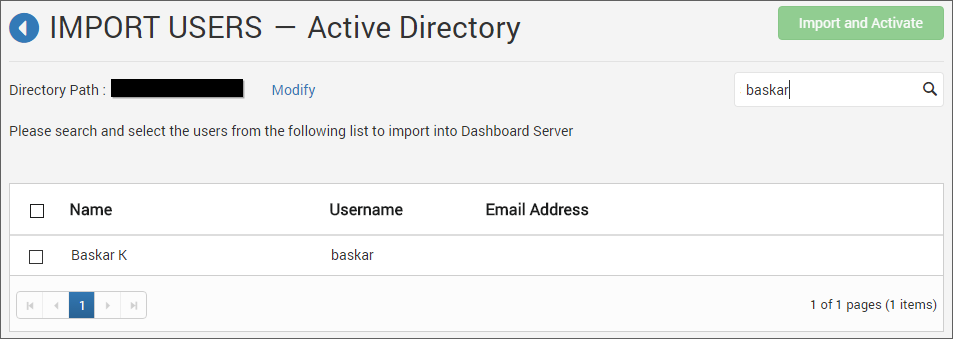
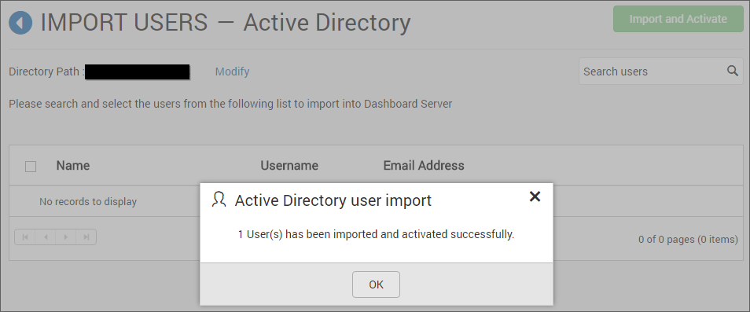
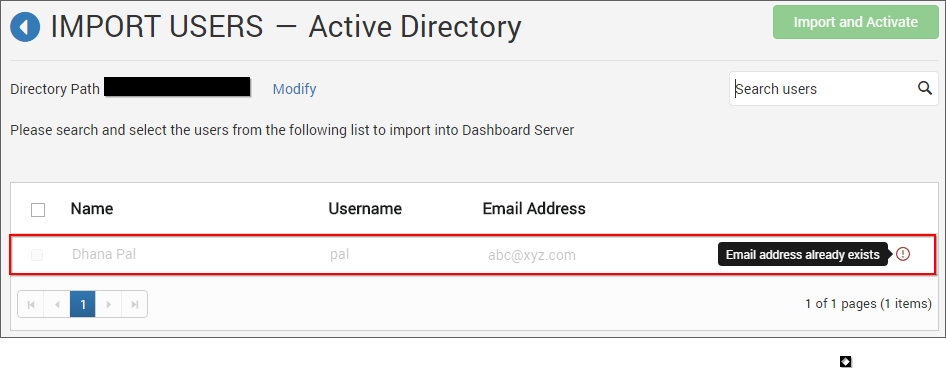
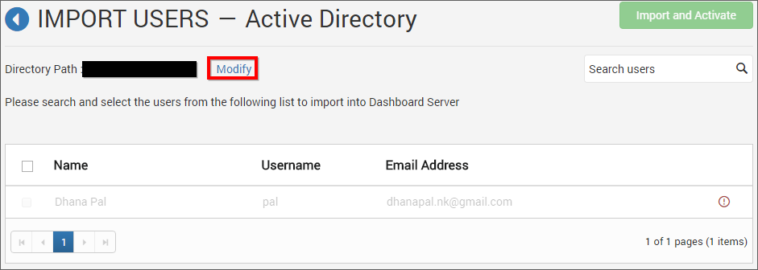

# Active Directory User Import

This section explains how to search and import users from Active Directory into the Syncfusion Dashboard Server.

N> Active Directory connection has to be configured in the [Active Directory Settings](/en-us/dashboard-platform/dashboard-server/site-settings/active-directory) in the `General` page for importing users.

Users belonging to the `System Administrator` group only can import Active Directory users into the Dashboard Server.

## Search Users

You can search the Active Directory users with any one of the below properties and choose them to import into the Dashboard Server. 

* User name
* First name
* Last name
* Email Address
* Display name

A maximum of 1000 users will be searched and pulled from Active Directory in a single request. 

Dashboard Server will list the search results of the users in the grid as shown in the below figure.

## Import Users

To import the Active Directory users into the Dashboard Server, you have to choose the users from the list and click on the `Import and Activate` button at the top right corner.

Dashboard Server will import the chosen users and a confirmation message will be displayed as shown in the below figure.

##Duplicate Users

Active Directory users who has the same username or email address as that of the Dashboard Server users(who are already present) will be marked as duplicate users and will not be allowed to import into Dashboard Server.  

##Modify Active Directory Connection

To modify Active Directory configuration settings, click on the `Modify` link as below

