# User Import from a Database

This section explains how to import users from Database into the Syncfusion Dashboard Server.

N> Account Activation type should be `E-mail Activation` and E-mail settings has to be configured in the [E-mail Settings](/en-us/dashboard-platform/dashboard-server/site-settings/email-settings) in the `General` page for importing users from Database.

Users belonging to the `System Administrator` group only can import users from database into the Dashboard Server.

## Get Database Connection Details

To add new users to the dashboard server, click on `New User` and then `Import from Database` from the User Management page.

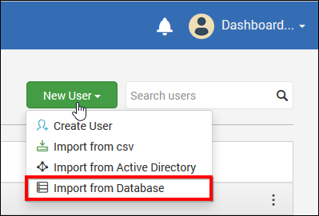

The link will redirect to another page that will look like below.

Users can be imported from below types of Databases.

1. SQL Server
2. MySQL
3. Oracle

To select the database type from which the users to be imported, click on `Database type` dropdown.

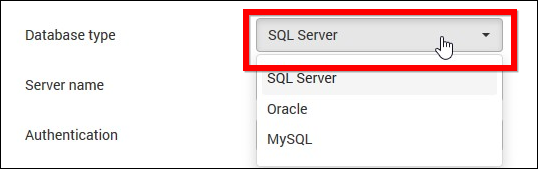
 
### SQL Server Database
 
For SQL Server Database, fill the form with Server name, Authentication type, Username, Password and Database name.
 
The connection details can be tested by click on 'Test Connection'
  
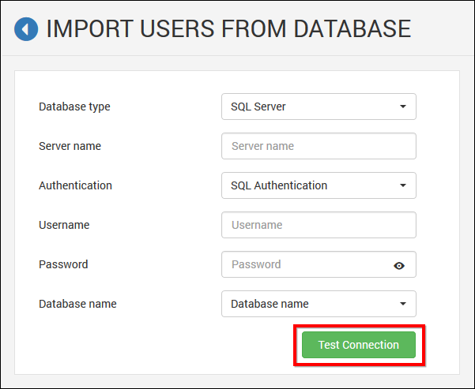
 
### MySQL Database
 
For MySQL Database, fill the form with DSN, Username, Password and Database name.
 
The connection details can be tested by click on 'Test Connection'
 
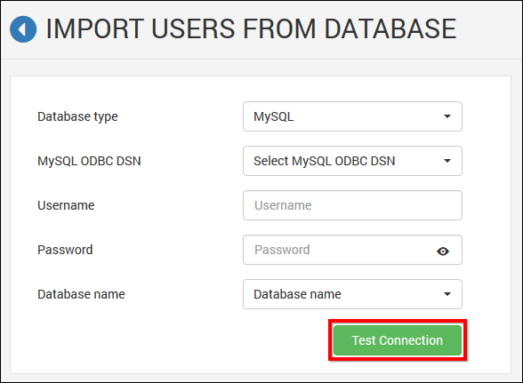
 
### Oracle Database
 
For MySQL Database, fill the form with DSN, Admin username, Admin password, Database name and Database password.
 
The connection details can be tested by click on 'Test Connection'
 
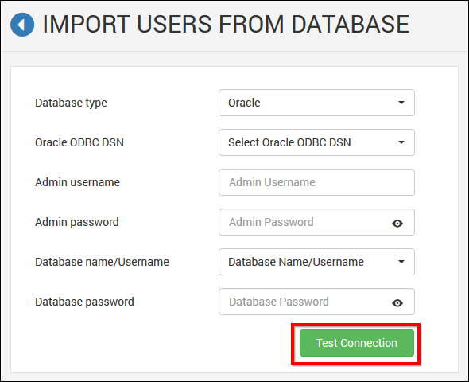
 
Once the connection details are filled, click on 'Connect' for getting schema of the provided database connection.

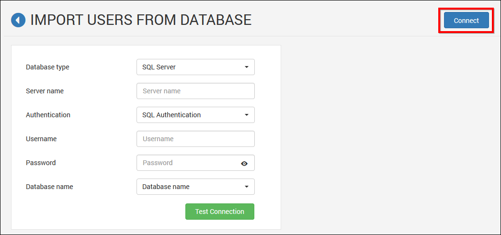

## Map Database Columns

The page will look like below once the database has been connected.

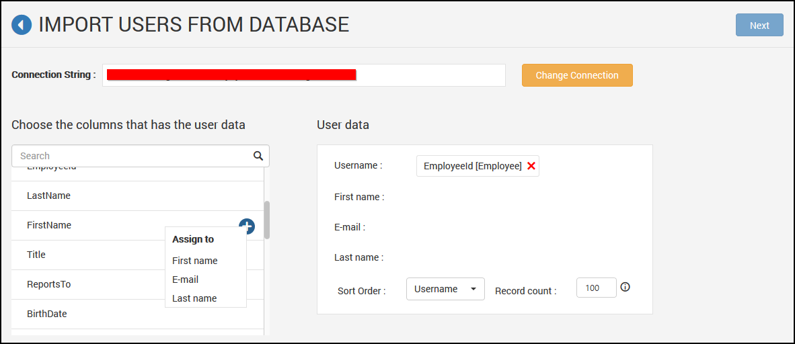

Select the matched columns from the database schema for Username, First name, Email address and Last name (Optional) fields.

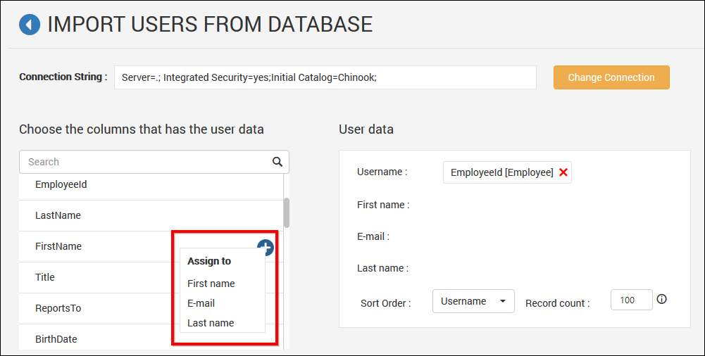

If the columns are selected from different tables, below scenarios will happen.

* If the tables have single relationship - The join will be made with the particular relationship.

* If the tables have multiple relationships - The relationship can be selected from the list of relationships and then click on `Apply`

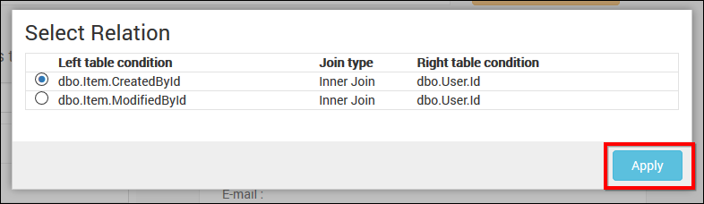

* If there is no relationship between tables - Form Join with the selected tables and then click on `Apply`

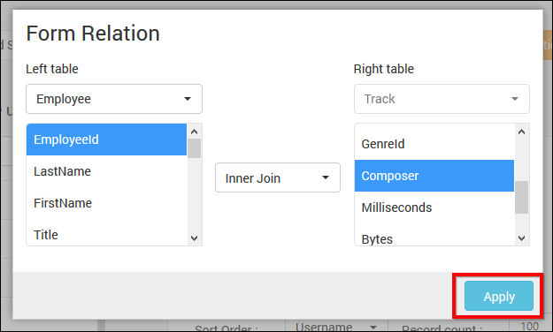

After selection of columns, give sort order and record count to pull user data from database.

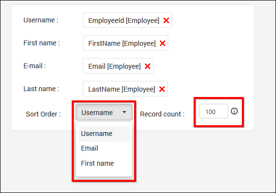

## Select Users and Import

After selecting columns the data retrieved from database will be shown in Grid. Select the users to be imported and click on `Import Users` to import the users.

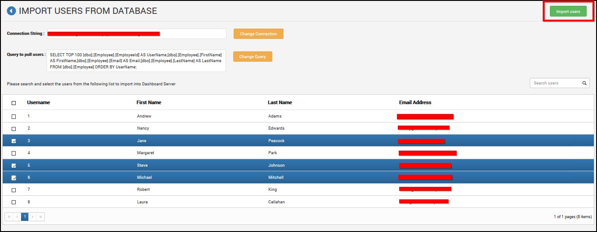

Dashboard Server will import the chosen users and a confirmation message will be displayed as shown in the below image.

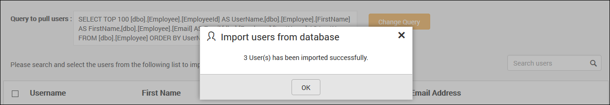