# Manage Categories

This section explains on how to open, add, update, share and delete categories in the Syncfusion Dashboard Server.

Categories are used to group and manage the dashboards. Categories that are accessible by the user depends upon the user's permission and the categories whose dashboards the user has access are displayed in the left panel in the dashboards page.

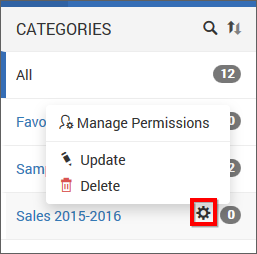

## Open Category
Click on any category in the left panel to view the dashboards grouped with it.

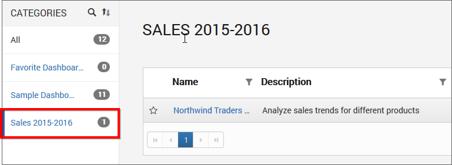  

## Add Category
To add a new category you must have `Create All Categories` permission. Click on the `Create` button in the menu and select `Category` to create a category.

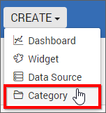

New categories can be added by providing name and description(optional) for the category.
 
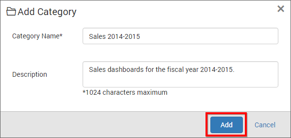

Fill the form with name, description and click on `Add`.

N> `Read Write Delete` permission for that `Specific Category` will be added for the user who created the category.

## Update Category

Category can be updated from the context menu with its name and description.

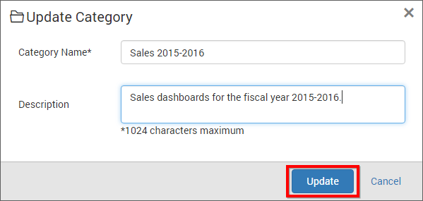

## Share Category

This section explains on how to share categories with the other users in the Dashboard Server. 

### Steps to share a category

1. Click the `Actions` button in the category list context menu and select `Manage Permissions` option.

	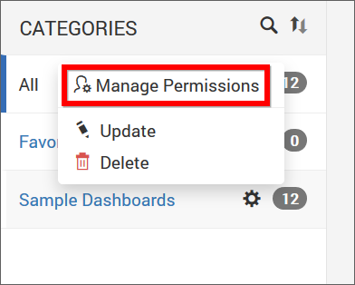

2. Select the permission access from the `Select Access` dropdown and select the users or groups to share the category.
  
	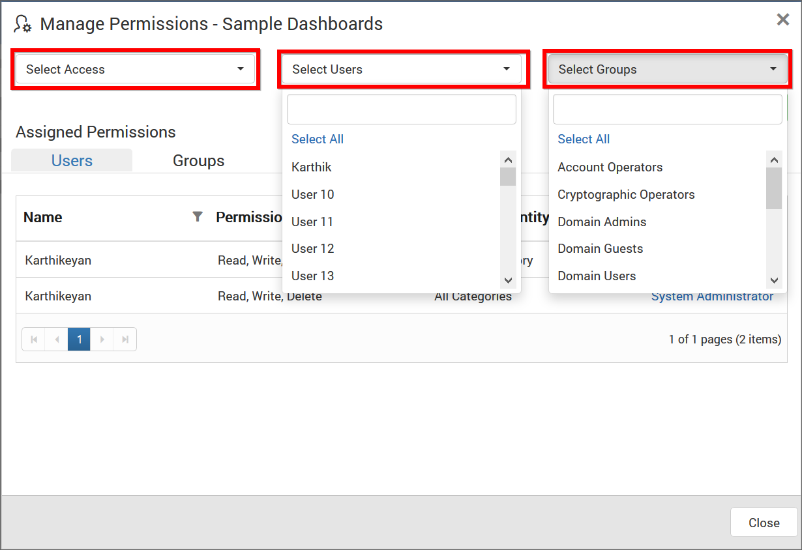
	
3. After selecting the access and users or groups, click on the `Add Permission` button.

	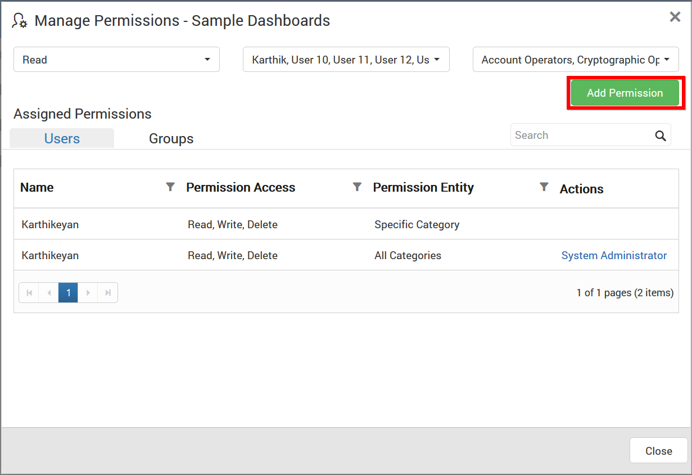
	
N> Only the user who created the category can share the category with other Dashboard Server users.

### View Permission

If the user is not an owner of the category, user can view the assigned permissions of the category by clicking the `View Permissions` option in the category list context menu.

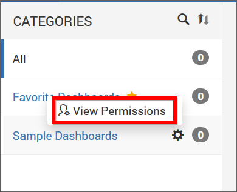

The permission availed to the users can be viewed in the `Users` tab.

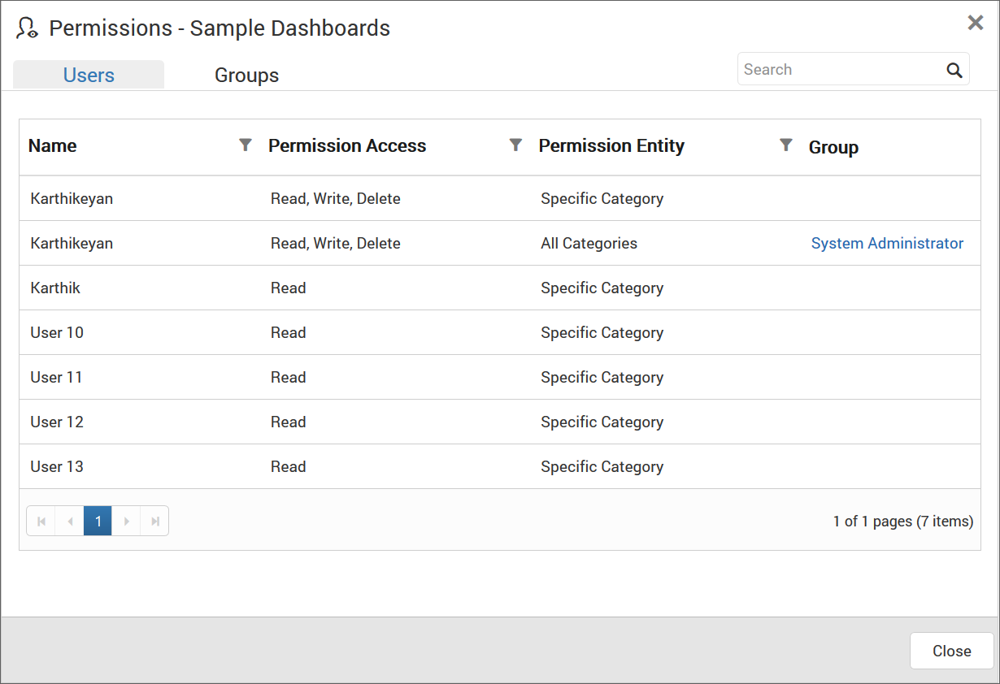

The permission availed to the groups can be viewed in the `Groups` tab.

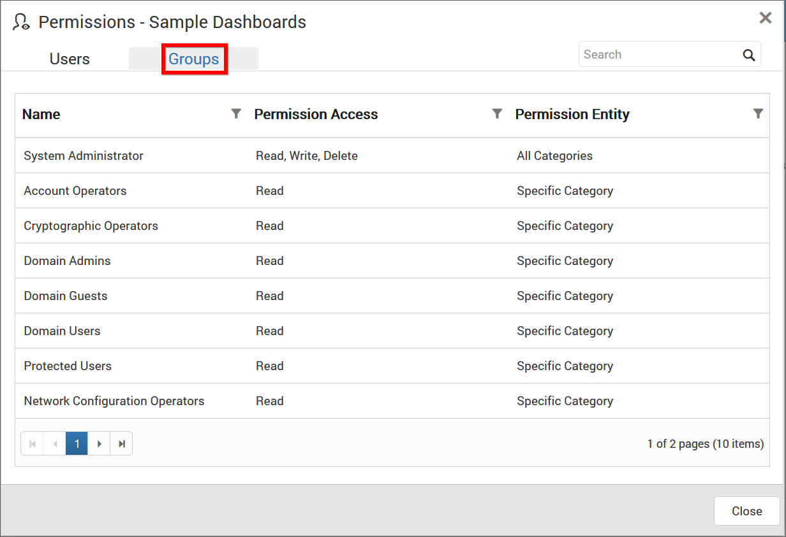

### Remove Permission

The user who created the category can remove the shared category permissions using the `Remove` option in the `Actions` column of the each permissions.

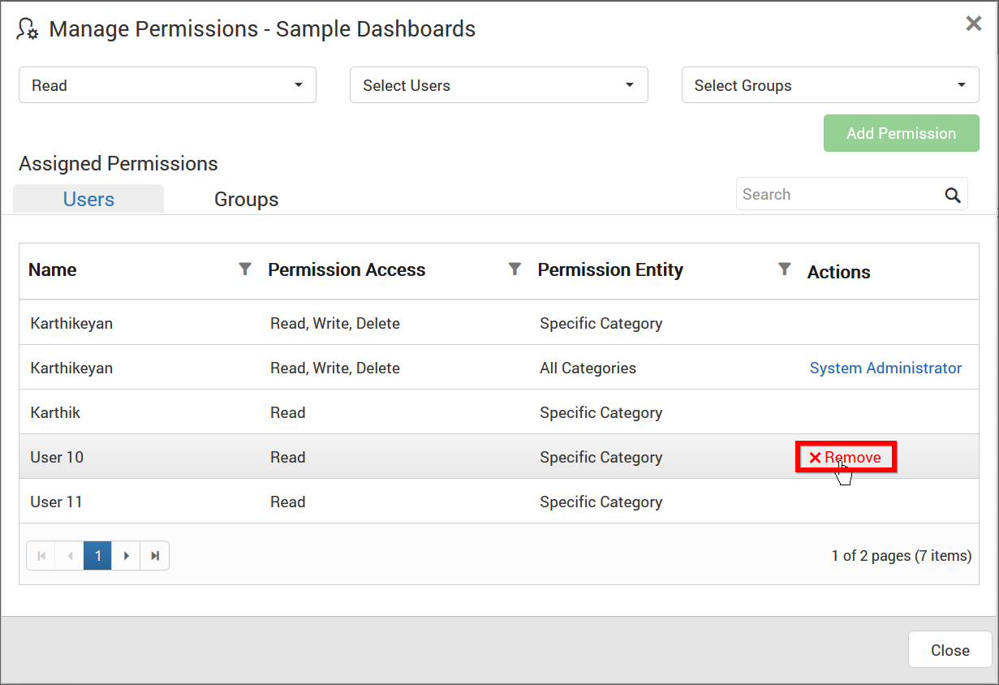

## Delete Category
Category can also be deleted from the Dashboard Server when they are no longer required.

Click on delete in the context menu for the category to be deleted.

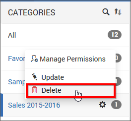

N> Category cannot be deleted when it has dashboards grouped in it.