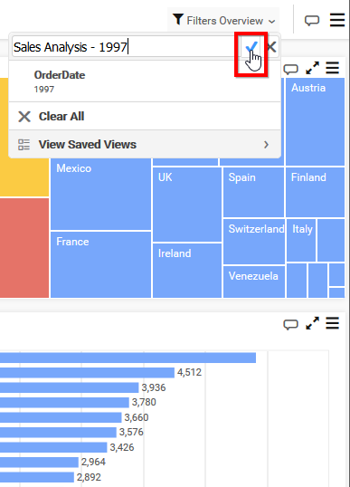

# Manage Dashboards Views

This section explains on how to open, add, update, share, delete Dashboard views in the Syncfusion Dashboard Server.

Dashboard Views that are accessible by the user depending on the user's permission is displayed in the Dashboards page.

## Open Dashboard Views
Dashboard Views are opened in our embedded Dashboard Viewer itself as Dashboards.
		
## Add Dashboard Views
* If the user has `Read Specific Dashboards` permission, then the user can create Dashboard View in any dashboard.
* The Created Dashboard View cannot be updated/deleted by other users.
* Also the owner of the Dashboard View only can has share permission on particular Dashboard View.
* The shared Dashboard View has only Read permission alone to other users.
* But Shared Dashboard View has `Save As` option to save as a new Dashboard View.

### Steps to add a Dashboard View

1. Apply some filters in Dashboard, you can find the `Filter Overview` at right top corner, Click on the `Filter Overview` option and select `Save` to add a Dashboard View.

    

    Now the textbox appeared at top of the drop down, fill the View name and Click on the Tick as shown in the below figure.
    
    

2. Now the saved Dashboard Views can be viewed by clicking on the `View Saved Views` option as below
  
   

N> `Read Write Delete` permission for that `Specific Dashboard View` will be added for the user who created the Dashboard View.

## Share Dashboard Views
Dashboard Views can be shared to any users with in the Dashboard Server.

Choose the users and groups from the dropdown and click on `Share` button to share to the selected users and groups.

## Make Public

Dashboard View can be public if the owner of the View marked the dashboard view as Public as below. 

		
## Delete Dashboard Views
Dashboard Views can also be deleted from the Dashboard server when they are no longer required.

Click the context menu under the `Filter Overview` and choose the `Delete` option to delete the Dashboard View from Dashboard Server.

