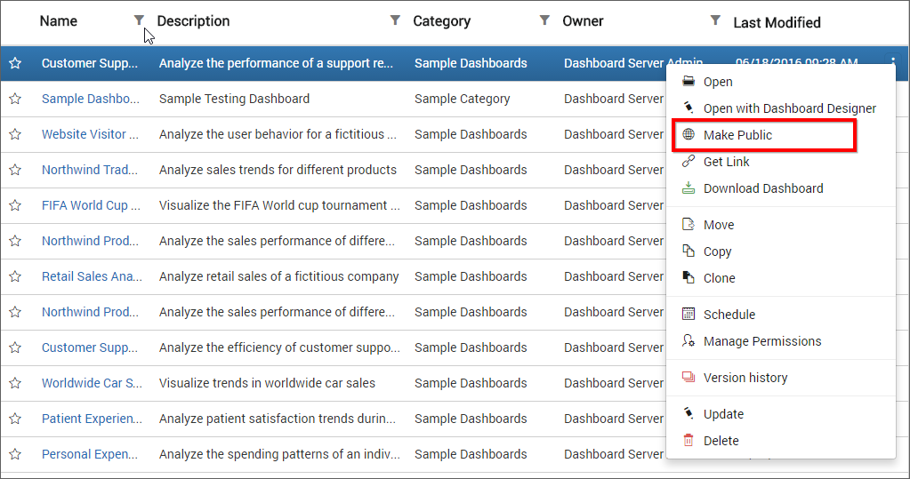
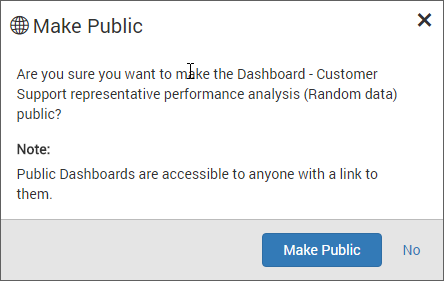
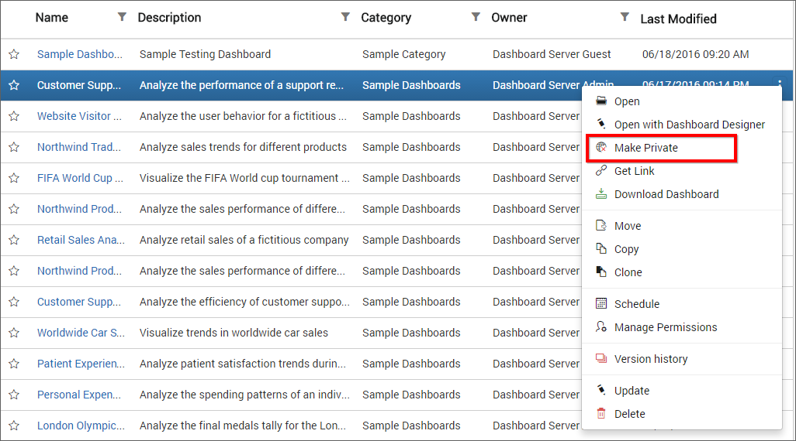
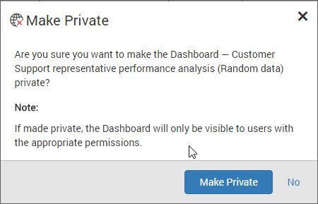

# Public Dashboard

This section explains on how to make the Dashboards public and private. 

Public Dashboards are accessible to anonymous users who has the Dashboard link.

Private Dashboards are accessible to the registered users in the Dashboard Server who has appropriate permissions.

## Make public

`Make Public` option is available only to the owner of the Dashboard.

Follow the steps below to make the Dashboards accessible to anonymous users.

1. Click on the context menu of the respective Dashboard and choose `Make Public` option.

    

2. Click on `Make Public` in the following confirmation dialog box.

    

Once the Dashboard made public dialog box with the Dashboard link will be displayed. 

## Make Private

`Make Private` option is available only to the owner of the Dashboard.

Follow the steps below to make the Dashboards accessible only to the users in the Dashboard Server who has appropriate permissions.

1. Click on the context menu of the respective Dashboard and choose `Make Private` option.

    

2. Click on `Make Private` in the following confirmation dialog box.

    

Once the Dashboard made private dialog box confirmation message will be displayed.