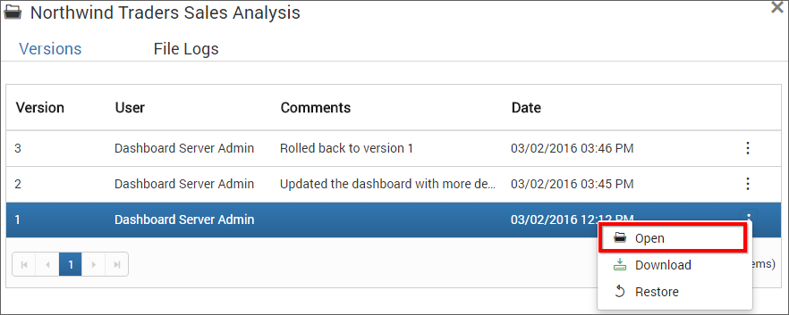
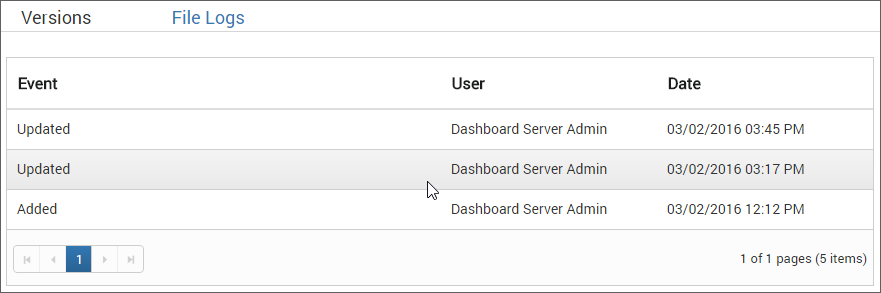

# Version History

Versions and file logs for each Dashboard will be maintained in the Dashboard server for every changes in the Dashboard.

### Versions
For each change in the `.sydx` file, a new version will be created. All versions can be individually opened. At any time, the Dashboard can be rolled back to an older version.

### File logs
For each change in the Dashboard including changes in the name, description, category and `.sydx` file, Dashboard server logs the changes done in the file logs.

