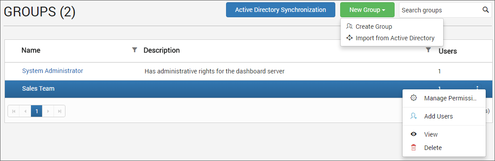
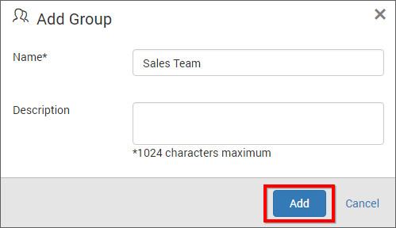
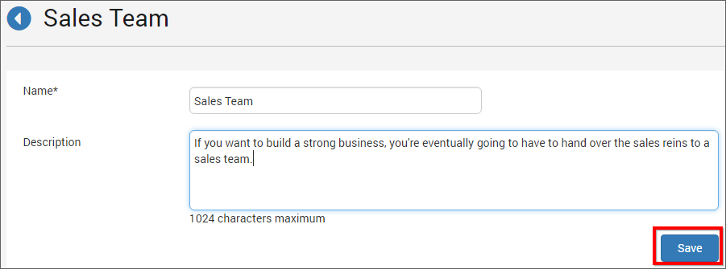
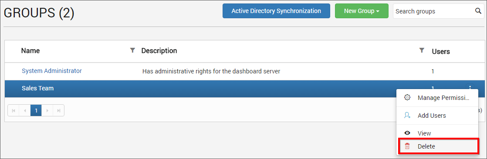
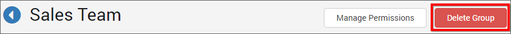
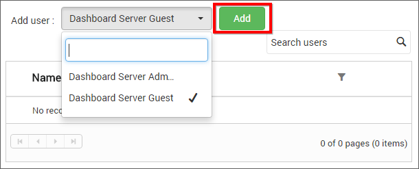
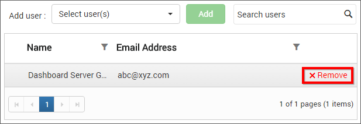

# Manage Groups

This section explains on how to add, edit, delete groups and also on how to assign users and manage permissions to groups in the Syncfusion Dashboard Server.

Groups is a collection of users to which permissions can be assigned.

## Add new group
To add new group to the dashboard server, click on `New Group` in the groups management page.
 
New groups can be added by providing name and description(optional) for the group.
 

Fill the form with name and description and click on `Add`. New group will be created and you can [add users](#assign-users) or [manage permissions](#manage-permissions) for it.

## Edit group
Group Information can be edited from the group's edit page.

Group name and description can be edited in the group edit page. In addition to that, users can also be assigned or removed from the group in this page.

## Delete group
Groups can be deleted if it is no longer needed. You cannot delete the `System Administrator` group.

### From group management page

### From group edit page

## Assign users
Users can be assigned to the selected group there by assigning the permissions of the group to the users.

Users can also be removed from the group if the user no longer needs the permissions of the group. Click on `Remove` next to the user in the group edit page to remove the user from the group.

## Manage permissions
Check the [Manage Permissions](/en-us/dashboard-platform/dashboard-server/administration/manage-permissions) section to learn how to manage permissions to a group.	