# Manage Users

This section explains on how to add, edit, activate, deactivate, delete users and also on how to manage the permissions and assign users to groups in the Syncfusion Dashboard Server.

Users can only be added/edited/deleted by the users, belonging to the `System Administrator` group.

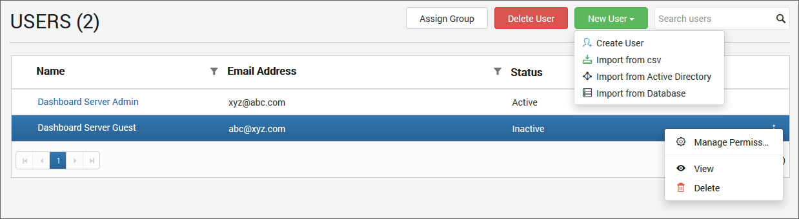

## Add new users

New users can be added to the Dashboard Server individually or in bulk using CSV import

### Add individual users

To add new users to the dashboard server, click on `New User` and then `Create User` from the User Management page. 

The `Add User` dialog will be shown as like in the image below.

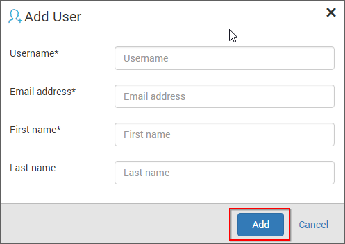

Fill the form with Username, Email address, First name and Last name and click on `Add`. 

New account will be created for the user and an [account activation email](/en-us/dashboard-platform/dashboard-server/site-settings/email-settings) will be sent to the email address with activation link to activate the Dashboard Server account.

The activation link sent to the user will be valid only for 3 days and if the user have not activated within the 3 days, a new activation link can be sent to the user from the user edit page. Check [Activate Users](#activate-users) section for more details.

The account will be in inactive status till the user activates the account from the activation email.

### Import users from CSV

Users can be added to the dashboard server in bulk using our CSV import feature. Using the CSV template that is downloadable from the `Import from CSV` page as shown below, you can fill the users with the below details

* Username
* Email address
* Full Name
* Password

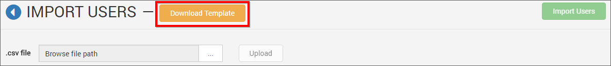

Follow the below steps to add users using the CSV template

1. Download CSV template.
2. Add users in the CSV file.

	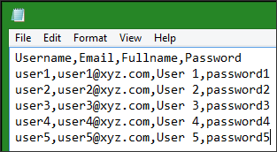

3. Save the CSV file and upload it.

	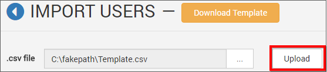

4. Once the file is uploaded the user details will be shown in the grid as like in the below image.

	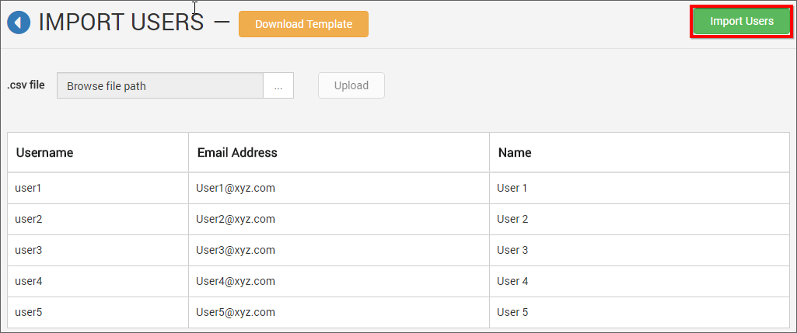

The same activation process has to be done to activate the user account as mentioned in the above section.   
	
## Edit users
User profile details can be edited from the users edit page as shown in the below image.

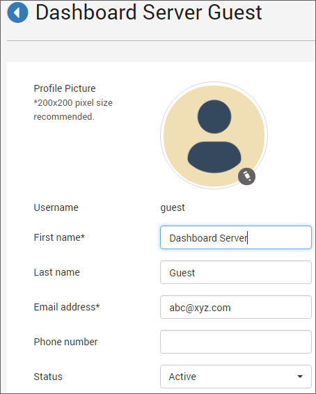

First Name, Last Name, Email address, Phone number and profile picture and the login password for the user can be edited by the user belonging to the 'System Administrator' group.  
	
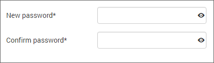
	
## Delete users
Users can be deleted from the Dashboard Server when the user no longer requires the access. Users can be deleted from the user management page or from the edit page.

### From user management page

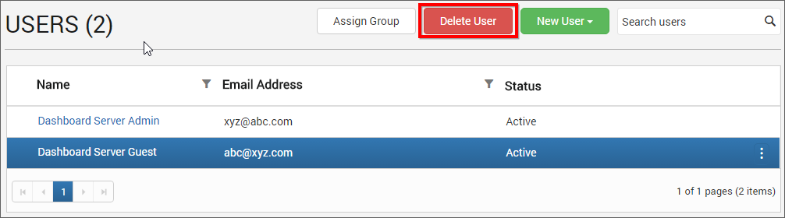

### From user edit page

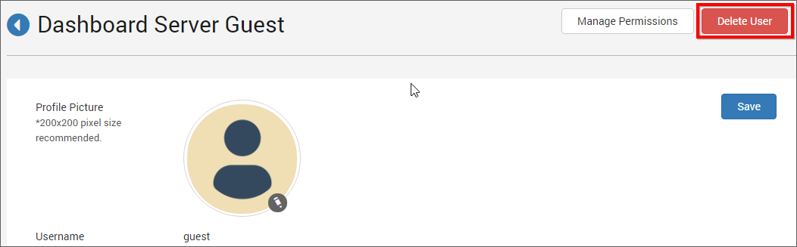

## Deactivate users
Users can be deactivated at any time. Once deactivated, the user cannot log into the Dashboard Server.
To deactivate a user, select inactive from the status dropdown in the user edit page.

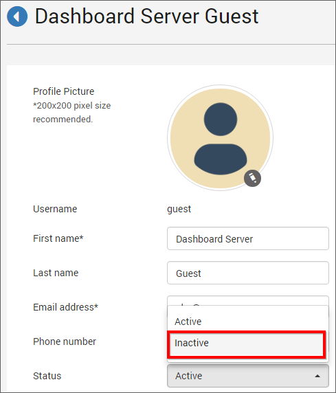

## Activate users
Inactive users can be activated by clicking on the `Activate User` button in the user edit page.

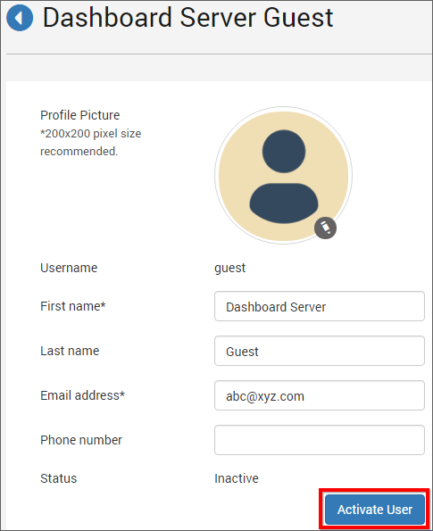

This will send an [account activation email](/en-us/dashboard-platform/dashboard-server/site-settings/email-settings) to the user with an activation link to activate the account and again this activation link will be valid only for 3 days.

If the user has not received the activation email within 3 days or missed to activate the account, the `System Administrator` has to resend the activation email to the user.

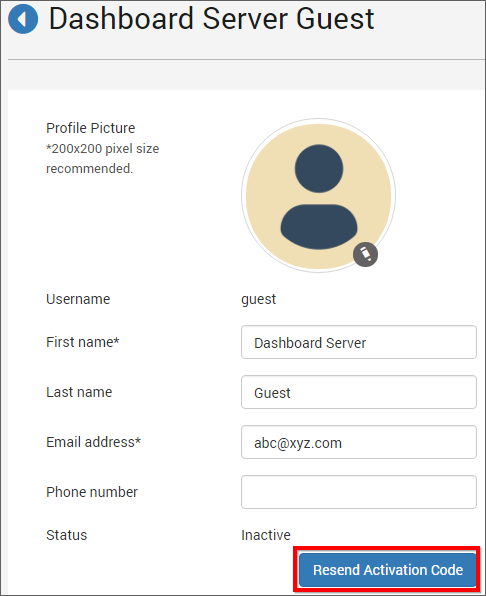
	
## Manage permissions
Check the [Manage Permissions](/en-us/dashboard-platform/dashboard-server/administration/manage-permissions) section to learn how to manage permissions to an user.
	
## Assign users to group
Users can be assigned to one or many groups from the user management page.

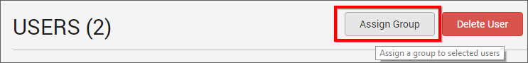

Users can be assigned to an existing group.

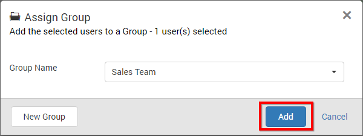

A new group can also be created at this time and the selected users can be assigned to the new group.

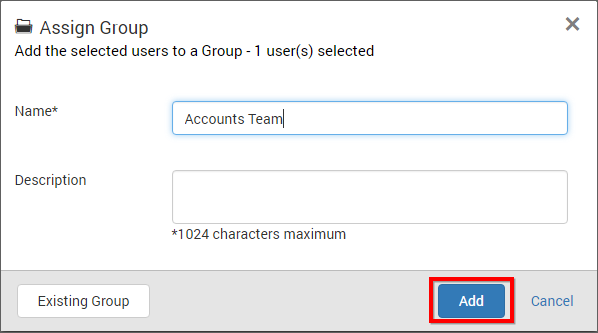

N> All the users in the group will have the permissions of assigned group.