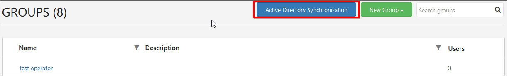
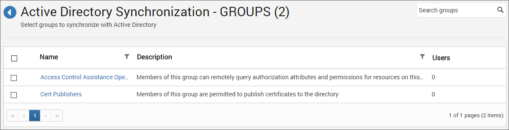
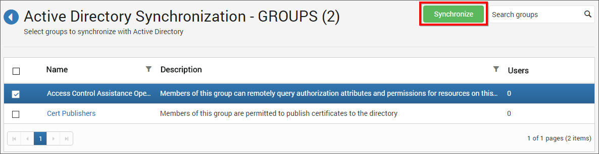
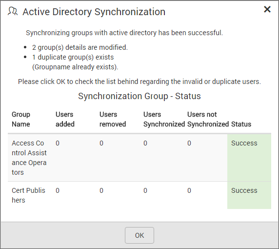
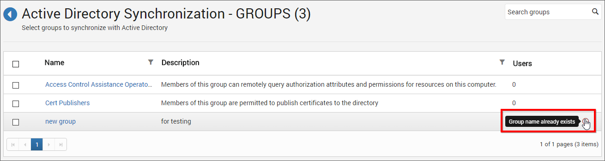

## Active Directory Group Synchronization

This section explains how to synchronize the imported Active Directory group and its users with the Active Directory.

You can navigate to the group synchronization page from groups page as shown in the below figure.

## Synchronize Groups

Dashboard Server will list the Active Directory groups that are already imported as shown in the below figure.

Choose the groups you want to synchronize and click on `Synchronize` at the top. 

### Synchronization procedure

* Dashboard Server will update the group's name and description from the Active Directory Server.

* Dashboard Server will delete the groups if the group has been deleted from the Active Directory Server.

* Dashboard Server will delete the user from Dashboard Server group, if the user has been deleted from Active Directory Server group. Dashboard Server will add the user into Dashboard Server, if a new user is added into the Active Directory group. If the new user is not present in the Dashboard Server, then a new user account will be created in the Dashboard Server and will be added into the group. 

After synchronization completes, the number of groups modified, deleted, duplicated will be shown in the success message box as shown in the below figure.

## Duplicate Groups

Active Directory groups who has the same group name as that of the Dashboard Server groups(which are already present) will be marked as duplicate groups and will not be allowed to synchronize with Active Directory.

