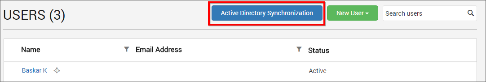
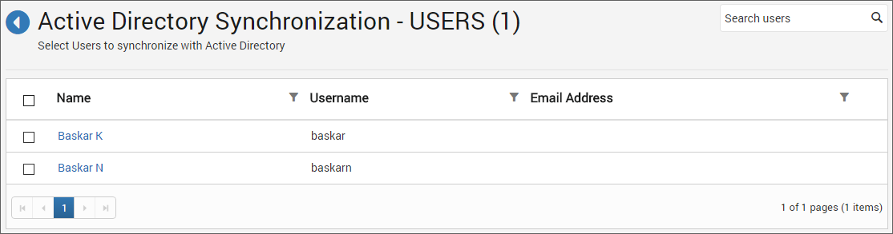
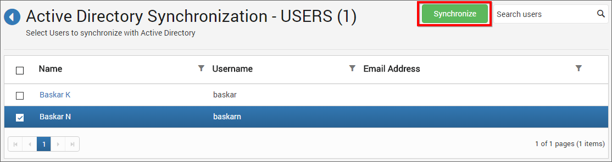
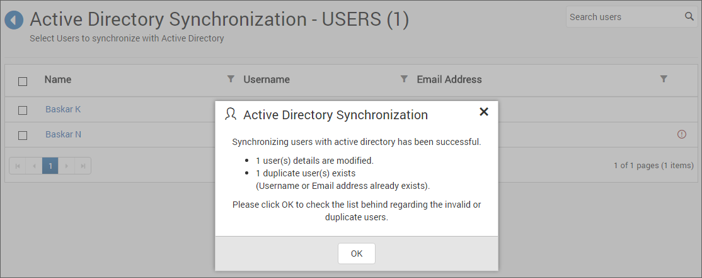
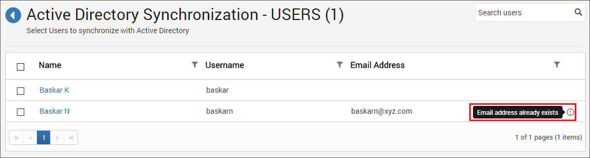

## Active Directory User Synchronization

This section explains how to synchronize the imported Active Directory users details with the Active Directory.

You can navigate to the user synchronization page from users page as shown in the below figure.

## Synchronize Users

Dashboard Server will list the Active Directory users that are already imported as shown in the below figure.

Choose the groups you want to synchronize and click on `Synchronize` at the top. 

###Synchronization procedure

* Dashboard Server will synchronize the user details - username, first name, last name, email address, contact number with the Active Directory Server.

* Dashboard Server will delete the user if the user has deleted from the Active Directory Server. 

After synchronization completes, the number of users modified, deleted, duplicated will be shown in the success message box as shown in the below figure.

## Duplicate Users

Active Directory users who has the same username or email address as that of the Dashboard Server users(who are already present) will be marked as duplicate users and will not be allowed to synchronize into Active Directory.

