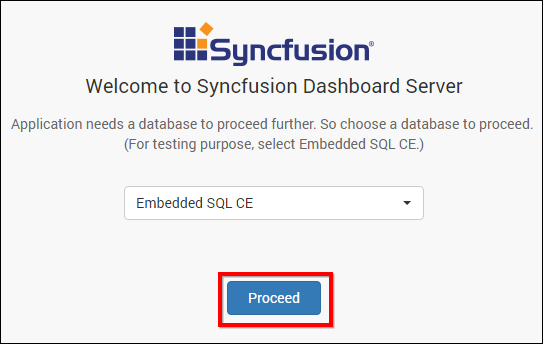
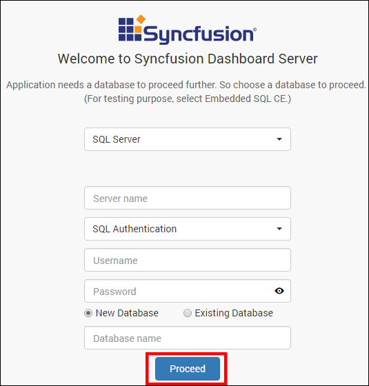
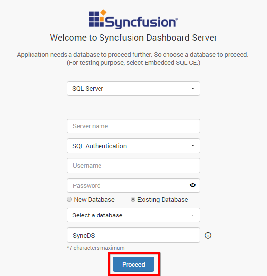
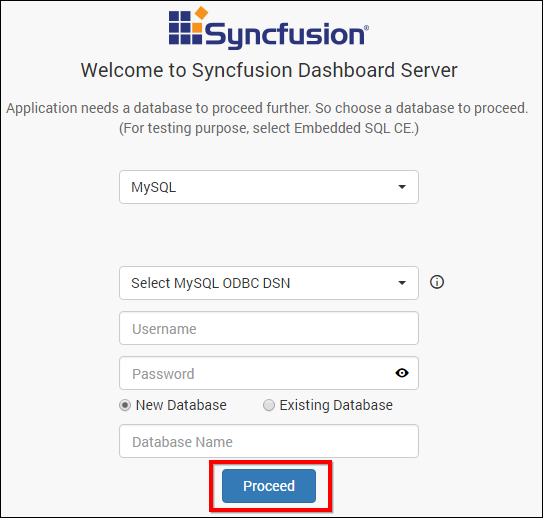
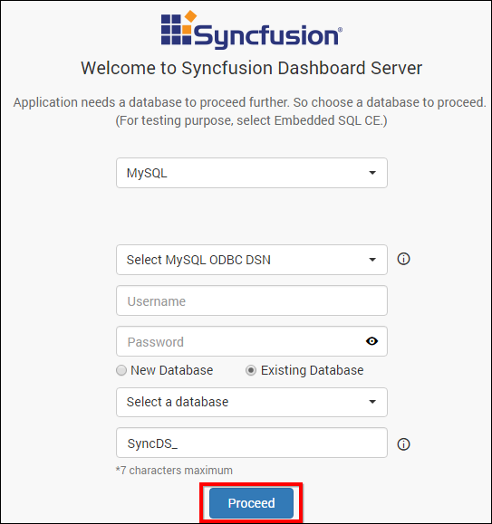
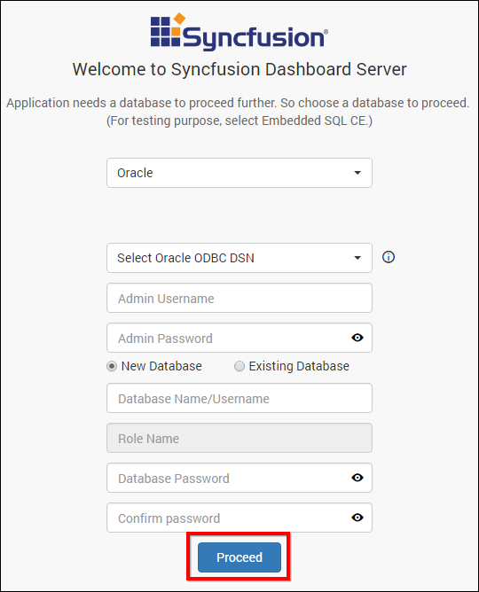
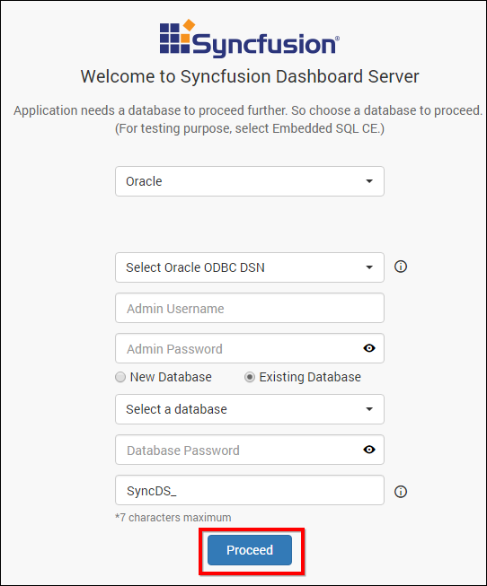
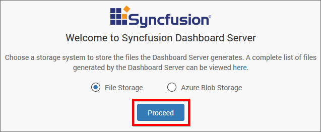
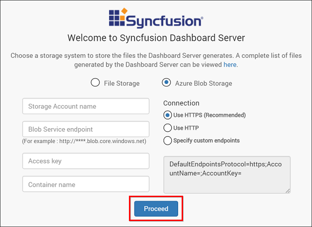
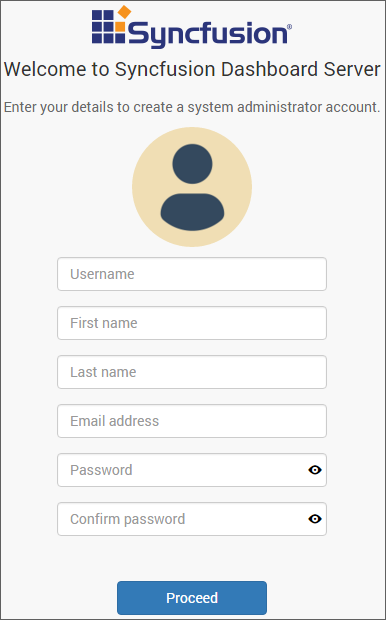

# Application Startup

This topic describes how to configure the Syncfusion Dashboard Server. 

Application startup screen help you configure storage options and to register a new user.

## Storage Options

Dashboard Server stores the user management data in the following databases as you select in the first screen.
	* SQL CE
	* SQL Server
	* MySQL
	* Oracle

  1. ### Embedded SQL CE (For Testing purposes only)
     Installed along with Dashboard Server Installer to easily set the environment up for testing purposes.
      
	 
   
  2. ### SQL Server
     Can connect to the existing SQL Server instance with the below options.
    
      * Create new `Syncfusion Dashboard Server` database.
      
        
      
      * Use an existing database for `Syncfusion Dashboard Server`.
	  * Choose one of the database from `Select a Database` drop down for creating Dashboard Server tables in that database.
	  * In order to avoid table name conflicts, we have added a prefix `SyncDS_` by default. It can also be changed. If the prefix is empty, the default prefix `SyncDS_` will be added.
      
        
     
     
     N> The credentials that is given to connect to the SQL Server instance must have permissions to 
        * Create Database
        * Create Table
        * Insert
        * Update Table
        * Alter Table
        * Select
        * Drop Table
        * Drop Database  
        
   3. ### MySQL
      Can connect to the existing MySQL instance with the below options.
      
      * Create new `Syncfusion Dashboard Server` database.
      
        
      
      * Use an existing database for `Syncfusion Dashboard Server`.
	  * Choose one of the database from `Select a Database` drop down for creating Dashboard Server tables in that database.
	  * In order to avoid table name conflicts, we have added a prefix `SyncDS_` by default. It can also be changed. If the prefix is empty, the default prefix "SyncDS_" will be added.
      
        
      
      N> The credentials that is given to connect to the MySQL instance must have privileges to 
        * Create
        * Delete
        * Insert
        * Update
        * Alter
        * Select
        * Drop 
        * Show Databases
        
   4. ### Oracle
      Can connect to the existing Oracle instance with the below options.
      
      * Create new `Syncfusion Dashboard Server` database.
      
        
      
      * Use an existing database for `Syncfusion Dashboard Server`.
	  * Choose one of the database from `Select a Database` drop down for creating Dashboard Server tables in that database.
	  * In order to avoid table name conflicts, we have added a prefix `SyncDS_` by default. It can also be changed. If the prefix is empty, the default prefix "SyncDS_" will be added.
      
        
      
      N> The credentials that is given to connect to the Oracle instance must have permissions to 
        * Create Database 
        * Create Role 
        * Grant Role 
        * Grant Permission 
        * Drop Database

Dashboard Server stores the dashboards and data sources that are uploaded to the server in the following location as file system.

`%programdata%\Syncfusion\Dashboard Server\Resources`

## Storage System

### File Storage

The default system will be File Storage, in this the Dashboard Server stores the dashboards and data sources that are uploaded to the server in the following location in the installed machine.

### Blob Storage

If the Dashboard Server wants to store the dashboards and data sources that are uploaded to the server in the blob storage location, need to provide details shown in below figure.

You can find the details on How to configure the Azure Blob [here](/en-us/dashboard-platform/dashboard-server/Azure-App-Service-deployment) 

## New User - System Administrator

New user should be created to access the dashboard server with the details mentioned in the below image.  

While creating this new user account, a new group `System Administrator` is also created.

`System Administrator` group will have permission to do the below by default

* [Create Dashboards](/en-us/dashboard-platform/dashboard-server/administration/manage-dashboards)
* [Create Data Sources](/en-us/dashboard-platform/dashboard-server/administration/manage-data-sources)
* [Create Schedules](/en-us/dashboard-platform/dashboard-server/administration/manage-schedules)
* [Create Users](/en-us/dashboard-platform/dashboard-server/administration/manage-users)
* [Create Groups](/en-us/dashboard-platform/dashboard-server/administration/manage-groups)
* [Manage Permissions for users and groups](/en-us/dashboard-platform/dashboard-server/administration/manage-permissions)

The new user account created will be assigned to this group by default. 