# Collaboration

This section explains on how to collaborate with other users in the Syncfusion Dashboard Server by commenting on Dashboards and Widgets.

Collaboration feature in Dashboard Server lets the users write comments on a Dashboard or a Widget to share with other users who has access to the Dashboard or the Widget. They are useful for tracking events and providing insights into those events. Users can also add links to other Dashboards or Widgets or any other external websites. 

Anyone with access to a Dashboard can write comments. When a comment has been added to a Dashboard, users who have notifications enabled in their profile, will be notified through email and system notifications. Learn more about Notifications in [this](/en-us/dashboard-platform/dashboard-server/notifications) section.

## Post a new comment

To post a new comment, open the Dashboard and click on the comment icon in the top right corner as shown in the below image.

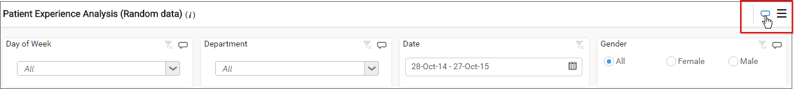

Type the comment in the text area and click on `Post` to save the comment for the Dashboard.

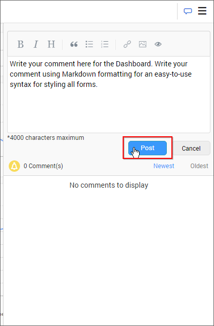

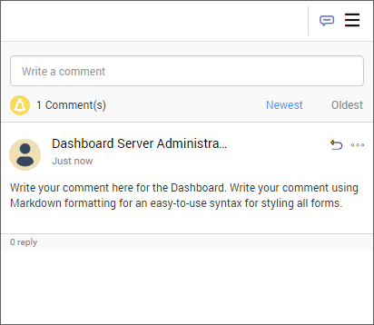

## Reply to a comment

To reply to a comment, click on the `Reply` icon in the comment as shown in the below image.

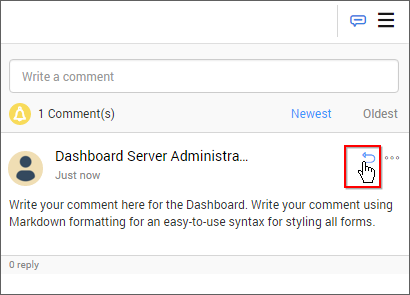

Type the reply in the text area and click on `Reply` to save the reply for the comment on the Dashboard.

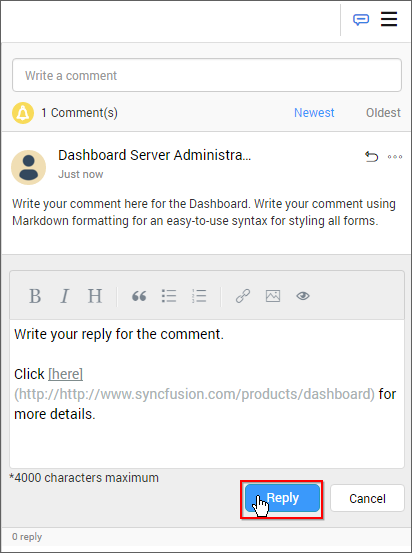

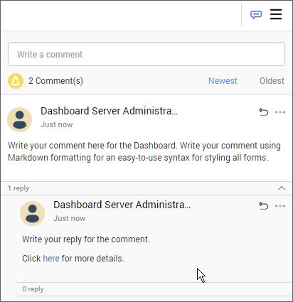

N> You can also reply to a reply of a comment. This can be repeated a number of times.

## Edit a comment

To edit a comment, click on the option `Actions` button to get more options for a comment or a reply and click on the `Edit` button as shown in the below image.

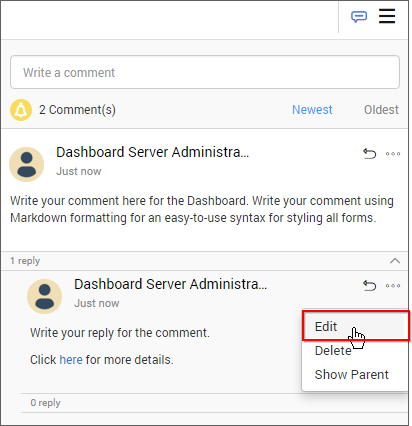

Edit the comment and click on `Save` to save it.

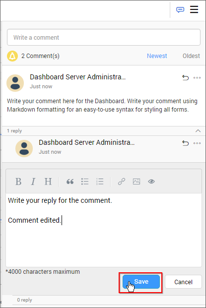

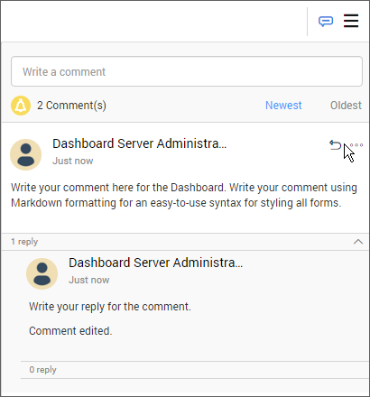

## Delete a comment

To delete a comment, click on the option `Actions` button to get more options for a comment or a reply and click on the `Delete` button as shown in the below image.

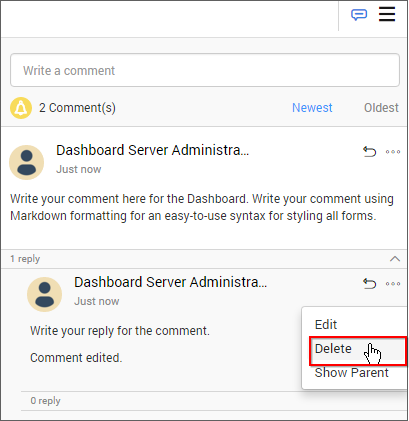

## Show parent comment of a reply

To know the parent comment of a reply or to know which comment the reply has been posted, click on the option `Actions` button and click on the `Show Parent` button as shown in the below image.

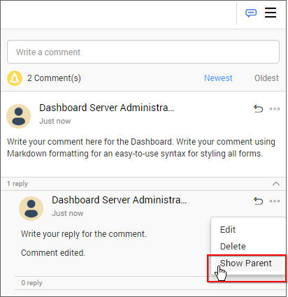

It will highlight the parent comment for the reply as like below.

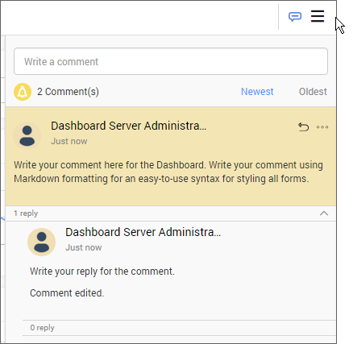

N> The above options - Post a new comment, reply to a comment, edit a comment, delete a comment and show parent comment of a reply applies to Widgets inside a Dashboard and to each Widget in the Widgets page (click [here](/en-us/dashboard-platform/dashboard-designer/compose-dashboard/commenting-dashboard-and-widget) for more details about Dashboard and Widget commenting ) too.