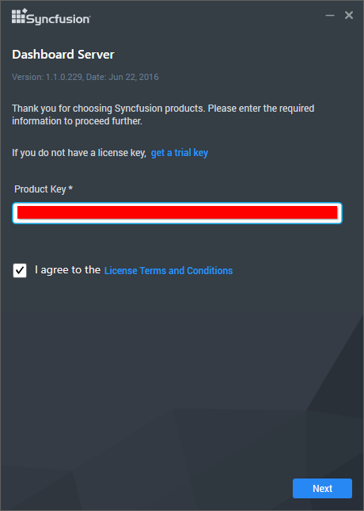
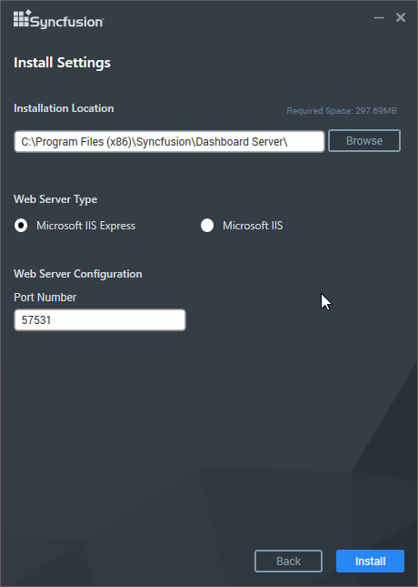
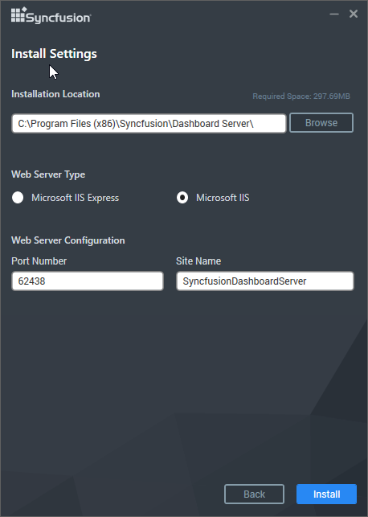
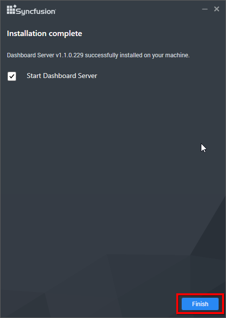
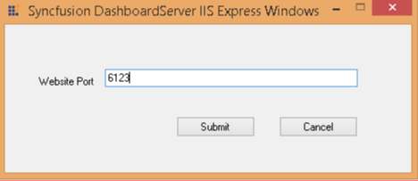
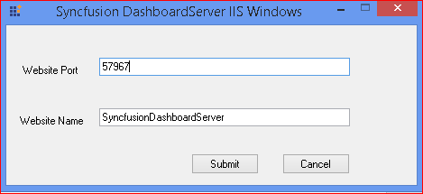
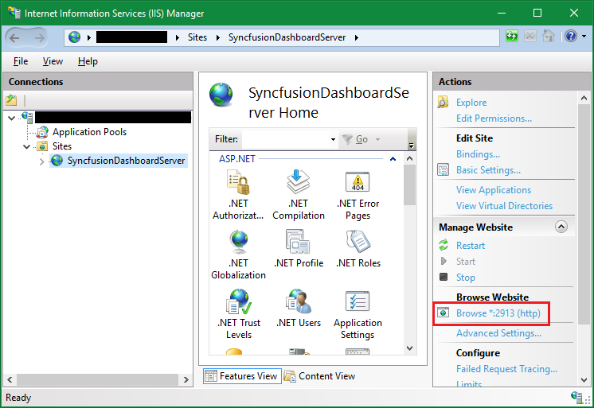
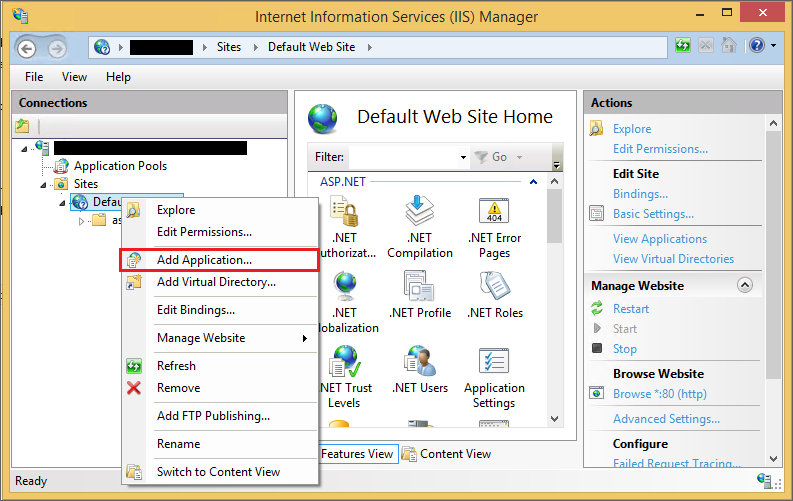

# Installation and Deployment 

This section explains on how to install and deploy the Syncfusion Dashboard Server. 

## Download Setup

* You can download the Dashboard Server setup from [here](http://www.syncfusion.com/downloads/dashboard) 
* Licensed customers can download the install from the [downloads](http://www.syncfusion.com/support/directtrac/downloads) section

N> The key to unlock the setup will be sent to your registered e-mail address. 

## Installation

This topic details the steps required to install the Dashboard Server.

To learn about the system requirements needed to deploy the Dashboard Server in your business environment, see [System Requirements](/en-us/dashboard-platform/system-requirements).

After you run the Dashboard Server Installer, type in the unlock key that has been sent to your registered e-mail address. You can check the License Agreement of Dashboard Server by clicking on the `License Terms and Conditions`.

After you read the license agreement, click on Next to select the installation server type, location and the port number on where the dashboard server has to be hosted.

We have provided the Dashboard Server to be hosted into the following two web server types

1. IIS Express
2. IIS

### IIS Express

### IIS

Need to provide the Port number, Location and Application Name to host the Dashboard Server into the IIS.

Dashboard Server will be installed with the below components in the mentioned installation location.

* Dashboard Server web application
* Scheduling Service

Once the installation completes you can start the dashboard server by checking the "Start Dashboard Server" in the last screen and click on finish.

Or you can also start the dashboard server from the shortcuts available in the desktop.

Desktop shortcuts will be provided for starting and stopping the dashboard server and for the dashboard designer.

N> Dashboard Server does not support multiple versions installed on the same machine.  

N> Dashboard Server cannot be downgraded to the previous version.

## Deployment

* Dashboard Server web application opens in your default browser with the specified port number at `http://localhost:[port_number]/`

We have shipped two utilities with the Dashboard Server to host the application in IIS and in IIS Express.

## Host as website in IIS Express

1. Run the program DashboardServerIISExpressWindows.exe from the following installed location to host the dashboard server in IIS Express.

    `{Installed_ Location}\Syncfusion\Dashboard Server\Infrastructure\StartDashboardServer\DashboardServerIISExpressWindows.exe`

    

    Note: By default, it will show a random port number. An unused port can also be chosen to host in that port.

2. Click Submit and this program will host the application in IIS Express and Dashboard Server application will be launched in browser.

## Host as website in IIS

Dashboard Server can also be hosted in [IIS](https://en.wikipedia.org/wiki/Internet_Information_Services) by following the below steps.

1. Run the program DashboardServerIISWindows.exe from the following installed location to host the dashboard server in IIS

    `{Installed_Location}\Syncfusion\Dashboard Server\Utilities\StartDashboardServerIIS\DashboardServerIISWindows.exe`
    
    

2. Type in a unused port for the Dashboard Server as like in the above image. This program will host the application in IIS and the Dashboard Server can be opened from the browse button in the IIS.

    
    
## Host as Application in IIS

Dashboard Server can also be hosted as Application in [IIS](https://en.wikipedia.org/wiki/Internet_Information_Services) by following the below steps.

### Add Dashboard Server as application

Right click the Website hosted in IIS and choose `Add Application` as below figure.

And Fill the following details as below figure

1. Alias name
2. Application pool
3. Physical path

### Convert the sub folders as application

We have the following folders to be converted as application.

1. API
2. WindowsAuthentication

Right click the folder and choose `Convert to Application` as below figure

    
#### SSL

To enable SSL for the Dashboard Server application, you will need a valid SSL certificate. Please check the below link on how to Obtain an SSL certificate and install it to a website in IIS.

<http://www.iis.net/learn/manage/configuring-security/how-to-set-up-ssl-on-iis>

N> If you want to access Dashboard Server from a different machine to the one it's installed on, use the URL http://machine_name:[port_number] or http://machine_ip_address:[port_number]