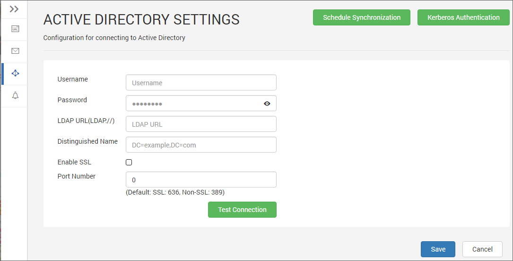
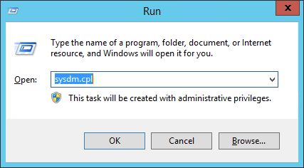
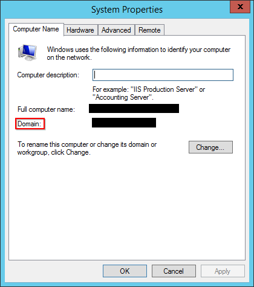

# Active Directory Settings

This section explains what are the [Active Directory](https://msdn.microsoft.com/en-us/library/windows/desktop/aa746492) details needed and how to configure Active Directory with the Syncfusion Dashboard Server.

You will need the below Active Directory details to configure Syncfusion Dashboard Server with your Active Directory

* Username and Password - username and password of the user who is present in the Active Directory domain
* LDAP URL - IP or DNS name of the Windows Server where you have Active Directory Domain Services enabled. For example, `LDAP://192.168.1.1`
* Distinguished Name - FQDN of the Active Directory. Follow the below procedure to find out the Distinguished Name of your Active Directory
    1. Go to Run(Win + R) and type sysdm.cpl in a machine which is connected to the Active Directory or in the Windows Server where you have Active Directory Domain Services enabled
    
    

    2. The `System Properties` dialog will be opened and you can find the Distinguished Name labeled as `Domain`
    
    
    
    For example, if your Domain is www.example.com, then you have to type in as dc=www,dc=example,dc=com
    
* Enable/Disable SSL connection to Active Directory - Enable this checkbox, if your Windows Server needs SSL connection to connect  
* Port Number - Default port for Non-SSL connections is 389 and for SSL connections is 636