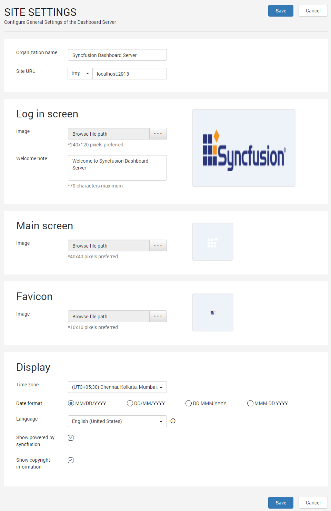
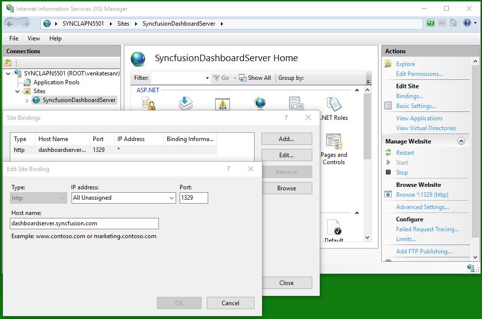

# Custom Rebranding

This section explains on how to customize the Syncfusion Dashboard Server by changing the organization name, site URL, login screen logo and welcome note text, main screen logo, favorite icon and time zone and date time display formats.

Dashboard Server can be rebranded with Organization name, site URL, login screen logo and welcome text, main screen logo, favicon, time zone and date time format. 

## Organization Name
Name of the Dashboard Server can be changed at any time and this is in the title bar of the browser.
		
## Site URL
Dashboard Server URL can be changed at any time in the Server Settings page and to get this change reflected you need to configure the same in the IIS. Check the [Host in IIS](/en-us/dashboard-platform/dashboard-server/installation-and-deployment#host-in-iis) section on how to host the dashboard server in IIS. After hosting is done, add the same URL in the site binding in IIS as like below.

Dashboard Server can also run under SSL for which you will need to select the `https` from the `Site URL` dropdown.
		
## Login Screen
* Login page logo image can be changed and the preferred image size is 240x120 pixels. Dashboard Server will have Syncfusion logo as default login logo.
* Welcome note can be changed and the maximum characters is 70. Dashboard Server will have "Welcome to Syncfusion Dashboard Server" as default login welcome text.
		
## Main Screen
Main screen logo image can be changed and the preferred image size is 40x40 pixels. Dashboard Server will have Syncfusion logo as default main screen logo.
		
## Favicon
Favicon for the Dashboard Server can be changed and the preferred image size is 16x16 pixels. Dashboard Server will have Syncfusion favicon as default favicon.
		
## Display

### Time zone
Time zone for the Dashboard Server can be changed. Dashboard Server sets the time zone of the system where it is installed by default.

### Date format
Date format of the Dashboard Server can be changed. Dashboard Server will have "MM/dd/yyyy" as the default date format.

### Language
Option to localize the Dashboard Server to any culture. Please click [here](/en-us/dashboard-platform/dashboard-server/localization) to learn how to add new localization or edit existing localization in the Dashboard Server.

### Powered by Syncfusion
Option to show/hide `Powered by Syncfusion` in the footer of the Dashboard Server. By default, this will be shown.

### Copyright Information
Option to show/hide `Copyright Information` in the footer of the Dashboard Server. By default, this will be shown.