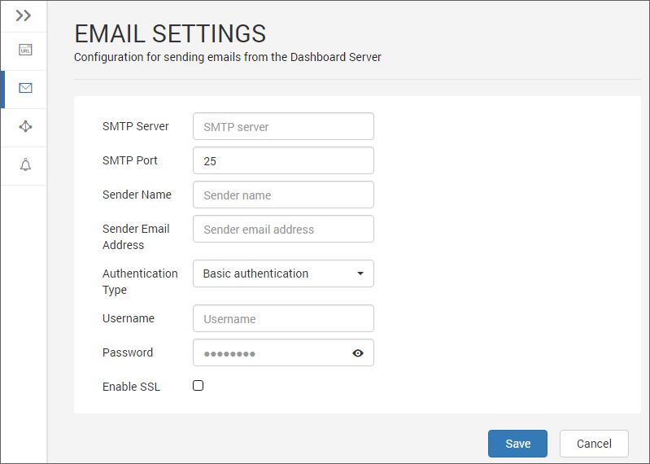

# Email Settings

This section explains on how to configure the [SMTP](https://en.wikipedia.org/wiki/Simple_Mail_Transfer_Protocol) details in the Syncfusion Dashboard Server to send emails. 

SMTP Email Settings are required to perform the following operations

**Account Activation** --- Sends user account activation email
   
**Forgot Password** --- Sends request links to reset the password when the user has forgotten the password
	
**Reset Password** --- Sends links to reset the password
	
**Scheduled Dashboards** --- Sends the exported dashboard to the scheduled recipients

The following SMTP details are required to send email from the dashboard server.

* SMTP Server
* SMTP Port
* Sender Name
* Sender email
* Password
* SSL/TLS
	
