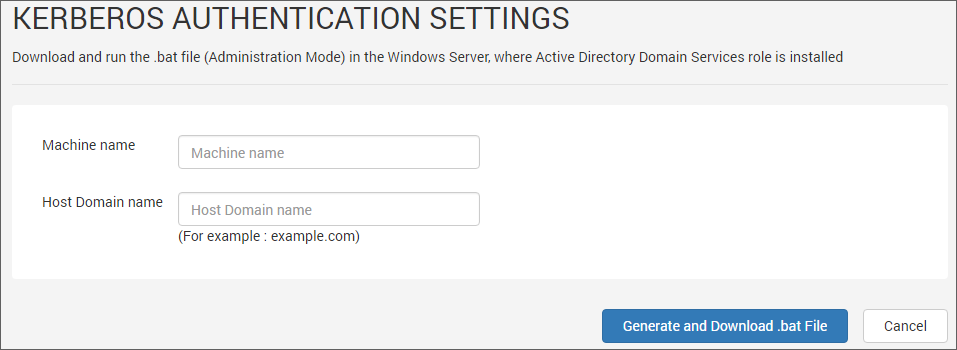
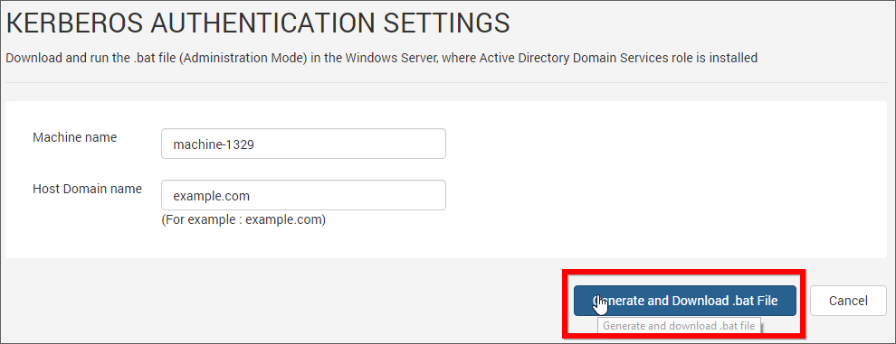

#Kerberos Authentication Settings

This section explains how to configure Syncfusion Dashboard Server to use Kerberos for user authentication.  

Please check the below links for more details about Kerberos authentication protocol.

<https://msdn.microsoft.com/en-us/library/bb742516.aspx>

<https://msdn.microsoft.com/en-us/library/windows/desktop/aa378747>

##Configure Kerberos Settings

To configure dashboard server to use Kerberos, you will need to feed the Machine name and Host Domain name and Dashboard Server will generate a .bat file which then you will need to run the batch file in the Windows Server, where Active Directory Domain Services role is installed.

* Machine name - You can find the machine name using the following steps.
    1. Right click on `My computer` and select `Properties`.
    2. You can find the Machine name labeled as `Computer name` under `Computer name, domain, and workgroup settings`
    
* Host Domain name - This is the DNS name of the Dashboard Server. For example, example.com.

##Generate SetSPN .bat file

After feeding in the above parameters, click on `Generate and Download .bat File`. Dashboard Server will generate the .bat file for setting the SPN and will prompt you to download.

Save and run the generated .bat file in the Windows Server machine, where Active Directory Domain Services role is installed.

This will set Service Principal Name to let the Dashboard Server to authenticate users using Kerberos authentication.