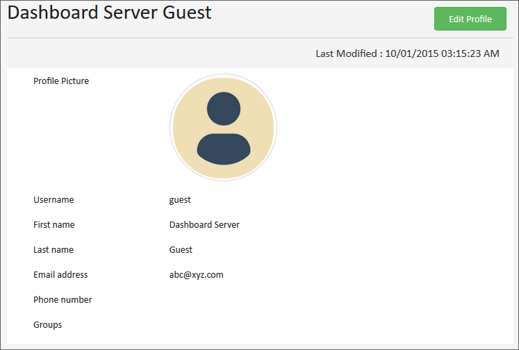
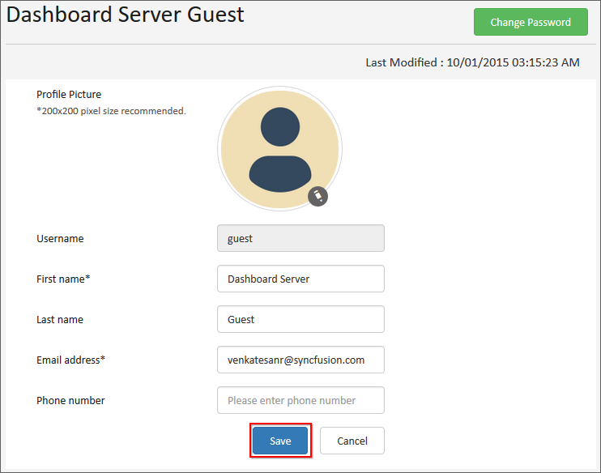
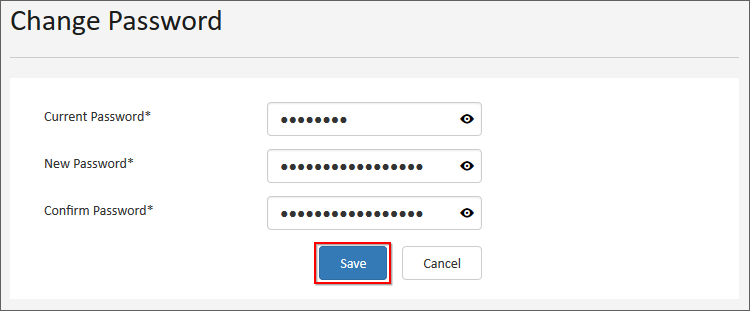

# User Profile

This section explains on how to view and edit profile and also on how to change password for the user profile in the Syncfusion Dashboard Server.  

User can view the profile and edit the profile details and can change the password.

## View Profile
You can view your profile details in this page.

 
## Edit Profile
First name, Last name, Email address, Phone number and Profile picture can be changed in the edit profile page.

     
## Change Password
Password to log in to the dashboard server can be changed in the change password page.

