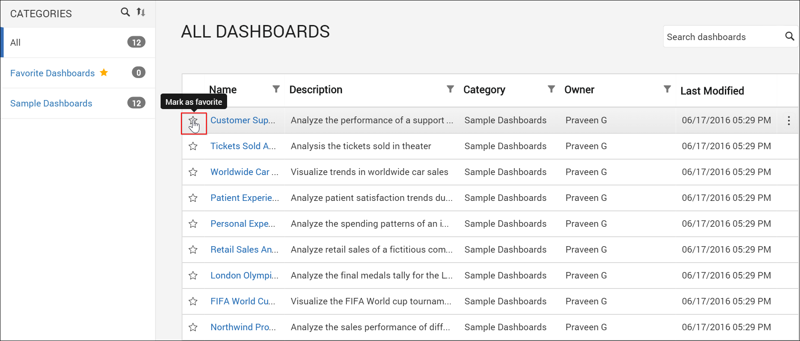
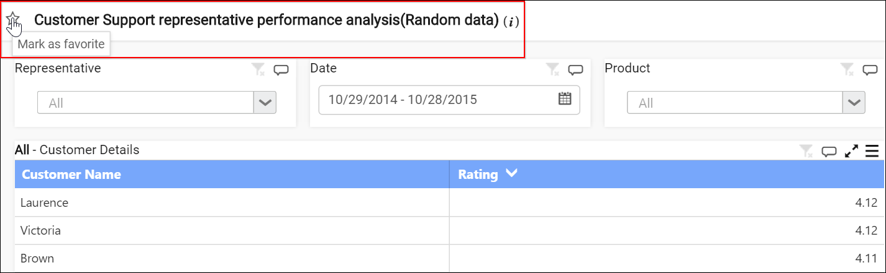
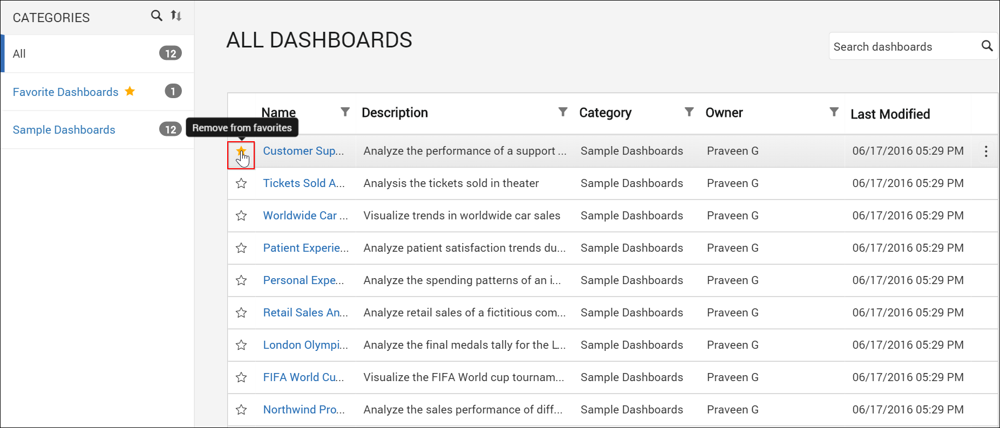
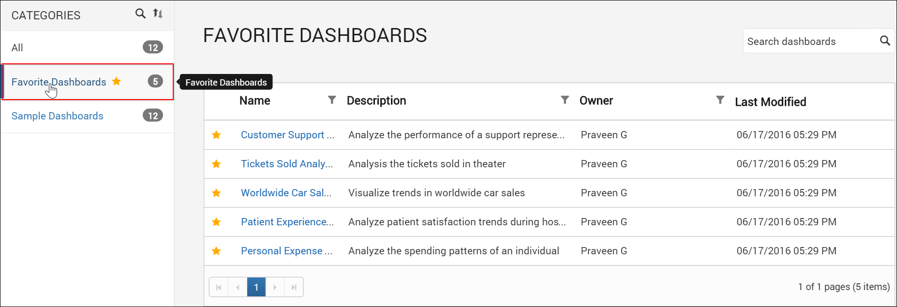

# Favorite Dashboard

This section explains about how to mark Dashboards as favorites, remove a particular Dashboard from favorites and view the list of favorite Dashboards in the Syncfusion Dashboard Server.

## Mark a Dashboard as favorite

Dashboards can be marked as favorite to view them in the `Favorite Dashboards` category instead of searching them in the Categories or using keywords in the Dashboards list.  

To mark a Dashboard as favorite, click on the star icon near the Dashboard name. 
The star icon will be filled with color to indicate that it is added as favorite Dashboard.

	
## Remove a Dashboard from favorites

To remove a dashboard from favorites, click on the star icon near the Dashboard name.
The star icon color will be emptied to indicate that it is removed from favorites.

## Favorite Dashboards Category

Dashboards that are marked as favorite can be viewed under `Favorite Dashboards` category.

