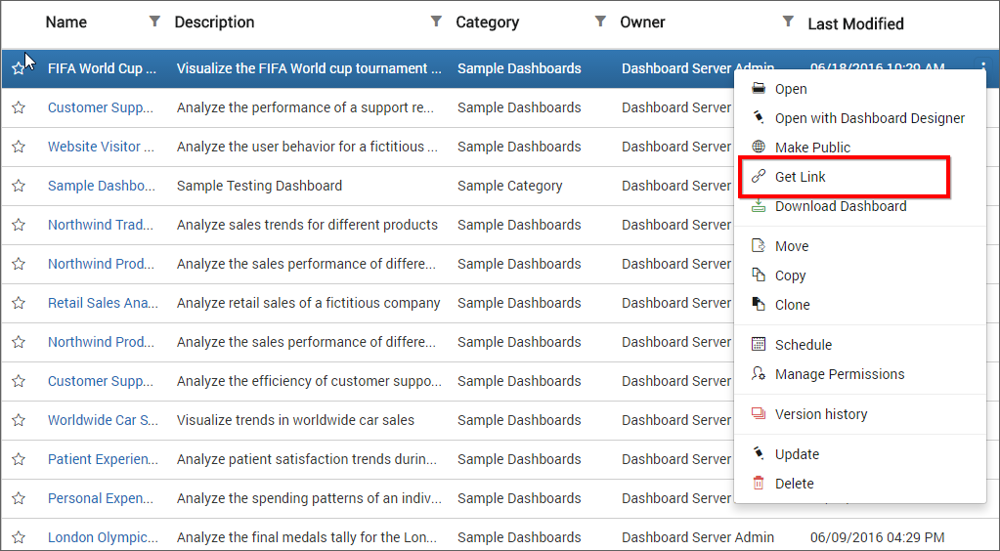
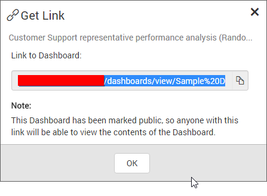
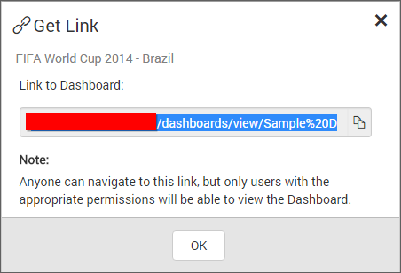

# Get Dashboard Link

This section explains on how to get link to the Dashboards in the Syncfusion Dashboard Server.

These links are used to navigate to the Dashboard and can be shared with others.

If the Dashboard is public, anyone with this link will be able to view its contents.

If the Dashboard is private, anyone with this link can navigate to the Dashboard, but only users with the appropriate permissions will be able to view its contents.

## Get Link 

`Get Link` option is available for all the Dashboards.

Follow the steps below to get the Dashboards link.

1. Click on the context menu of the respective Dashboard and choose `Get Link` option.

	

2. Respective Dashboard link will be show in the `Get Link` dialog box.

    For Public Dashboards
     

    For Private Dashboards
    