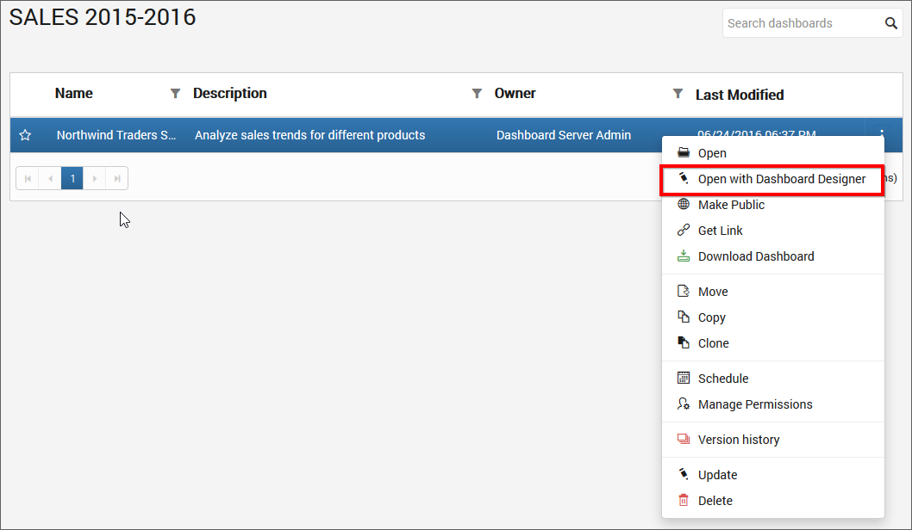

# How to open Dashboards

This section explains on how to open Dashboards in the Dashboard Server and in the Dashboard Designer from the Dashboard Server.

Dashboards that are accessible by the user depending on the user's permission is displayed in the Dashboards page.

## Open Dashboard
Click on the Dashboard Name in the list to open it.

Dashboards are opened in our embedded Dashboard Viewer and Dashboards can also be exported in image format.

## Open with Dashboard Designer

Dashboards can be launched directly in the Dashboard Designer from the Dashboard Server. 

Click the `Actions` button in the Dashboards grid context menu and select `Open with Dashboard Designer` to open the Dashboard in the Dashboard Designer if it is already installed in the client machine.

If Dashboard Designer is not already installed in the client machine, then Dashboard Designer will be downloaded in the client machine for the user to install.