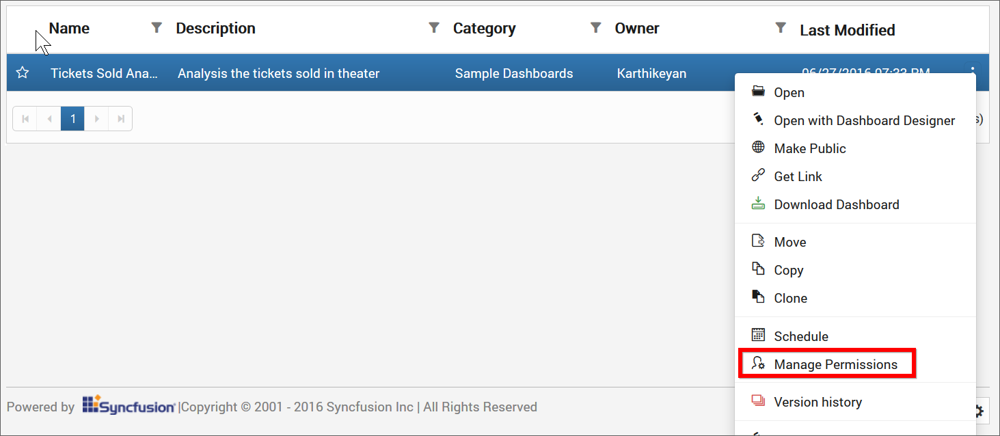
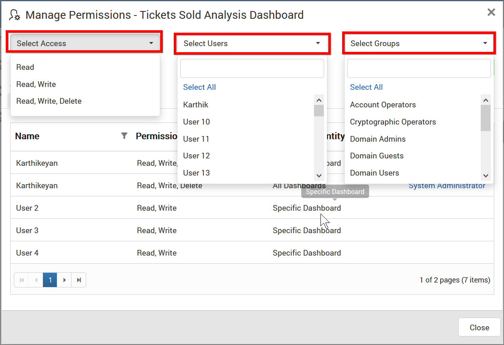
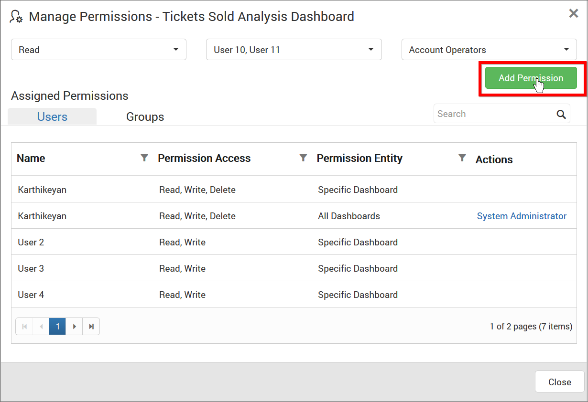
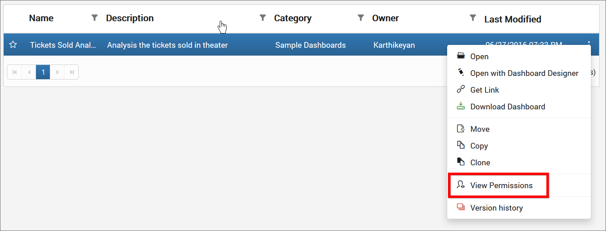
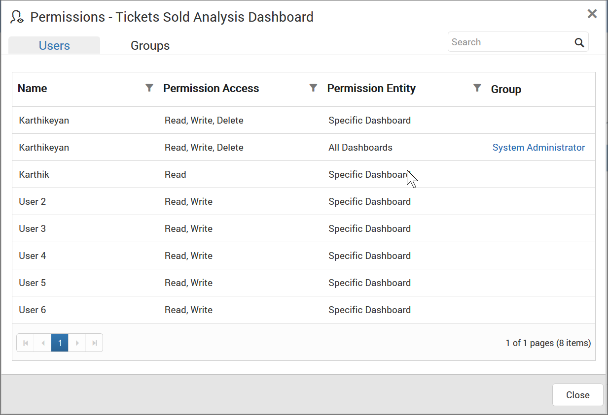
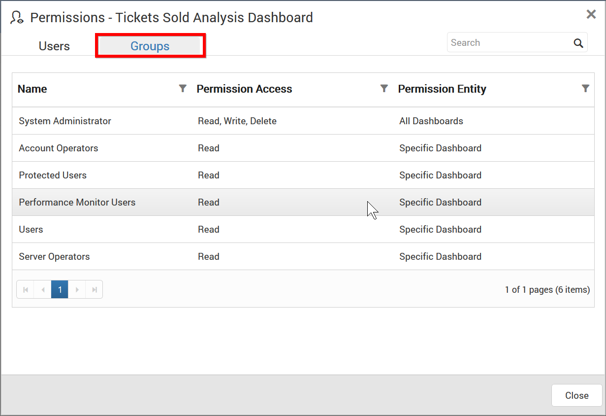
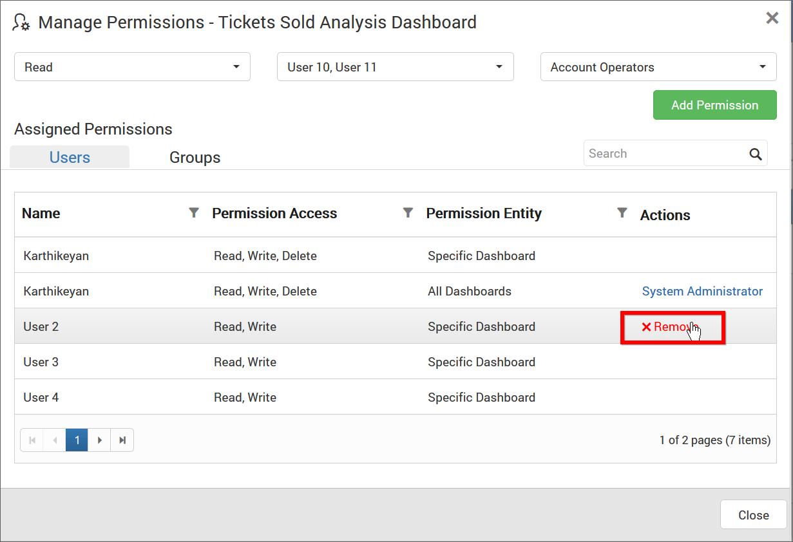

# Share Dashboards

This section explains on how to share dashboards with the other users in the Dashboard Server. 

### Steps to share a Dashboard

1. Click the `Actions` button in the Dashboards grid context menu and select `Manage Permissions` option.

	

2. Select the permission access from the `Select Access` dropdown and select the users or groups to share the dashboard.
  
	
	
3. After selecting the access and users or groups, click on the `Add Permission` button.

	
	
N> Only the user who created the dashboard can share the dashboard with other Dashboard Server users.

### View Permission

If the user is not an owner of the dashboard, user can view the assigned permissions of the dashboard by clicking the `View Permissions` option in the Dashboards grid context menu.

The permission availed to the users can be viewed in the `Users` tab.

The permission availed to the groups can be viewed in the `Groups` tab.

### Remove Permission

The user who created the dashboard can remove the shared dashboard permissions using the `Remove` option in the `Actions` column of the each permissions.

	
