# Manage Data Sources

This section explains on how to add, update, share, download, delete data sources and also on how to view the version history of data sources in the Syncfusion Dashboard Server. 

Data Sources that are accessible by the user depending on the user’s permission is displayed in the data sources page.

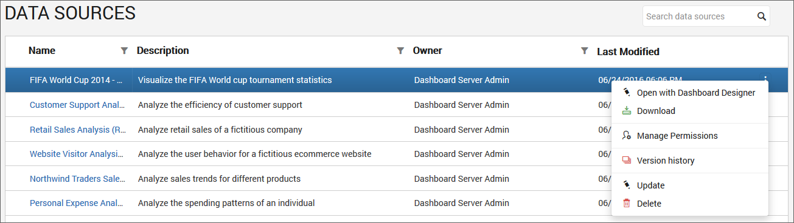

## Add Data Sources
Data source can be created only if the user has `Create All Data Sources` permission.

### Steps to add a data source

1. Click on the `Create` button in the menu and select `Data Source` to add a data source.

	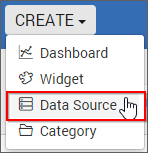
	
2. Fill in the form with name and description of the data source and upload the data source file(`.syds`).
	
	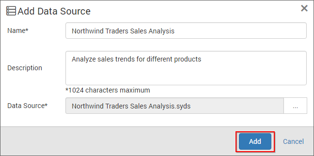

3. When clicking on `Add`, the data source will be added to the dashboard server.

N> `Read Write Delete` permission for that `Specific Data Source` will be added for the user who created the data source.
	
## Update Data Sources
Name, description and the data source file(`.syds`) can be changed in the update data source dialog box.

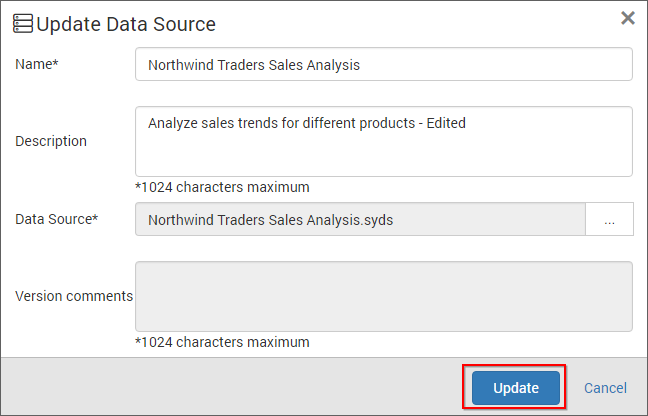

# Share Data sources

This section explains on how to share data sources with the other users in the Dashboard Server. 

### Steps to share a data source

1. Click the `Actions` button in the Data sources grid context menu and select `Manage Permissions` option.

	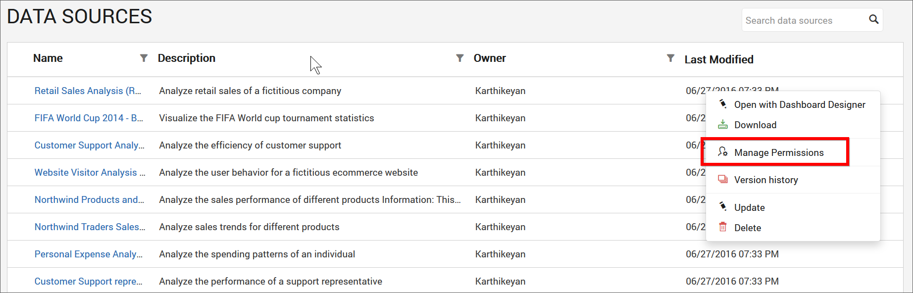

2. Select the permission access from the `Select Access` dropdown and select the users or groups to share the data source.
  
	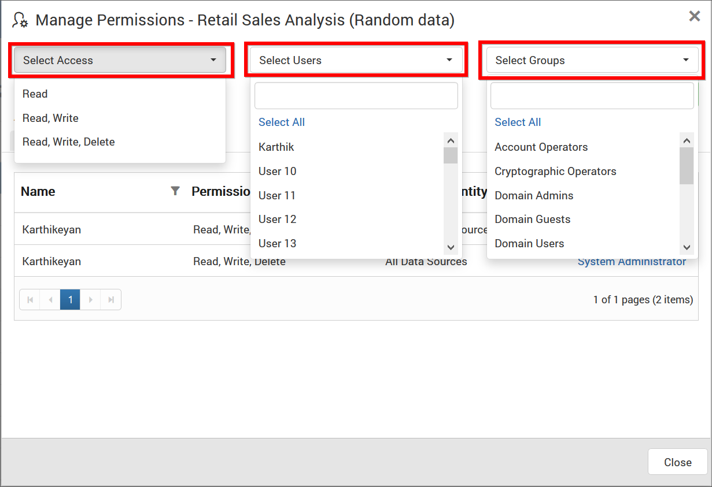
	
3. After selecting the access and users or groups, click on the `Add Permission` button.

	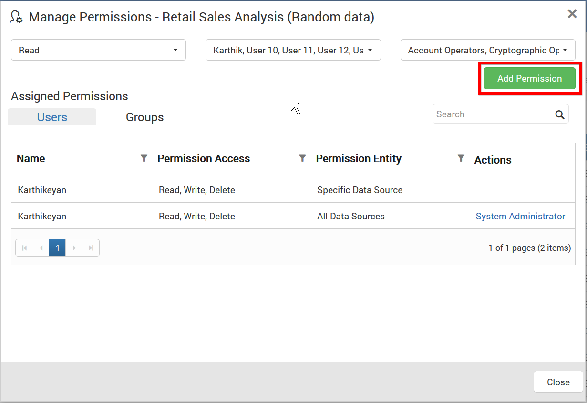
	
N> Only the user who created the data source can share the data source with other Dashboard Server users.

### View Permission

If the user is not an owner of the data source, user can view the assigned permissions of the data source by clicking the `View Permissions` option in the Datasources grid context menu.

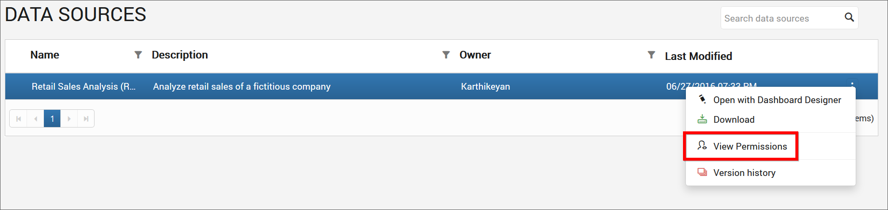

The permission availed to the users can be viewed in the `Users` tab.

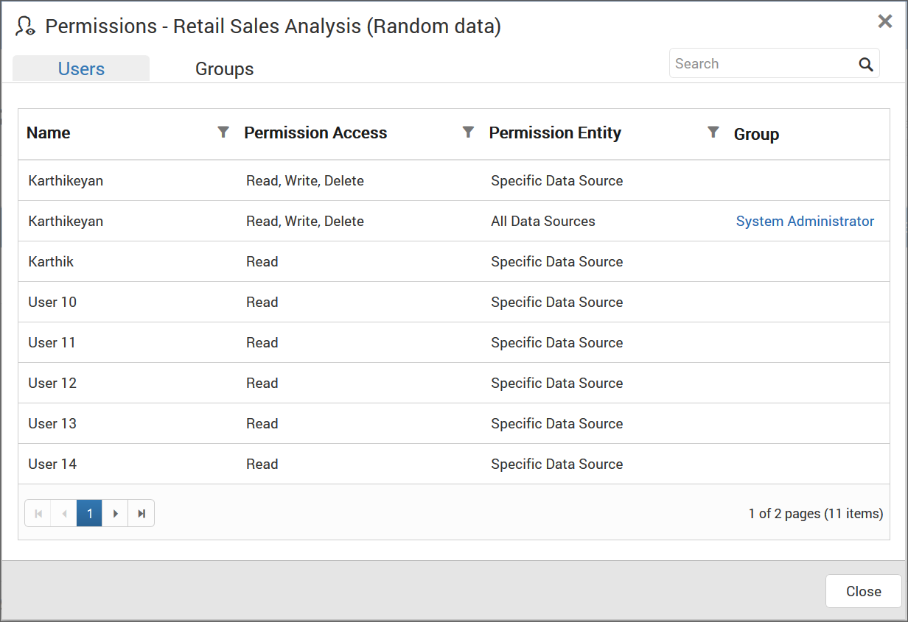

The permission availed to the groups can be viewed in the `Groups` tab.

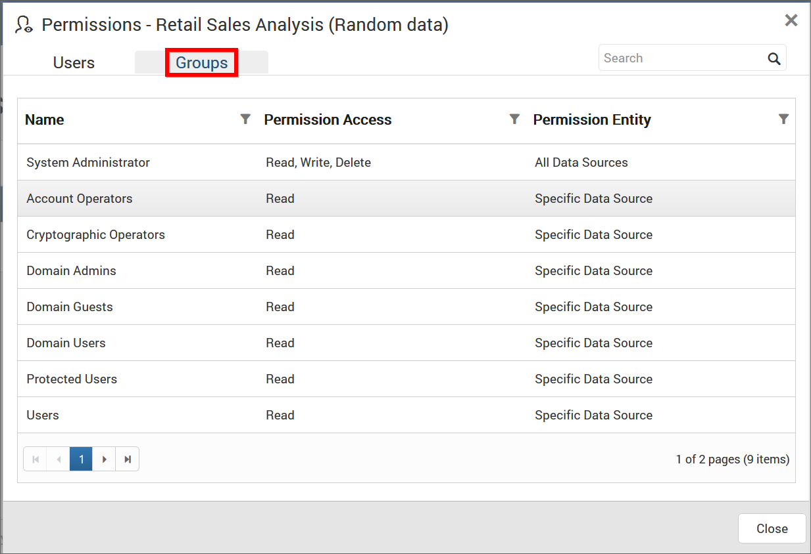

### Remove Permission

The user who created the data source can remove the shared data source permissions using the `Remove` option in the `Actions` column of the each permissions.

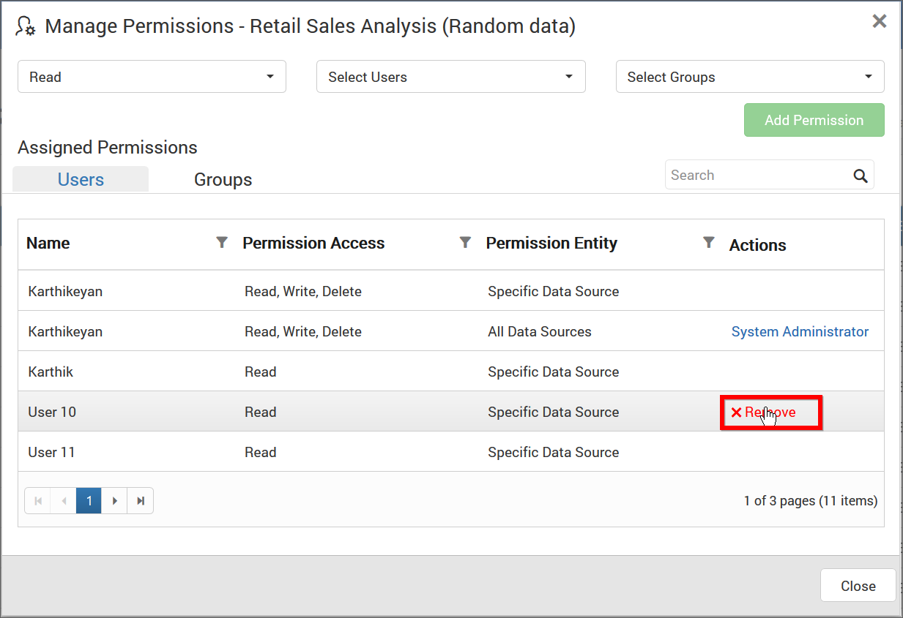

## Open with Dashboard Designer

Data Sources can be launched directly in the Dashboard Designer from the Dashboard Server. 

Click the `Actions` button in the Data Sources grid context menu and select `Open with Dashboard Designer` to open the Data Source in the Dashboard Designer if it is already installed in the client machine.

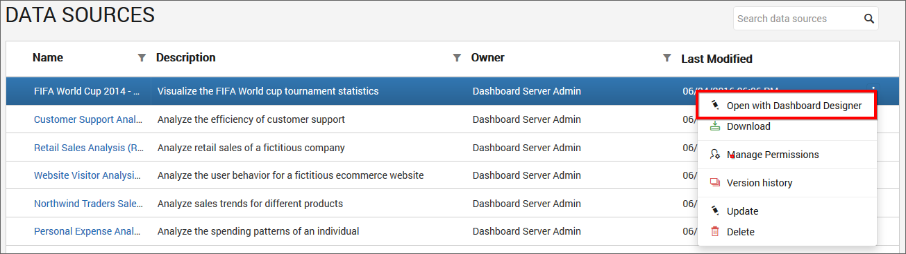

If Dashboard Designer is not already installed in the client machine, then Dashboard Designer will be downloaded in the client machine for the user to install.

## Download Data Sources

Click the `Actions` button in the data sources grid context menu and select `Download` to download the data source in `.syds` format.

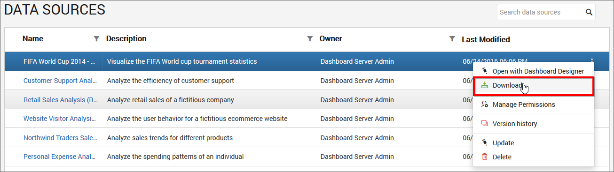

## Version History

Versions and file logs for each data source are maintained in the dashboard server for every changes in the data source. Check [Version History](/en-us/dashboard-platform/dashboard-server/administration/manage-dashboards#version-history) section under [Manage Dashboards](/en-us/dashboard-platform/dashboard-server/administration/manage-dashboards) for more details.

## Delete Data Sources
Data Sources can also be deleted from the dashboard server when they are no longer required.

Click the `Actions` button in the data sources grid context menu and select `Delete` to delete the data source.

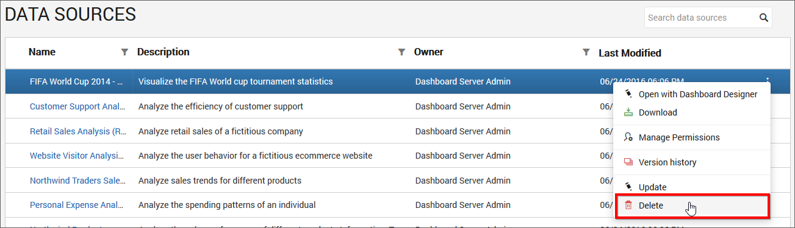