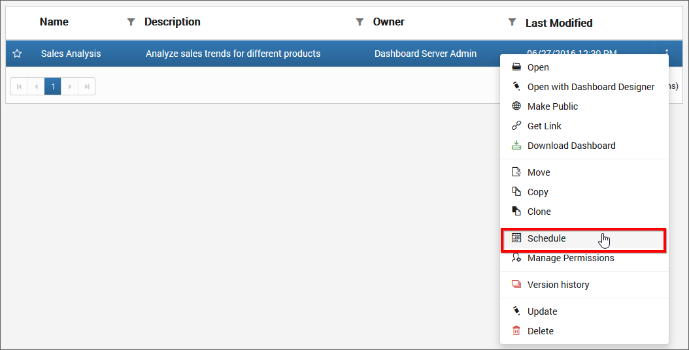

# Manage Schedules  	

This section explains on how to add, edit, delete schedules and also on how to run the schedules on demand and enable or disable schedules in the Syncfusion Dashboard Server.

Schedules that are accessible by the user depending on the user’s permission will be shown in the schedules' page.

## Add Schedules
Schedules are created from the dashboards page. Schedules can only be created if the user has `Create All Schedules` permission.

### Steps to create a schedule 

1. Click the `Actions` button in the schedules grid context menu and select `Schedule` to schedule the corresponding dashboard.

	

2. Select the recurrence type, recurrence, start and end dates, export formats and the users to which the exported dashboards has to be emailed in the `Add Schedule` dialog box.
	* Dashboards can be scheduled daily, weekly, monthly and yearly
	* Dashboards can be exported as image
	* Application Time Zone will be shown below the date picker. Start time of the schedule will be converted to client Time Zone and shown in the right side for the user’s convenience 
	* Exported dashboards can be sent to individual users or groups or to external recipients
	
	
	

3. 	When clicking on `Schedule`, the dashboard will be scheduled in the selected recurrence.

N> `Read Write Delete` permission for that `Specific Schedule` will be added for the user who created the schedule.

## Edit Schedules
Name, recurrence type, recurrence, start and end dates, export format and the recipients can be changed in the `Edit Schedule` dialog box.
	
## Run Now
Schedules can be made to run on demand by using `Run Now` option in the schedule grid context menu. Dashboard will be exported in the format specified and sent to the recipients.

## Enable or Disable Schedule
Schedules can be disabled at any time which will ignore any next occurrences. When enabled it will get the next occurrence and run accordingly.

## Delete Schedules
Schedules can be deleted from the dashboard server when it is no longer required.

Click the `Actions` button in the schedules grid context menu and select `Delete` to delete the schedule.

