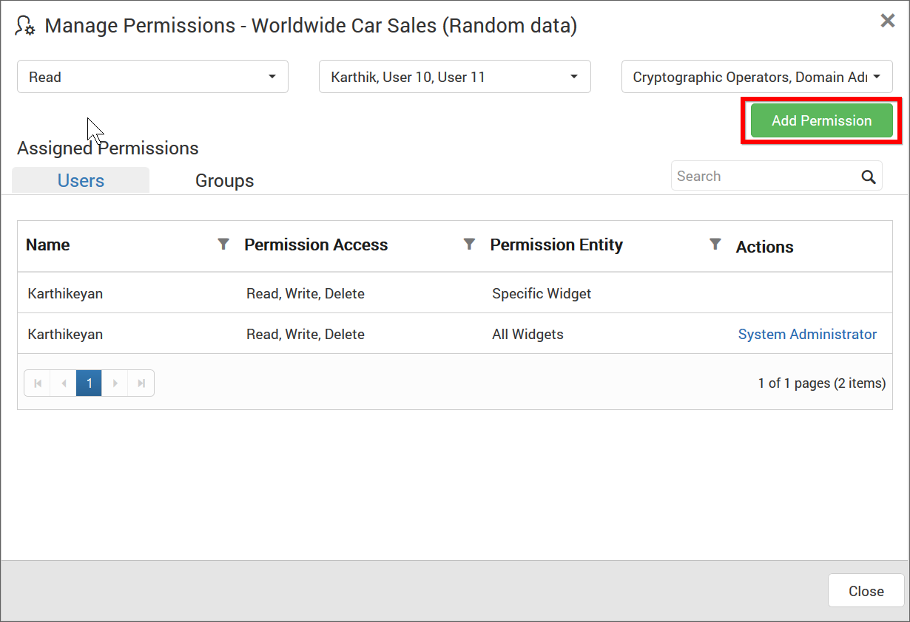

# Manage Widgets 

This section explains on how to open, add, update, share, download, delete Widgets and also on how to view version history for Widgets in the Syncfusion Dashboard Server.

Widgets that are accessible by the user depending on the user's permission is displayed in the Widgets page.

## Open Widget

Widgets are opened in our embedded Dashboard Viewer.

## Add Widgets

* Widgets can be created only if the user has `Create All Widgets` permission.
* Widgets can be designed in the Dashboard Designer and then added in the Dashboard Server. For client users, Dashboard Designer can be downloaded from the Dashboard Server.

### Steps to add a Widget

1. Click on the `Create` button in the menu and select `Widgets` to add a Widget.

	

2. Fill in the name and description of the Widget and upload the Widget file(`.sydw`) in the Add Widget dialog box.

	

3. After filling the form, the Widget can be saved to be added in the Dashboard server.

N> `Read Write Delete` permission for that `Specific Widget` will be added for the user who created the Widget.

## Update Widgets
Name, description and the Widget file(`.sydw`) can be changed for the Widget in the update Widget dialog box.

## Share Widgets

This section explains on how to share widgets with the other users in the Dashboard Server. 

### Steps to share a Widget

1. Click the `Actions` button in the Widgets grid context menu and select `Manage Permissions` option.

	

2. Select the permission access from the `Select Access` dropdown and select the users or groups to share the widget.
  
	
	
3. After selecting the access and users or groups, click on the `Add Permission` button.

	
	
N> Only the user who created the widget can share the widget with other Dashboard Server users.

### View Permission

If the user is not an owner of the widget, user can view the assigned permissions of the widget by clicking the `View Permissions` option in the Widgets grid context menu.

The permission availed to the users can be viewed in the `Users` tab.

The permission availed to the groups can be viewed in the `Groups` tab.

### Remove Permission

The user who created the widget can remove the shared widget permissions using the `Remove` option in the `Actions` column of the each permissions.

## Open with Dashboard Designer

Widgets can be launched directly in the Dashboard Designer from the Dashboard Server. 

Click the `Actions` button in the Widgets grid context menu and select `Open with Dashboard Designer` to open the Widget in the Dashboard Designer if it is already installed in the client machine.

If Dashboard Designer is not already installed in the client machine, then Dashboard Designer will be downloaded in the client machine for the user to install.

## Download Widgets

Click the `Actions` button in the Widgets grid context menu and select `Download` to download the Widget in `.sydw` format.

Downloaded Widget can be loaded in our Dashboard Designer.

## Version History

Versions and file logs for each Widget are maintained in the dashboard server for every changes in the Widget. Check [Version History](/en-us/dashboard-platform/dashboard-server/administration/manage-dashboards#version-history) section under [Manage Dashboards](/en-us/dashboard-platform/dashboard-server/administration/manage-dashboards) for more details.

## Delete Widgets
Widgets can also be deleted from the Widget server when they are no longer required.

Click the `Actions` button in the Widgets grid context menu and select `Delete` to delete the Widget.

