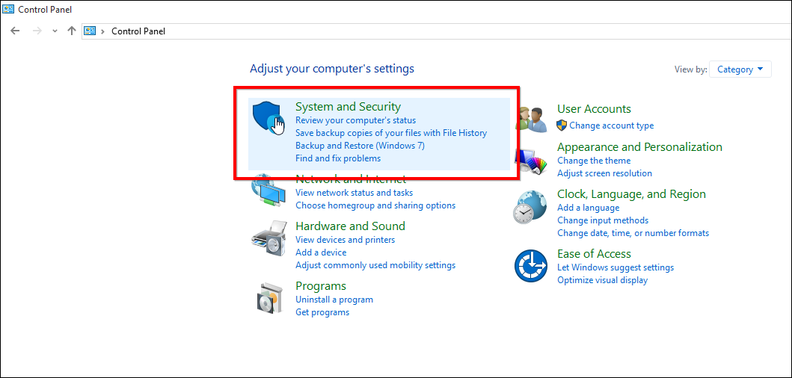
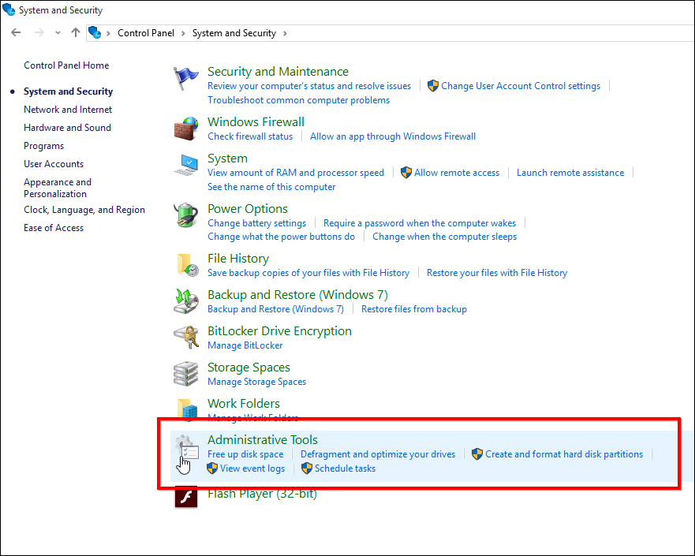
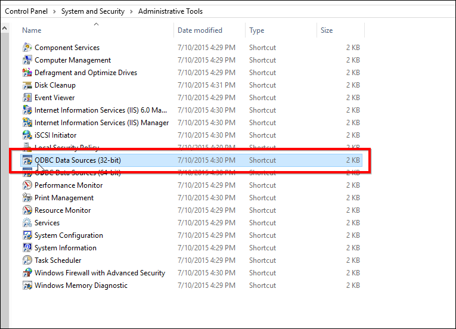
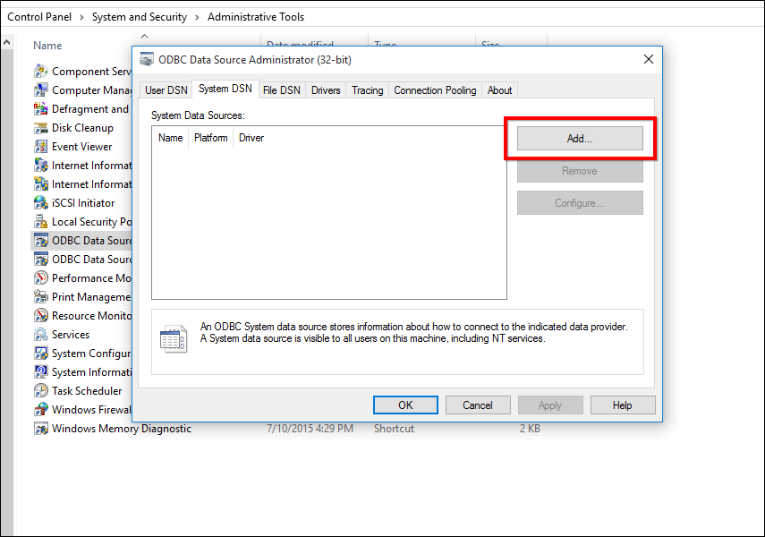
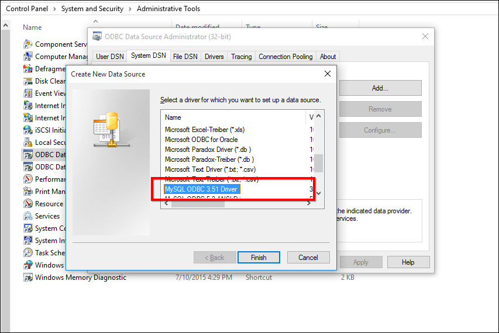
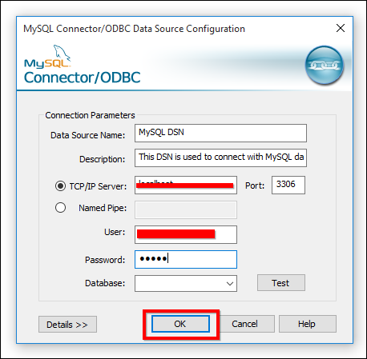
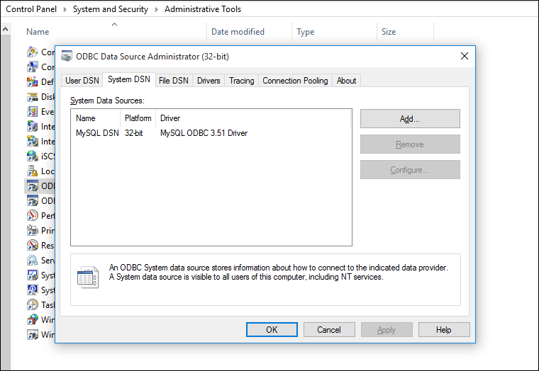

# How to create DSN for MySQL

This topic describes how to create DSN for MySQL that can be used to connect MySQL database from Syncfusion Dashboard Server. 

An ODBC Data Source Name (DSN) stores information for establishing a connection to a database on a remote database server. A system DSN provides access to multiple users, rather than only the user who created it.

## Download and Install MySQL ODBC Driver

Download and install the 32-bit Connector/ODBC driver from the [Downloads section of the MySQL website](http://dev.mysql.com/downloads/connector/odbc/) .

## Create DSN

After installing MySQL ODBC driver follow the below steps to create DSN for MySQL database.

### Open ODBC Data Source Administration Tool 

Open `Control Panel` and select `System and Security`.

  

Select `Administrative Tools` from the list of options.

  

Select `ODBC Data Sources (32-bit)` from the list of options.

  

### Create DSN with MySQL ODBC Driver

In the `ODBC Datasource Administration (32-bit)` Tool navigate to `System DSN` and click on `Add` to add a new DSN.

 

Select MySQL ODBC Driver from the list of drivers and then click on `Finish`.

 

The `MySQL Connector/ODBC Configuration` tool will be opened and fill the requested details in the tool.

  
 
* Data Source Name – Name of the DSN that will be used to connect MySQL database from Syncfusion Dashboard Server.
* Description – Description of the DSN(Optional)
* TCP/IP Server – Server that holds MySQL Database.
* Port - Port number provided for MySQL Database.
* User – Username that used to connect MySQL.
* Password - Password of the corresponding user.

The created DSN will be listed in the `ODBC Data Source Administration (32-bit)` tool.

 

