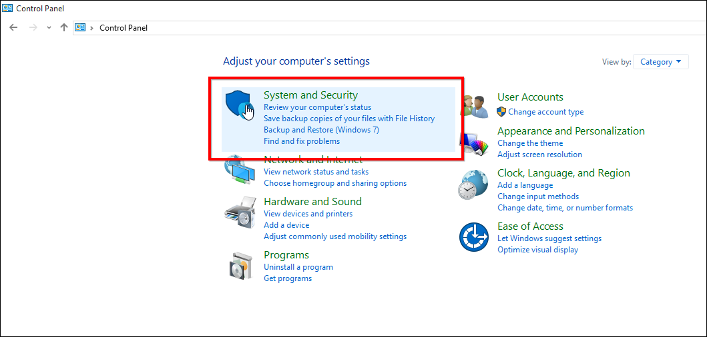
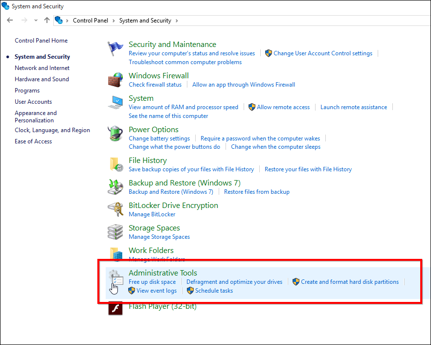
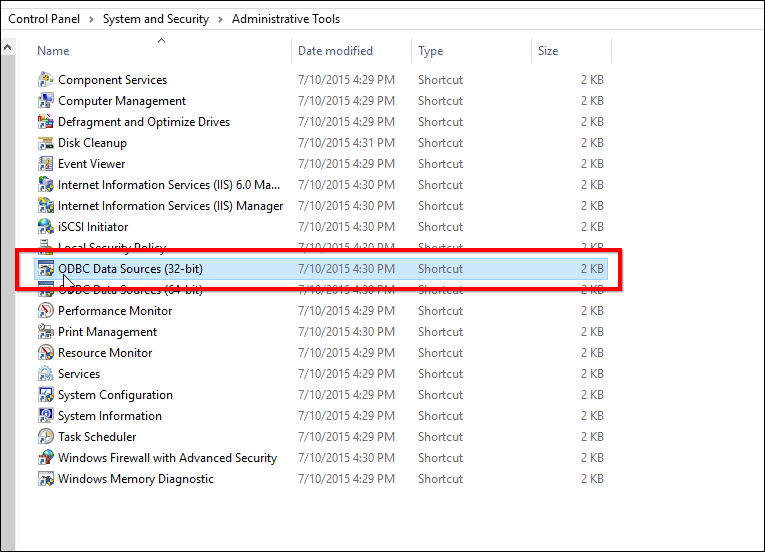
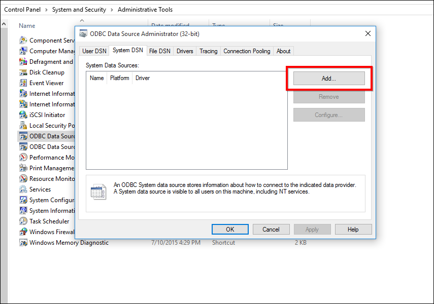

# How to Create DSN for Oracle

This section explains on how to create DSN for Oracle.

An ODBC Data Source Name (DSN) stores information for establishing a connection to a database on a remote database server. A system DSN provides access to multiple users, rather than only the user who created it.

## Steps to create DSN for Oracle

### Open ODBC Data Source Administration Tool

Open `Control Panel` and select `System and Security`.

  

Select `Administrative Tools` from the list of options.

  

Select `ODBC Data Sources (32-bit)` from the list of options.

  

### Create DSN with Oracle ODBC Driver

In the `ODBC Datasource Administration (32-bit)` Tool navigate to `System` and click on `Add` to add a new DSN.

 

Select the Oracle Driver from the list of drivers and then click on `Finish`. 

 

Click Finish. An ODBC driver setup window opens. Fill the requested details in the tool.

* Data Source Name – Type a name to display in the DSN field on the Dashboard Server application for the Oracle database type.
* Description – Description of the DSN(Optional)
* TNS Service name – Select the TNS Service Name for the database your workspace repositories will be stored in. If no choices are shown, or if you are unsure which name to select, contact your DBA.
* User ID – Enter the database User ID.

N> While initializing application, the Username and Password given in the start up page will overwrite the Username and Password of the DSN.

The created DSN will be listed in the `ODBC Data Source Administration (32-bit)` tool.

 