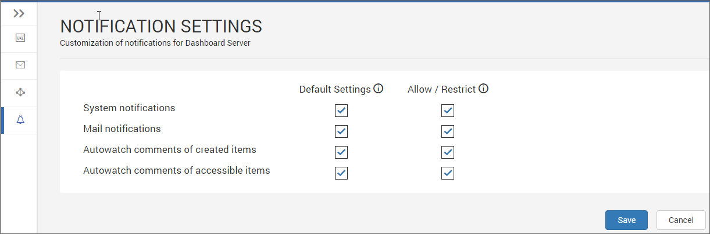
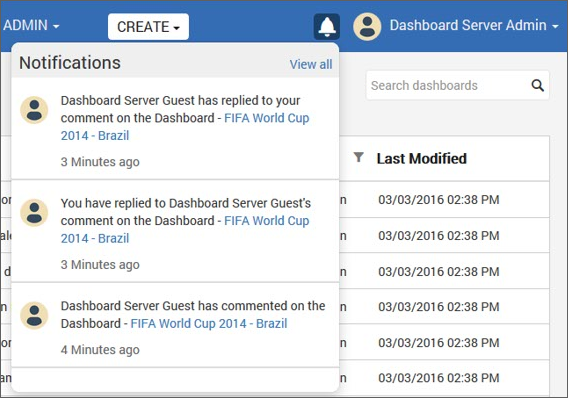
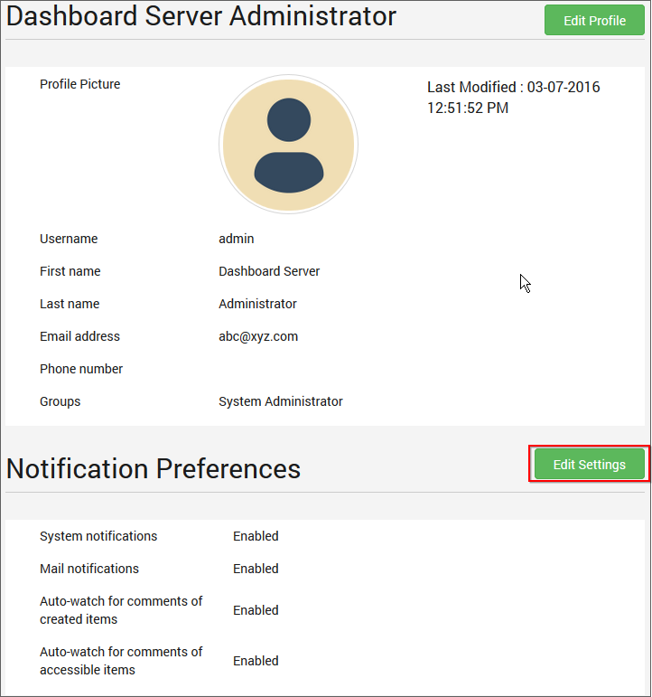
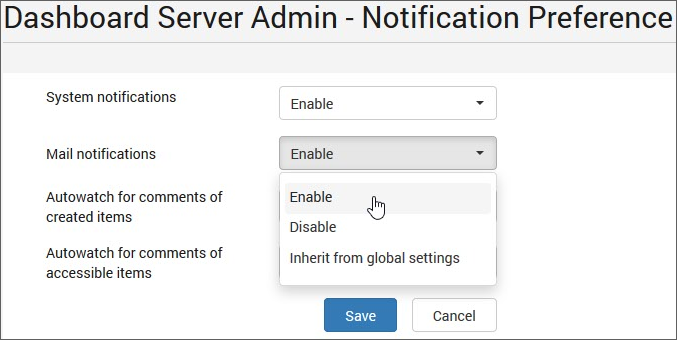
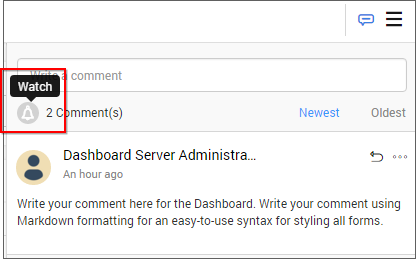

# Notifications

This section explains on how to configure notifications to notify the users for comments on the Dashboards and Widgets in the Syncfusion Dashboard Server.

Notifications can be configured by both the `System Administrator` and the user.

## Admin notification settings

Configure how the users receive notifications for the comments from the admin notification settings page.

Let's look at the notification settings one by one.

### System notifications

System notifications are the ones that will appear in the top right before the user name once the user logged into the Dashboard Server as like in the below image.

### Mail notifications

Users will also be notified through email for comments.

### Autowatch comments of created items

This is a switch for watching the comments of the items that the users have created. Enabling this will send notifications for comments on all the items that the users have created.

### Autowatch comments of accessible items

This is a switch for watching the comments of the items that the users have access. Enabling this will send notifications for comments on all the items that the users have access.

Now, let's look at the default and allowable notification settings configuration.

### Default Settings

This is the default settings applied to the user while the user is added into the Dashboard Server. Users can change switch from this setting and make their own or choose to inherit this setting anytime in their profile edit page

### Allow/Restrict Settings

This is the master settings for the Dashboard Server. Upon enabling or disabling any setting in here will enable or disable it in the Dashboard Server. This will override the default and user settings.

## User Notification Settings

Configure how the current user receive notifications for the comments from the user notification settings page.

Users can navigate to this page from the profile edit page as shown in the below image.

Refer to the below image for changing the notification settings for the current user.

Settings can be enabled or disabled or inherited from global settings which is the default settings of the Dashboard Server.

### Specific watch

Apart from autowatch of created and accessible item settings, users can also watch on a specific item if they want to watch an item specifically.

Users can toggle between watch and unwatch for a Dashboard comment anytime.