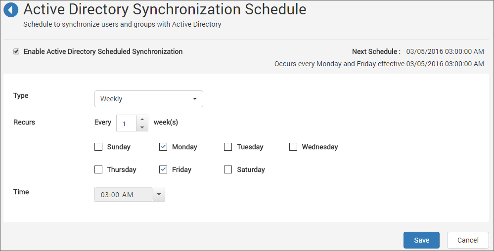

# Active Directory Synchronization Schedule

This section explains how to schedule the synchronization of users and groups from Active Directory with the users and groups in the Syncfusion Dashboard Server.

N> Please configure [Active Directory Settings](/en-us/dashboard-platform/dashboard-server/site-settings/active-directory), before you schedule synchronization of Active Directory users and groups.   

Users and groups from Active Directory can be synchronized on schedule to get the latest details of them into the Dashboard Server.

Please find more details on the synchronization of users and groups from Active Directory with Dashboard Server in the below links.
[Synchronize Active Directory Users](/en-us/dashboard-platform/dashboard-server/administration/synchronization-active-directory-users)
[Synchronize Active Directory Groups](/en-us/dashboard-platform/dashboard-server/administration/synchronization-active-directory-groups)

##Email Notifications

Once a scheduled recurrence of synchronization is completed, the users in the `System Administrator` group will be notified through email about the synchronization status.

##Enable/Disable Synchronization schedule 
Synchronization schedule can be enabled or disabled anytime from the top check box.